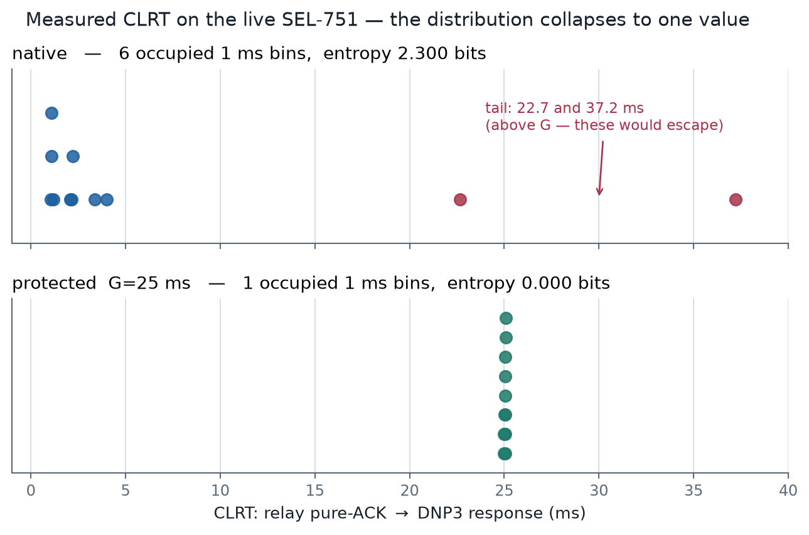
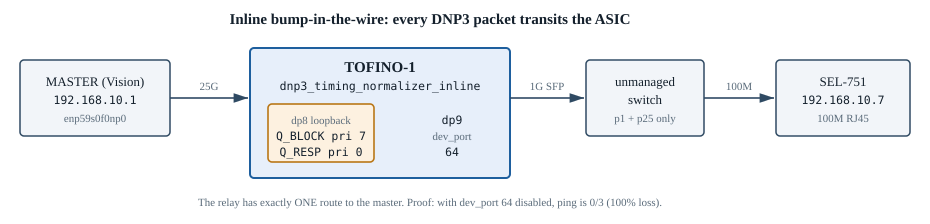
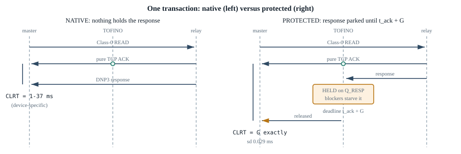
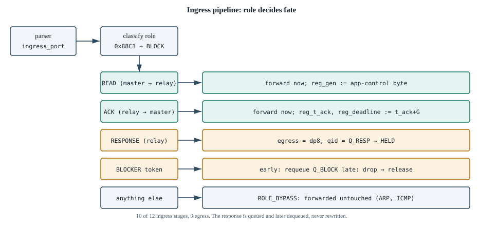
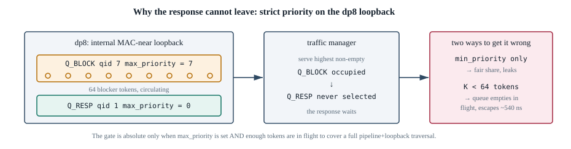
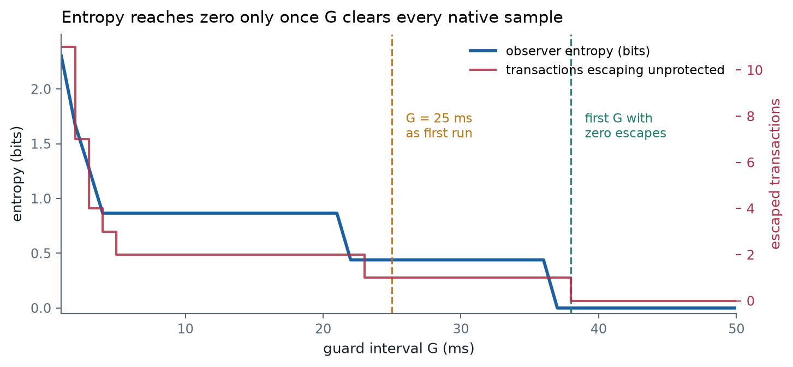

::: buildinfo
Built from commit `@COMMIT@` on @DATE@. Every number here was measured on the physical testbed.
:::

# 1. What this is, and what it showed

A protection relay answers its SCADA master in one to five milliseconds. That interval identifies
the device. This document describes a defense that runs on an Intel Tofino-1 switch and makes
every response leave at the same moment relative to the relay's own TCP acknowledgement. It now
runs inline with a physical SEL-751 carrying real DNP3 traffic.

Here is what the live relay did:

| run | n | median | min | max | **sd** | occupied 1 ms bins | entropy |
|:--|--:|--:|--:|--:|--:|--:|--:|
| native | 13 | 1.603 ms | 1.061 | 37.215 | **9.514 ms** | 6 | **2.035 bits** |
| protected, G = 25 ms | 13 | 25.070 ms | 25.003 | 25.083 | **0.029 ms** | 1 | **0.000 bits** |

The spread tightens by 329 times. The observer's histogram goes from six occupied bins to one,
and the entropy of the timing channel drops to zero. Every transaction looks the same.

Two things this is not, said up front rather than buried at the end. It does not prove byte
identity in this inline setup, and it does not give the device anonymity. Section 11 explains
both.



# 2. The channel being closed

A DNP3 outstation on TCP answers a poll with two packets. First the TCP stack acknowledges the
request. That is a bare ACK with no payload, and it comes back almost immediately. Then, once the
application has actually built the answer, the outstation sends the DNP3 response.

The gap between those two packets is the Command Loop Response Time. It belongs to the device
rather than the network. It measures how long that firmware, on that processor, with that point
map, takes to assemble a reply. Formby's fingerprinting work uses this to identify devices
without reading any payload, breaking any crypto, or sending a single packet. You just watch.

That rules out the obvious defense. Delaying every response by a fixed offset would shift the
distribution but keep its shape, so it would leak just as much. The only thing that works is
squashing the distribution down to one value.

# 3. Why the switch has to be inline

The defense holds the relay's response, and you can only hold a packet you are forwarding. A
mirror port or a passive tap gets a copy after the original has already gone. So the switch has
to sit in the path, and the relay needs exactly one route to its master.



This is easy to get wrong. We got it wrong first. The relay was on an unmanaged switch, the
Tofino uplinked to that same unmanaged switch, and the master was plugged into it too. Frames
went straight between two ports of the unmanaged switch and the Tofino only ever saw flooded
broadcast. The give-away was a counter: the port facing the relay had transmitted zero frames,
ever.

## 3.1 The single-path proof

Being able to reach the relay proves nothing, because a topology that bypasses the switch also
lets you reach it. The real test is the opposite:

| relay leg `dev_port 64` | `ping 192.168.10.7` |
|:--|:--|
| enabled | 3/3 replies |
| **administratively deleted** | **0/3, 100 % loss** |
| re-enabled | 3/3 replies |

If the relay had still answered with that port down, there was another path and none of the
timing numbers would mean anything.

## 3.2 Ports, and a trap

Front-panel `E1/33` is `dev_port 64`, and it links at 1 G with FEC off and auto-negotiation forced
off. That is worth stating because our own notes previously said the chip could not terminate the
relay leg and needed an active media converter. It can. An ordinary unmanaged switch with a 1 G
SFP uplink does the 100 M to 1 G step, and the Tofino takes it from there.

| role | front panel | dev_port | speed | FEC / AN |
|:--|:--|--:|:--|:--|
| master leg | 15/1 | 9 | 25 G | RS / default |
| loopback (blocker ring) | 15/0 | 8 | 25 G | internal MAC-near, no cable |
| **relay leg** | **33/0 (`E1/33`)** | **64** | **1 G** | **none / force-disable** |

All of those are below 128, so all of them are in pipe 0. That matters, because the registers are
per-pipe. A leg on pipe 1 would arm a deadline that the blockers never see, since they read pipe
0's copy, and every transaction would fall through to fail-open.

> Do not pass `64` to the setup script's `--host-ports`. That script forces host ports to 25 G
> with RS-FEC, which knocks the 1 G relay leg down. Configure `dev_port 64` on its own.

# 4. The hard part

A Tofino forwards at line rate and has no idea what "later" means. There is no timer to arm, no
way for the control plane to reach into a queue and hold something, and no instruction that means
wait. Parse, match, act, leave. That is the whole repertoire.

So we stopped trying to delay the packet. Instead we make it unable to leave, then take the
obstruction away at the right moment. The obstruction is built out of other packets.



# 5. Code walkthrough

Line references are to `p4/dnp3_timing_normalizer_inline.p4`, which is 929 lines and fits in 10
of 12 ingress stages with nothing in egress.

## 5.1 Ports are constants, and the parser keys on them

```p4
const PortId_t PORT_L      = 9w8;   /* internal loopback (blocker ring)   */  // :132
const PortId_t PORT_VISION = 9w9;   /* master side                        */  // :133
const PortId_t PORT_HULK   = 9w11;  /* outstation side, REPLAY injector   */  // :134
const PortId_t PORT_RELAY  = 9w64;  /* outstation side, LIVE relay leg    */  // :139
```

Direction is decided from the ingress port alone, before any header is examined:

```p4
transition select(ig_intr_md.ingress_port) {         // :302
    PORT_L      : from_loopback;
    PORT_HULK   : from_outstation;
    PORT_RELAY  : from_outstation;                   // the live relay leg
    PORT_VISION : from_master;
    default     : accept;      /* port_ok stays 0 -> dropped in the MAU */
}

state from_outstation { meta.dir = DIR_OUT;    meta.fwd_port = PORT_VISION; ... }  // :321
state from_master     { meta.dir = DIR_MASTER; meta.fwd_port = PORT_RELAY;  ... }  // :323
```

Anything arriving on an unexpected port dies early:

```p4
if (meta.port_ok == 8w0) { ctr_bypass.count(8w1); drop_pkt(); }   // :699
```

Going from replay to a live relay was a three line change: add `PORT_RELAY`, add it to the parser
select, point `from_master` at it. Resource usage afterwards was identical, at 10 of 12 stages, 60
logical tables and 55 SRAM blocks.

## 5.2 Blocker tokens cannot be faked onto a host port

```p4
state parse_token {          // :337
    pkt.extract(hdr.ib);
    meta.role   = ROLE_BLOCK;      /* FORCED, regardless of ingress port */
    meta.gen_in = hdr.ib.gen;
    transition accept;
}
```

Ethertype `0x88C1` is always `ROLE_BLOCK`. An injected frame cannot argue its way onto a host port
no matter what role byte it carries.

## 5.3 The ACK arms the deadline, the response gets parked



```p4
/* ACK from the outstation: forward it at once, and arm the deadline. */
reg_t_ack    = ig_intr_md.ingress_mac_tstamp;
reg_deadline = reg_t_ack + G;                  // deadline_arm_once, :472

/* RESPONSE from the outstation: do not forward it. Park it. */
ig_tm_md.ucast_egress_port = PORT_L;           // :578  dp8 loopback
ig_tm_md.qid               = QID_RESP;         // :579  qid 1, max_priority 0 (LOW)

/* BLOCKER token, once per lap. */
ig_tm_md.ucast_egress_port = PORT_L;           // :573
ig_tm_md.qid               = QID_BLOCK;        // :574  qid 7, max_priority 7 (HIGH)
hdr.ib.seq = hdr.ib.seq - 32w1;                // :801  fail-open budget
```

The ACK goes out immediately, and that is deliberate. Holding it too would just move the
fingerprint into the request-to-ACK gap instead of removing it.

Notice what is missing. Nothing rewrites the response anywhere. It gets queued, then dequeued
later. Byte preservation falls out of how this is built, not from patching a checksum afterwards.

# 6. The obstruction: strict priority and a reservoir



The response goes on a low priority queue on the dp8 loopback. The blocker tokens go on a high
priority queue on the same port. Tofino's traffic manager honours strict priority, so while any
blocker is sitting there the response never gets picked. The blockers re-enqueue themselves every
lap, so the crowd keeps itself going with no host involved.

We found two ways to break this, both the hard way.

## 6.1 `max_priority` is the field that counts

The first version failed completely, and it turned out to be a config mistake rather than a design
flaw. We were only setting `min_priority`. The field that arbitrates leftover bandwidth is
`max_priority`. With it unset the two queues just shared bandwidth fairly, so the "blocked"
response drained straight out. Setting `max_priority = 7` on the blocker queue is what makes the
gate absolute. The control plane reads it back and refuses to continue if it does not match, which
is the `strict_priority_verified: true` line.

## 6.2 One blocker is not enough

A single token leaves gaps. While it is in flight through the pipeline its queue is briefly empty,
strict priority finds nothing to serve there, and the held response slips out in about half a
microsecond. The queue has to stay occupied the whole time, which means enough tokens in flight to
cover a full trip through the pipeline and back round the loopback.

On this chip, K of 1, 8, 18 and 32 all leak. K of 64 or more holds with no escapes.

## 6.3 Generation tags, and why injection order matters

A token is only accepted if its `gen` byte matches the current transaction generation, and that
generation is the DNP3 application-control byte of the READ, written into `reg_gen` as the READ
goes past. So two things follow. Tokens injected before the READ carry a stale generation and kill
themselves on the first lap. Tokens also have to be circulating before the response shows up one
to five milliseconds later.

The live injector therefore sends the READ and injects immediately after, with nothing in between.
Replay harnesses hid this by scheduling everything ahead of time. A live session cannot.

The token is 21 bytes padded out to 60:

```
Ethernet(dst=02:00:00:00:00:01, src=02:00:00:00:0b:0c, ethertype=0x88C1)
  + ibspg(role:8 = 1, slot:8 = 0, gen:8 = 0xC0|appseq, seq:32 = pass budget)
```

# 7. The release: how the data plane knows the time

Nothing so far says when to let go. There is no timer, and the control plane is far too slow and
too jittery for a loop that has to be accurate to microseconds on a millisecond interval.

So the blockers work it out themselves. Each one, on each lap, compares the current timestamp with
`reg_deadline`. If it is early it re-enqueues at high priority. On the first lap where it is late
it terminates instead. The crowd drains, the high priority queue empties, strict priority finally
serves the low priority queue, and the response goes out.

The release moment is decided on-chip, by the packets, with no external clock anywhere.

## 7.1 A compiler constraint that shaped the code

Writing that comparison is harder than it looks, and two attempts each cost a compile cycle. A bit
slice inside a gateway condition gets rejected outright as "condition expression too complex". A
bit slice of a 32-bit arithmetic field breaks PHV allocation completely, even as a plain
assignment, giving 12 unallocated slices.

Expiry is decided instead by a ternary match on the sign bit of `(now - deadline)`. Same bit the
arithmetic would have tested, no slicing involved.

## 7.2 Fail-open

Every token carries a pass budget in `hdr.ib.seq`, decremented once per lap at `:801`. When it hits
zero the token dies no matter what the deadline says. This is a watchdog, there to guarantee a held
response eventually gets out even if the deadline logic never fires. At the configured
`BUDGET = 2000000` that works out to roughly 3.4 seconds.

A response released this way is not protected. Its observed CLRT is the fail-open time, not G. The
counters tell the two apart, `ctr_release_deadline` against `ctr_release_fail_open`, and any run
showing fail-open releases should be thrown away.

# 8. Choosing G

G is the guard interval, the constant that every CLRT becomes. It is the only knob, and it breaks
differently at each end.



## 8.1 The floor, and a failure you cannot see

You can only add delay. If a transaction's native CLRT is already bigger than G there is nothing
to hold back. It goes through at its true timing and nothing on the wire says so.

This is not hypothetical. Two native runs on this relay hit maxima of 22.66 ms and then 37.22 ms.
Against the G of 25 ms we first ran, that second one would have escaped without a trace. The figure
above makes it exact: at G = 25 ms the observer's entropy is still 0.44 bits, not zero. It only
reaches zero at G of 38 ms or more.

So, two rules. Measure the tail before picking G, which means a few hundred native polls so the p99
and the maximum are known instead of guessed. That is the most useful measurement still outstanding.
And always report the escape count. The counter `ctr_response_zero_hold` records transactions whose
native CLRT was at or above G, and a run with a non-zero count is not a protected run.

## 8.2 The ceiling

Four limits, roughly in the order you meet them.

The relay's TCP retransmission timeout comes first. The held segment is one the relay sent, so if
the hold outlasts its RTO the relay resends, which duplicates the response and creates an obvious
new artifact. At G = 25 ms we measured no retransmissions, no duplicate ACKs and no reordering.
Linux sits at a 200 ms floor, but this relay runs an embedded stack and may differ. The way to find
the real ceiling is to raise G until the first retransmission shows up, which turns G from a number
we chose into a property of the device we measured.

Next is the blocker pass budget. A bigger G means more laps before the deadline, and if the budget
runs out first, fail-open releases early and quietly breaks the protection. 40 ms is nowhere near
the 3.4 second bound, but the two are coupled.

Then the polling interval. There is exactly one transaction slot, since every register runs at index
0, so G has to stay well under the gap between polls or transactions collide. At roughly one second
polling, G = 40 ms is a 4 % duty cycle.

The DNP3 application layer contributes nothing here. The captured responses carry `CON = 0` and the
session uses unconfirmed link service, so no application timer is ever armed, and opendnp3's master
response timeout is seconds away.

## 8.3 The cost nobody notices at first

A device that naturally answers in 2 ms but always answers in 40 ms is itself distinctive.
Normalizing removes the variance an attacker fingerprints, but the constant is still visible. If the
point is to hide inside a population of devices, G should look like a plausible member of that
population. That is where the 17 and 25 ms candidates came from originally, being the relay's own
native p95 and p99 in the capture corpus. There is a real tension between headroom and plausibility,
and it should be settled by the anonymity set rather than by convenience.

For now, use G = 40 ms in the lab, and treat it as a floor until the tail is measured.

# 9. Running it yourself

Everything below runs on the master host, Vision, from `~/dnp3_live`. Reach Vision at
`10.10.54.166`. The `10.10.54.19` address rides `eno1` and is not reachable from the lab network.

The Tofino keeps running the same program the whole time. Native and protected differ in one thing
only: whether blocker tokens get injected. Nothing is reloaded between them.

## 9.1 Preflight

```bash
cd ~/dnp3_live
./status.sh
```

Four checks. The inline program is loaded, the master leg is up, the relay answers through the
Tofino, and tcp/20000 accepts. It exits non-zero if any of them fail. Check 1 gets skipped when you
run it from Vision, which has no SSH key to the switch, so verify that one from gambit with
`ssh decps@10.10.54.81 'pgrep -a bf_switchd'` and look for `tn_inline_abs.conf`.

## 9.2 The two runs

```bash
./run.sh native                 # 20 read-only polls, nothing held
./run.sh protected              # same polls plus 64 blocker tokens (asks for sudo)
```

Both fire one unmeasured warm-up poll first, because the cold poll is a big outlier. Only the token
injection needs root. The capture does not.

The full form is `./run.sh <mode> [n] [k]`, so `./run.sh protected 100 64` for a longer run.

## 9.3 Measure

```bash
./clrt.py native.pcap protected.pcap
```

You get a strip plot of both runs on a shared axis, the observer's histogram at 1 ms bins, the
occupied bin count and the Shannon entropy:

```
  native.pcap    |  @=  . .     .                                           .   |
  protected.pcap |                                       @                      |
                  -0.39                                                 38.66 ms

  native     sd 9.514 ms   6 bins   entropy 2.035 bits
  protected  sd 0.029 ms   1 bin    entropy 0.000 bits   <- carries no information
             spread 329x tighter
```

## 9.4 Reloading the program

```bash
ssh decps@10.10.54.81
sudo pkill -x bf_switchd
sudo setsid nohup bash /home/decps/timing_inline/launch_tn_inline.sh </dev/null >/dev/null 2>&1 &
sleep 45
python3 /tmp/ibspg_paired_setup.py --prog dnp3_timing_normalizer_inline --config \
        --qb 7 --qh 1 --host-ports 9 --port-l 8 --pg-l 2
```

Look for `strict_priority_verified: true`. Then put the relay leg back, since that script must not
touch it:

```
$SPEED=BF_SPEED_1G  $FEC=BF_FEC_TYP_NONE  $AUTO_NEGOTIATION=PM_AN_FORCE_DISABLE   on dev_port 64
```

> A symptom worth recognising. TCP connects, the relay's pure ACK comes back, but every poll returns
> 0 bytes. That means dp8 is not configured. The held response gets enqueued onto the loopback port,
> and if dp8 is absent the response is simply lost while TCP looks perfectly fine.

# 10. Capturing with Wireshark

## 10.1 Live, on screen

Capture on the master leg. The `wireshark` group already allows this, so no sudo:

```bash
wireshark -k -i enp59s0f0np0 -f "host 192.168.10.7 and tcp port 20000"
```

Then make the CLRT readable directly:

1. Set the display filter to `ip.src == 192.168.10.7`. You now see only the relay's own packets,
   alternating between a pure ACK (Length 0) and the DNP3 response (Length 54).
2. View, then Time Display Format, then Seconds Since Previous Displayed Packet.
3. The Time value on each response row is the CLRT.

Run `./run.sh native` in another terminal and the response rows bounce between about 0.001 and
0.005 s. Run `./run.sh protected` and every response row sits at 0.025 s. You can see the defense
working without analysing anything.

## 10.2 Headless capture

```bash
# what run.sh does internally
sg wireshark -c "dumpcap -i enp59s0f0np0 -f 'host 192.168.10.7 and tcp port 20000' \
                 -a duration:30 -w capture.pcap"
```

## 10.3 The filters that matter

| filter | what it shows | expected |
|:--|:--|:--|
| `ip.src==192.168.10.7 && tcp.len==0` | the relay's separate pure ACKs | one per poll |
| `ip.src==192.168.10.7 && tcp.len>0` | DNP3 responses | one per poll, 54 B |
| `tcp.analysis.retransmission` | hold outlasted the relay's RTO | **empty** |
| `tcp.analysis.flags` | any TCP anomaly | **empty** |
| `eth.type==0x88c1` | blocker tokens escaping to a host | **empty** |
| `_ws.malformed` | corruption | **empty** |

The last three are the honest checks. Retransmissions mean G has gone past the TCP budget. A
`0x88c1` frame on a host leg means the isolation property has failed. Malformed frames mean the
switch damaged something.

## 10.4 Command line equivalents

```bash
# CLRT by hand, without clrt.py
tshark -r protected.pcap -Y "ip.src==192.168.10.7" \
       -T fields -e frame.time_delta_displayed -e tcp.len

# the three integrity checks
tshark -r protected.pcap -Y "tcp.analysis.retransmission" | wc -l   # want 0
tshark -r protected.pcap -Y "eth.type==0x88c1"            | wc -l   # want 0
tshark -r protected.pcap -Y "_ws.malformed"               | wc -l   # want 0

# response sizes, since constant size supports the integrity argument
tshark -r protected.pcap -Y "ip.src==192.168.10.7 && tcp.len>0" \
       -T fields -e tcp.len | sort -u
```

# 11. Scope, and what this does not show

It does not prove byte identity in this setup. The relay is live, so its measured values genuinely
change between runs, and the DNP3 transport sequence counter increments as well, so comparing
payloads across two time windows tells you nothing about integrity. More to the point, the relay leg
cannot be tapped. The unmanaged switch has no span port, and a Tofino mirror would change the frozen
program, so we cannot compare the same frame on both sides. Byte identity rests on the earlier
replay campaign, where it held 100 out of 100. What this run does support is weaker but still worth
saying: responses were a constant 54 bytes, every one decoded as DNP3 function 129, no frame was
malformed, and there were no TCP anomalies.

It does not give anonymity. This closes the CLRT channel. Response size, ACK mode and the TCP stack
fingerprint are all untouched. On this corpus the SEL-751 is the only separate-ACK device, an
anonymity set of one. Making a device answer at a fixed time does not make it look like a different
device.

The sample is small. Thirteen transactions per run. The distributions are clear enough, but the tail
is not characterised, and that is exactly the gap that makes G = 25 ms unsafe.

There is one transaction slot. Every register runs at index 0, so the relay has to be alone on the
unmanaged switch and G has to stay well under the polling interval.

There is also a new place to watch from. A bump in the wire only normalizes what is downstream of
it, so the unmanaged switch between the Tofino and the relay is now a physically accessible spot
where the un-normalized timing is still visible.

# 12. What is in this bundle

```
dnp3_inline_live/
├── README.md                      navigation index
├── index.html                     this report, self-contained
├── DNP3_INLINE_LIVE_REPORT.pdf    this report, single column
├── interactive.html               interactive explainer (G explorer, pipeline walk)
├── assets/                        4 editable SVG diagrams + 2 data figures
├── run/                           the runnable pipeline
│   ├── status.sh  run.sh  poll.py  clrt.py  dnp3_crc.py  README.md
├── p4/
│   ├── dnp3_timing_normalizer_inline.p4     the dataplane (sha fb3b10da)
│   └── lab.env.inline                       PROG / P4_SRC_SHA256 / DP_HULK=64
├── evidence/
│   ├── RESULT.md                            the measured result
│   ├── native_inline2.pcap                  native run
│   └── prot_inline.pcap                     protected run, G = 25 ms
├── design/
│   ├── INLINE_TOPOLOGY_DESIGN.md            port map, rates, bypass, gates
│   └── INLINE_RELAY_SAFETY_AND_CONFIG.md    relay safety, timing tolerance
└── source/                        report source, diagram and figure generators, build script
```

Rebuild the report with `source/build.sh`. Diagrams and figures are regenerated from source on every
build, so they cannot drift away from the text.

## Provenance

The P4 in `p4/` is byte identical to what was compiled and loaded, sha `fb3b10dad575bed4…`, matching
both the copy on the switch and the pin in `lab.env.inline`. It compiles with 0 errors on bf-p4c
9.13.1 locally and 9.13.2 on the switch, with the same resource usage either way: 10 of 12 ingress
stages, 60 logical tables, 55 SRAM blocks.
