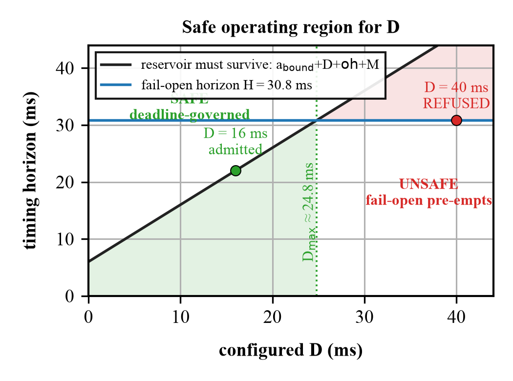
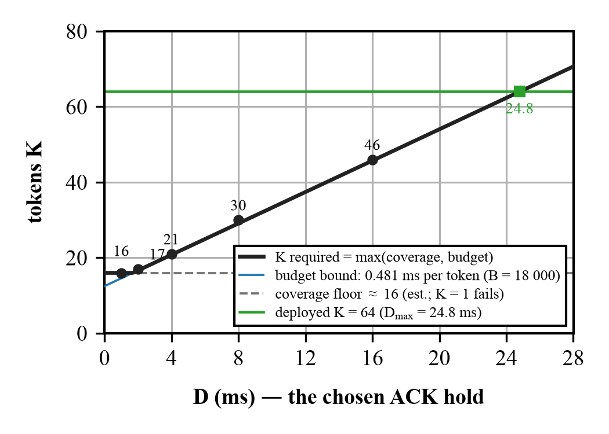
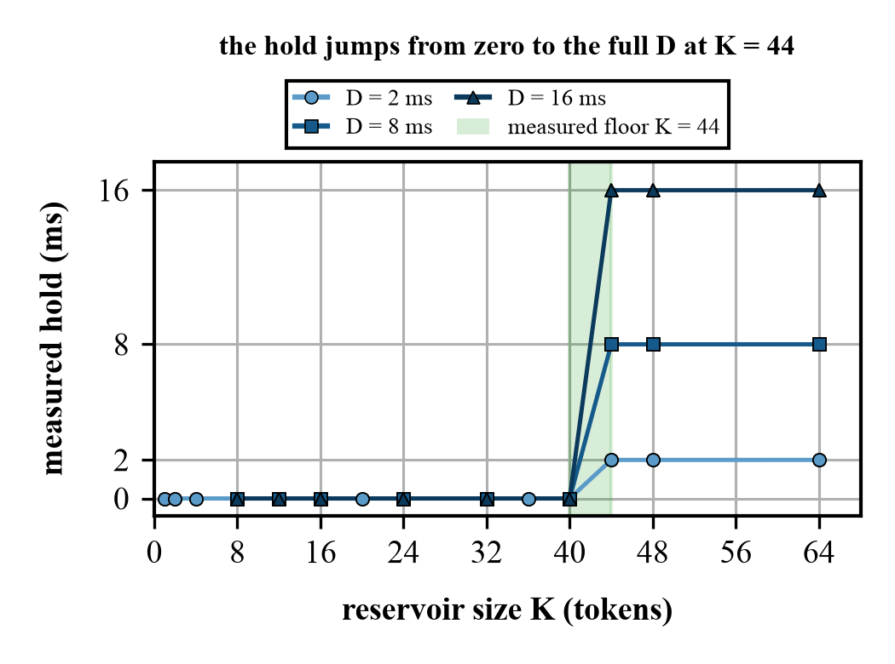
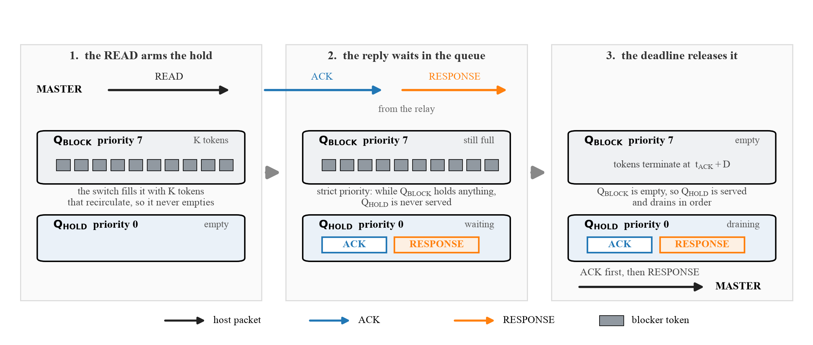
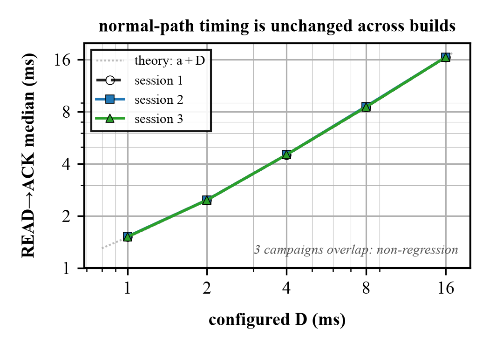

# Defense 3 — full report

A predetermined acknowledgement delay for DNP3, implemented in the data plane of an Intel
Tofino switch, and validated against a real SEL-751 protection relay.

> **Status.** The program described here is the one that runs: `p4/case_a_defense3.p4`,
> compiled with bf-p4c 9.13.2 and validated on Tofino-1 silicon against a physical SEL-751.
> Its safety paths — response authorisation, the generation-labelled fail-open note, the
> rejection of foreign blocker frames — are unconditional in that source, so a no-flag build
> is the safe program. **Several evaluation questions remain open** and are not claimed:
> external-wire adversarial injection (topology-blocked), physical reproduction of the
> cross-transaction generation-wrap coincidence, a hardware-timestamped observer capture, the
> acknowledgement-retirement boundary sweep, and a full physical core-vs-telemetry parity
> campaign — see the open-work table in §13. How the program reached this state, and
> the defects found and closed along the way, are recorded separately in
> [`REPAIR_HISTORY.md`](REPAIR_HISTORY.md) and [`AUDIT_RESPONSE.md`](AUDIT_RESPONSE.md); this
> report describes the system as built and interprets what it measures.

**A typeset single-column PDF of this report, with all fourteen figures, is
[`REPORT.pdf`](REPORT.pdf)** (36 pages, built from [`REPORT.tex`](REPORT.tex) with
`tectonic`). This Markdown file and the PDF carry the same content; the PDF is the one to
read on paper or to hand to someone else.

**This report assumes no prior knowledge.** It explains the problem, the vocabulary, the
arithmetic, the implementation, every mistake found along the way, all the measurements,
and what may and may not be claimed. Nothing is left out, including the parts that did not
work and the parts that are still unknown.

---

## Final system at a glance

The one-screen summary of the finished design, for a reader who wants the shape before the
40-page investigation.

| item | final value |
|---|---|
| Protected exchange | READ → pure ACK → RESPONSE (a separate-ACK device, the SEL-751) |
| Transformation | the pure TCP ACK is held until `t_ACK + D`, released independently of the RESPONSE |
| Ordering | the ACK and an in-window RESPONSE share the `Q_HOLD` FIFO, so ACK-before-RESPONSE is structural |
| Blocking | K = 64 self-recirculating tokens in `Q_BLOCK`, strict-priority over `Q_HOLD` |
| Fail-open | a generation-labelled `reg_failopen` note; the budget is the only terminator when no ACK arrives |
| Safety paths | a RESPONSE is authorised against the session before it may mark the transaction; a budget-exhausted token records a fail-open note; foreign `0x88C1` frames are dropped before the queue |
| Canonical source | `p4/case_a_defense3.p4` — the safety paths are **unconditional** (a no-flag build is the safe program) |
| Core resources | 10/12 ingress stages, 0 egress, critical path 10 (bf-p4c 9.13.2) |
| Telemetry resources | 11/12 ingress stages, 0 egress, critical path 10 |
| Physical evidence | 2 400 total transactions across three campaigns, 2 000 defended |
| Main result | CLRT standard deviation **2.854 ms → 0.012 ms at D = 16 ms** (≈ 238× compression, not flattened to a constant) |
| Main limitation | the defense is itself detectable in the measured sessions; **device anonymity is not demonstrated** |
| Release status | canonical artifact frozen and hardware-validated; optional experiments remain (§12) |

---

## Contents

1. [The setting, in plain terms](#1-the-setting-in-plain-terms)
2. [The vocabulary you need](#2-the-vocabulary-you-need)
3. [The leak: what CLRT is and why it identifies a device](#3-the-leak-what-clrt-is-and-why-it-identifies-a-device)
4. [Related work](#4-related-work)
5. [The three possible defenses, and why this one](#5-the-three-possible-defenses-and-why-this-one)
6. [How you delay a packet inside a switch that has no timers](#6-how-you-delay-a-packet-inside-a-switch-that-has-no-timers)
7. [The arithmetic](#7-the-arithmetic)
8. [The implementation](#8-the-implementation)
9. [The transaction state machine](#9-the-transaction-state-machine)
10. [Validation on synthetic traffic: gates 1 to 4](#10-validation-on-synthetic-traffic-gates-1-to-4)
11. [Validation on the real relay](#11-validation-on-the-real-relay)
12. [The D-sweep campaign, the data, and the analysis](#12-the-d-sweep-campaign-the-data-and-the-analysis)
13. [What may and may not be claimed](#13-what-may-and-may-not-be-claimed)
14. [How to reproduce everything](#14-how-to-reproduce-everything)

A typeset single-column version of everything below is [`REPORT.pdf`](REPORT.pdf).

---

## 1. The setting, in plain terms

An electrical substation contains **protection relays** — devices that watch the current
and voltage on a power line and trip a breaker if something goes wrong. A control centre
talks to them over a network using an industrial protocol called **DNP3**. A typical
exchange is boring and constant: the control centre asks "what is your status?", the relay
answers with a list of measurements. This repeats every second or so, forever.

An attacker who can see that network traffic — a passive eavesdropper, not someone who can
inject or modify anything — would like to know **what equipment is installed**. Knowing
that a particular cabinet contains an SEL-751 rather than some other relay tells them which
vulnerabilities to try, which firmware to study, and what the substation is protecting. In
security terms this is **reconnaissance**, and it is the step before an attack.

You might think encryption solves this. It does not, for two reasons. First, a great deal
of installed DNP3 is unencrypted. Second, and more importantly, **encryption hides the
contents of messages but not their timing**. If a device always takes about 3 milliseconds
to think before it answers, that 3 milliseconds is visible whether or not the answer is
encrypted. Timing is a side channel.

This project is about closing one specific timing side channel, in the network, without
touching the relay and without modifying a single byte of any packet.

**Why this is hard.** The obvious fixes do not fit a substation. You cannot patch the relay:
these are certified, long-lived devices, and changing their firmware to answer at a constant
speed is neither practical nor permitted. You cannot simply encrypt the link, because the
timing survives encryption. And the closest in-network work — traffic shapers that pad or
pace packets on a programmable switch — hides *how big* and *how often* packets are, but not
this particular signal, which lives in the *gap between two specific packets*: the device's
low-level TCP acknowledgement and its actual answer. That gap, which we call the **CLRT**
(cross-layer response time), is the fingerprint, and no existing defense removes it without
touching the device.

**Our approach.** We put the fix in the network, on the switch that already sits between the
control centre and the relay. When the relay sends its acknowledgement, the switch **holds
that acknowledgement for a fixed, chosen amount of time D** and then releases it — on a
schedule decided in advance, not in response to anything the relay does. Because the release
time no longer depends on the answer, the gap an eavesdropper measures no longer reveals how
long the device took to think. The relay is untouched, the master is untouched, and not one
byte of any packet is changed; only *when* the acknowledgement leaves is different.

**Contributions.** This report makes four:
1. **A mechanism.** A predetermined ACK-delay that a programmable switch (Intel Tofino) can
 run at line rate, holding a single packet with a strict-priority reservoir of recirculating
 tokens — no timers, no host, no packet modification (§6–§7).
2. **A correctness account.** The one-byte transaction state machine, the ordering rules
 that keep it consistent under concurrency and failure, and a single control-plane policy
 that decides the safe range of D from the fail-open horizon (§8–§9).
3. **Physical evidence.** Validation against a real SEL-751 protection relay across three
 campaigns (2,400 transactions): the CLRT distribution's spread collapses ~238× at D = 16 ms
 while the normal-path timing is unchanged (§10–§12).
4. **An honest boundary.** The defense compresses the fingerprint but is itself detectable,
 and we do not claim device anonymity — we say exactly what is and is not established (§13).


**Figure 8.** Where the switch sits. The relay and the master are both untouched; the switch
between them runs the defense. Measurement was taken with a host PCAP at the **master
interface**, which is a *proxy* for a port-9 wire observer, not the wire observation point
itself — the timing numbers are therefore an approximation of what an attacker on the wire
would obtain, with a capture resolution of ~1 µs (§13, open-work #14). Port numbers,
front-panel positions and link speeds were read out of the live switch configuration, not
taken from a configuration file (§11.1).
Source: `figures/src/fig8_topology.py`.

---

## 2. The vocabulary you need

**DNP3** — the protocol. For our purposes it runs over TCP, and a "poll" is one
request/response pair.

**A Class-0 READ** — the most common DNP3 request: "send me your current static data". It
is read-only. Nothing in this project ever sends a command that could change the relay's
state; see §13.

**TCP acknowledgement (ACK)** — TCP is the transport underneath. When a machine receives
data it sends back a tiny, empty packet saying "got it". That is an ACK. It is generated by
the operating system's network stack, almost immediately, and carries no application data.

**Separate-ACK versus combined-ACK devices.** When the relay receives a READ, two things
have to happen: TCP must acknowledge the bytes, and the relay's application must compute
an answer. Some devices send the TCP ACK immediately and the answer later — two packets,
**separate ACK**. Others wait and put the acknowledgement and the answer in one packet —
**combined ACK**. This distinction is the whole ballgame, and it is why this work is
labelled **Case A**:

- **Case A = a separate-ACK device.** The SEL-751 is one. There are two packets, so there
 is a measurable gap between them. **This is the case Defense 3 addresses.**
- **Case B = a combined-ACK device.** One packet, so there is no gap to measure and
 nothing to hide. Out of scope.

**CLRT — Cross-Layer Response Time.** The gap, on a separate-ACK device, between the TCP
acknowledgement and the application's answer:

```
CLRT = (time the RESPONSE is seen) − (time the ACK is seen)
```

The name says what it is: a time interval measured *across* two layers — the transport
layer's ACK and the application layer's response.

**Tofino** — a programmable network switch chip. Unusually, you write a program that says
what the switch does to each packet. The language is **P4**. A Tofino is not a computer: it
has no loops, no waiting, and a strict budget of processing "stages" through which every
packet marches in lockstep. Everything in §6 follows from those constraints.

**D** — the parameter of this defense. The chosen amount of time to hold the ACK back.

---

## 3. The leak: what CLRT is and why it identifies a device

When a relay receives a READ, its TCP stack acknowledges the bytes within a fraction of a
millisecond. Then its application firmware wakes up, gathers measurements, formats a DNP3
response, and sends it. The time that second step takes depends on the relay's CPU, its
firmware, its scheduler, how much data it has to format — in other words, **on what the
device is**. Different models differ. That is what makes CLRT a fingerprint.

The prior work that established this (Formby et al.) treats CLRT as a **physical property
of the device** and uses it to identify equipment on a network. So the defensive objective
this project inherited is exactly: **make the observed CLRT stop revealing the device.**

### 3.1 Threat model

We assume a **passive, on-path observer** — an eavesdropper who can see the packets between
the control centre and the relay (a mirrored port, a tap, or a compromised intermediate link)
but who does **not** inject, modify, drop or delay anything. This is the reconnaissance
adversary of Formby et al.: their goal is to *identify the device* from its traffic, and CLRT
is the feature they use. The adversary can time packets to the resolution of their capture
point and can collect many transactions.

**What is in scope.** Hiding the CLRT of one **separate-ACK** device (a relay whose TCP
acknowledgement and DNP3 response are distinct packets, like the SEL-751) on one plaintext
DNP3-over-TCP session. **Out of scope** by assumption: an *active* adversary who injects or
tampers (§10 discusses why the in-switch mechanism is nonetheless robust to a forged token);
devices that piggyback the acknowledgement onto the response (no separate ACK, no CLRT to
hide); encrypted links where no plaintext observation point exists; and changing the relay or
the master, which the deployment forbids. We do **not** claim to make two devices
indistinguishable (anonymity); we claim to compress the CLRT feature the adversary relies on
(§13 states this boundary precisely).

Here is what we measured on the real SEL-751, with no defense running — 80 polls:

| | value |
|---|---|
| CLRT median | **2.828 ms** |
| CLRT standard deviation | **2.854 ms** |
| CLRT 95th percentile | 12.222 ms |
| CLRT maximum | 13.175 ms |

That spread is the information. A device whose CLRT is always about 2.8 ms with occasional
excursions to 13 ms looks different from a device whose CLRT is always 0.4 ms. The
**standard deviation** — how much the value moves around — is the number to watch
throughout this report, because a defense that leaves the spread intact has not hidden
anything.

---

## 4. Related work

Defense 3 sits where four lines of work meet: the fingerprinting attacks that motivate it, the
in-network shapers that show a switch can obfuscate at line rate, the website- and
flow-fingerprinting defenses that established what "hiding a feature" even means, and the
timing-channel literature that shows timing alone is enough to leak. We place the defense against
each in turn.

**ICS device and protocol fingerprinting.** Passive fingerprinting of networked devices from
timing metadata goes back to Kohno et al.'s use of microscopic clock skew to identify remote hosts
[1], and was formalised for protocol implementations by Shu and Lee [2]. In the embedded and
industrial setting, GTID showed that inter-arrival-time distributions identify both a device and
its *type* [3], and Jeon et al. fingerprinted SCADA roles on real critical-infrastructure captures
without deep packet inspection [4]. Our threat model is Formby et al.'s cross-layer response time
(CLRT) [5]: the interval between an outstation's TCP acknowledgement and its DNP3 response captures
the device's processing time and yields a stable, hard-to-forge fingerprint that classifies
substation devices with 92-99% accuracy. Prior work exposes this leak; to our knowledge Defense 3
is the first *defense* against it, releasing the pure ACK at a predetermined offset so the device's
processing time never enters a measurable interval.

**In-network obfuscation on programmable data planes.** Programmable switches (P4/Tofino) now host
non-trivial security functions at line rate [6], from volumetric-attack identification [7] to
network-layer anonymity such as HORNET [8], TARANET's constant-rate shaping via packet splitting
[9], and PINOT's in-switch client-address encryption [10]. The closest system is Ditto, which
shapes WAN traffic to a fixed size/timing pattern entirely in the data plane using padding, chaff
packets, and priority-queue scheduling, at 100 Gb/s and with no end-host changes [11]. Defense 3
adopts this line-rate, host-transparent stance and the same queue/recirculation toolkit, but
differs in target and cost: Ditto obfuscates the *aggregate* size, volume, and timing of a whole
link by adding traffic, whereas Defense 3 leaves every DNP3 byte and packet intact and normalises
exactly one *device-specific* observable - the ACK-to-response cross-layer interval - at the cost
of a single held acknowledgement.

**Website- and flow-fingerprinting defenses.** A large body of work hides encrypted-traffic
patterns from a passive observer. Traffic morphing reshapes packet-size distributions [12]; BuFLO
and its congestion-sensitive successor show that only rigid constant-size, constant-rate
transmission resists analysis, at substantial overhead [13, 14]; WTF-PAD injects adaptive dummy
packets at zero added latency [15]; and Walkie-Talkie molds bursts so distinct pages collide [16].
Deep Fingerprinting later defeated padding-only defenses with a CNN, showing that masking a feature
that remains present is brittle [17]. These defenses are host- or proxy-based, per-flow, and
dominated by packet-size obfuscation; Defense 3 instead runs in-network on one device-timing
feature and *structurally removes* it rather than statistically masking it.

**Timing side channels and timing-only defenses.** Timing alone is a first-class leakage channel:
inter-keystroke timing over SSH recovers typed content [18], and Feghhi and Leith mount a
traffic-analysis attack using *only* timing, with no size information [19] - which is exactly why a
timing-only countermeasure is a necessary, non-redundant contribution. Dependent link padding
bounds timing leakage by transmitting on a content-independent schedule [20], and in the smart-home
domain, rate/timing patterns of encrypted device traffic betray user activity, motivating
rate-shaping and stochastic traffic padding [21, 22]. Defense 3 is a timing-channel normalizer in
this tradition, but exploits the specific structure of the CLRT leak - its confinement to one
cross-layer interval - to neutralise it deterministically by scheduling a single packet's release,
avoiding the continuous cost of constant-rate schedules or cover traffic.

**ICS defensive context.** Reconnaissance and fingerprinting are recognised early-stage steps in
DNP3 attack taxonomies [23], and existing ICS defenses are largely detective - state- and
specification-based intrusion detection for Modbus/DNP3 [24, 25] and broader process-control
detection-and-response frameworks [26] - while cryptographic protection remains infeasible on much
legacy field equipment [27]. Defense 3 is complementary and proactive: it denies the attacker a
passive fingerprint upstream of any intrusion, transparently in the network, without modifying the
relay, the DNP3 payload, or introducing key management.

---

## 5. The three possible defenses, and why this one

Given a two-packet exchange (ACK, then RESPONSE) and a switch sitting in the middle, there
are three things the switch can do to the gap between them.

**Defense 1 — hold the ACK until the response arrives, then release both.** The gap
collapses to nearly zero. Already built in this project. Its flaw: the switch releases the
ACK *when the response arrives*, so the ACK's own timing now depends on the response. The
interval from READ to ACK becomes (relay ACK time + CLRT), and the CLRT is still in there,
just moved.

**Defense 2 — forward the ACK immediately, hold the RESPONSE until a fixed deadline G.**
Also already built, and proven on this hardware against this relay. The observed CLRT
becomes G, a constant. Its cost is latency: the response is genuinely late by up to G.

**Defense 3 — this work. Forward nothing on demand; hold the ACK until a fixed,
predetermined instant `t_ACK + D`, independent of when the response arrives.** The
response, if it turns up during the hold, queues behind the ACK and goes out just after it.

The reasoning for Defense 3 is arithmetic. Write `a` for the relay's own ACK latency
(READ → ACK, about 0.45 ms) and `c` for the CLRT (the thing we want to hide):

| defense | what the observer sees for READ→ACK | what they see for CLRT | is `c` visible? |
|---|---|---|---|
| none | `a` | `c` | **yes, directly** |
| Defense 1 | `a + c` | ≈ 0 | **yes — inside READ→ACK** |
| Defense 3 | `a + D_realized + ε` | `max(c − D, Δ_release)` | **no, when `D > c`** |

That third row is the point. Because the release instant is chosen *in advance* and does
not depend on the response, `c` appears in **neither** observable, provided `D` exceeds `c`.
The exact statement is piecewise: `CLRT_out = c − D + ε_direct` when `c > D` (the response is
forwarded directly, 0 loopback passes), and `CLRT_out = Δ_release` when `c ≤ D` (held behind
the ACK); and `READ→ACK_out = a + D_realized + ε_release`, not exactly `a + D`. **`Δ_release`
is not a universal constant** — it is a capture-dependent distribution (FIFO release, egress
scheduling, serialization, NIC handling, host timestamping) whose median was about **32 µs in
this campaign** (§12), not an architectural floor.

This is why the correct value of `D` is not "the average CLRT" but **larger than the CLRT
you want to hide**. Only transactions faster than `D` are concealed. That single sentence
drove the whole D-sweep in §12.


**Figure 4.** The same exchange with no defense and under each of the three defenses, drawn
to scale with the measured medians (`a` = 0.45 ms, `c` = 2.85 ms). The orange span in each
row is the interval that carries the secret. Under Defense 1 the secret has simply moved
from the CLRT into READ→ACK; under Defense 3 neither interval contains `c`, provided
`D > c`. ACK and RESPONSE are drawn in two lanes per row because under Defenses 1 and 3
they leave within microseconds of one another. Source: `figures/src/fig4_timelines.py`.

---

## 6. How you delay a packet inside a switch that has no timers

This is the hardest part of the whole project, and it is worth understanding because every
number later depends on it.

A Tofino processes a packet in a fixed pipeline and sends it out. **There is no
instruction that means "hold this packet for 2 milliseconds."** There is no timer you can
attach to a packet, no sleep, no delay queue you can program with a deadline. Packets go
in and come out.

What the chip *does* have is a **traffic manager** with queues and **strict priority**. If
queue 7 is set to strict priority over queue 1, then as long as queue 7 has anything in it
at all, queue 1 is not served. That is the lever.

So the mechanism is:

1. Put the ACK we want to delay into **Q_HOLD** (queue 1, low priority) on an internal
 loopback port.
2. Fill **Q_BLOCK** (queue 7, strict high priority) with dummy packets — we call them
 **blocker tokens** — so that Q_HOLD is starved and the ACK cannot leave.
3. Have each blocker token, when it is served, look at the clock, decide whether the
 deadline has passed, and if not, **send itself around the loop again**. A token that
 re-circulates keeps Q_BLOCK non-empty.
4. When the deadline passes, every token stops re-circulating and is dropped. Q_BLOCK
 empties. Q_HOLD is served. The ACK leaves.

The delay is therefore produced by **a self-sustaining crowd of dummy packets that get out
of the way at the right moment**. Nothing waits; everything is a packet being processed
normally, over and over.


**Figure 2.** *(a)* The construction. `Q_BLOCK` sits at strict priority 7 and `Q_HOLD` at
priority 0 on the same internal loopback port, so `Q_HOLD` is never served while a single
token remains in `Q_BLOCK`. Each token reads the clock as it passes and sends itself round
again until the deadline. *(b)* What happens after the deadline, at nanosecond scale,
measured on the physical relay — the hold is `D` plus these three terms, and `D` itself is
1 999 691 ns, three orders of magnitude larger. Source: `figures/src/fig2_mechanism.py`.

Three consequences that matter:

**Why 64 tokens and not one?** A single token would leave gaps: after it is served it takes
a fraction of a microsecond to come back around, and in that window Q_BLOCK is empty and
the ACK escapes. You need enough tokens in flight that the queue is *never* momentarily
empty. K = 64 was established by earlier work in this project as sufficient, and every
measurement here confirms it. **How much of that 64 is actually required was measured on
silicon in §7.5: the floor is 44 tokens, at every `D`** — so 64 is sufficient with a
measured 1.45× margin, and is not minimal.

**Where do 64 tokens come from?** The switch generates them itself. Tofino has a **packet
generator** that can be triggered by a pattern in a re-circulated packet. When the READ
arrives and arms a transaction, the switch mirrors a small tagged copy of it to the
generator's port; the generator recognises the tag and emits 64 tokens. No external host is
involved, which matters because a defense that needs a server to feed it is not a defense.

**What if something goes wrong?** Each token carries a **budget** — a maximum number of
loops. If the deadline somehow never arrives, tokens exhaust their budget and stop anyway.
This is the **fail-open** path: the defense gives up and lets the packet through rather
than holding it forever and breaking the connection. §7 gives the arithmetic that sets the
budget.

---

## 7. The arithmetic

Four numbers govern the mechanism. All are measured or derived, none are guessed.

### 7.1 The deadline, and why D is quantized

The switch stores the deadline as a 32-bit word. The low byte is reserved as a flag
("armed"/"not armed"), so the actual time lives in the upper 24 bits, counted in units of
**256 nanoseconds** — one "tick".

To hold for D milliseconds — the tick count is **floored**, not rounded, so the realized
delay never *overshoots* the request (`D_realized ≤ D_requested`):

```
ticks = ⌊ D × 1 000 000 / 256 ⌋ (round DOWN — never overshoot D)
word = ticks << 8 (low byte zero, so the armed flag survives addition)
```

For D = 2 ms:

```
ticks = ⌊ 2 000 000 / 256 ⌋ = 7 812
word = 7 812 << 8 = 1 999 872 → D_realized = 1.999872 ms
error = 2 000 000 − 1 999 872 = 128 ns short (always ≥ 0 by construction)
```

**Every "D = 2 ms" in this report actually means 1 999 872 ns.** The ≤ 128 ns shortfall is
quantization, not an error. The admissible range of `D` is not a fixed clamp: the parameter
policy computes `D_max` from the fail-open horizon (§7.1, and §7.3).

### 7.2 The release bias: why the hold is longer than D

When the deadline passes, the tokens do not vanish simultaneously. Each one only learns the
deadline has passed the next time it is *served*. Draining 64 tokens out of a queue at the
loop's packet rate takes time:

```
τ = K / rate_dp8 = 64 / 37 400 000 packets per second = 1 711 ns
```

where 37.4 million packets per second is the **measured** rate of the 25 Gbit/s internal
loopback for the small frames involved. So the ACK is not released at the deadline; it is
released at approximately `deadline + τ`.

This matters enormously for honest measurement. If you score the hold against `D` you see a
systematic **+1 711 ns** error on *every* transaction and will be tempted to call it jitter.
The correct target is `D + τ`. Every deadline number in this report is reported both ways —
raw against `D`, and corrected against `D + τ`.

**And τ was verified independently, which is the part that matters.** Originally `τ` was a
model whose only evidence was the residual it removed — circular reasoning. Instrumentation
was added to timestamp the *first* and *last* token terminations, so the drain could be
measured directly:

```
predicted τ = 1 711 ns measured drain = 1 692 – 1 696 ns agreement: 1.1 %
```

The full decomposition of a hold, from the synthetic gate:

```
hold = 2 001 505 ns
 = 1 999 763 (D, tick-quantized)
 + 1 692 (drain: first token termination → last)
 + 27 (release tail: last token gone → ACK out)
 + 23 (detection: deadline passed → first token noticed)
```

Each term is measured separately. Nothing in that line is inferred.

**Two different quantities were both called "the release tail". They are not the
same event and they differ by three orders of magnitude.** From here on:

| name | value | what it measures |
|---|---|---|
| **internal release tail** | 26–27 ns | last token termination → the held ACK's loopback return, inside the switch |
| **external ACK→RESPONSE floor** | ~32 µs | the gap an observer captures at the master when both packets leave back to back |

The external floor is *not* the internal tail scaled up. It contains switch output queuing,
frame serialization, link traversal, NIC processing and host capture behaviour, none of
which the internal figure includes. Every later mention of "32 µs" means the external
floor.

**The drain model is off by one.** The interval from the *first* termination to the
*last* spans K − 1 gaps, not K:

```
(K−1)/rate = 63 / 37.4e6 = 1 684.5 ns measured 1 692–1 696 ns (error 9.5 ns)
 K /rate = 64 / 37.4e6 = 1 711.2 ns measured 1 692–1 696 ns (error 17.2 ns)
```

The measurement fits `(K−1)/rate` better. `K/rate` remains the right figure for the
reservoir's full circulation period, and the release bias it predicts is still correct to
about 1 %, but the earlier claim that the drain "independently verifies K/rate" was
imprecise.

### 7.3 The fail-open horizon

Each token may loop at most `B` times. With K tokens sharing the loop, the wall-clock time
before the last one gives up is:

```
H = B × K / rate_dp8 = B × τ
```

With B = 18 000: `H = 18 000 × 1 711 ns = 30.802 ms`.

**The constraint below was written against the wrong quantity.** The budget starts
when the reservoir is created, which is a few hundred nanoseconds after the READ — but the
deadline is `t_ACK + D`, and `t_ACK` can be milliseconds later. So the horizon has to clear
the relay's own acknowledgement latency as well:

```
H > a + D + detection + drain + tail (a = the relay's READ→ACK latency)
```

Measured against the campaign's own worst-case `a` per arm:

| arm | worst observed `a` | `a + D` | margin `H/(a+D)` |
|---|---|---|---|
| D = 1 | 4.608 ms | 5.608 ms | 5.49× |
| D = 2 | 3.399 ms | 5.399 ms | 5.71× |
| D = 4 | 5.651 ms | 9.651 ms | 3.19× |
| D = 8 | 1.509 ms | 9.509 ms | 3.24× |
| **D = 16** | **4.673 ms** | **20.673 ms** | **1.49×** |

An earlier version of this section quoted **8.8×**, computed as `H / 3 ms` using a stale
design point and omitting `a` entirely. **The true worst-case margin in this campaign was
1.49×**, at D = 16 ms. Fail-open still never fired — but the headroom is a third of what
was claimed, and a transaction with the historically observed 22 ms READ→ACK would have
exceeded the budget at D = 16.

**The original parameter range was arithmetically impossible — and has since been fixed.**
The *original* control plane clamped `D` at a fixed 40 ms while `B = 18 000` gives
`H = 30.802 ms`; at that clamp the budget expires *before* the deadline can arrive, even with
an instantaneous acknowledgement. **The final parameter policy removes the fixed clamp** and
instead computes the admissible
`D_max = H − a_bound − t_detect − t_drain − t_tail − M`
from the configured budget, ACK-latency bound, release overhead, RTO margin and poll-rate
constraint (`control/parameter_policy.py`). With the campaign values this gives
`D_max ≈ 24.8 ms`, so `D = 16 ms` is admitted and `D = 40 ms` is **refused** — verified on
silicon (the setup's `--config` reports the policy verdict).

`H` has to sit in a window. Too small and it fires during a legitimate hold, silently
turning a D-governed delay into a budget-governed one. Too large and it approaches TCP's
retransmission timeout (~200 ms measured), at which point the master gives up and
retransmits, which is a real fault.

```
worst measured a + D (D = 16 ms): H / 20.673 = 1.49 × thin but clear
TCP retransmission timeout: 200 / 30.8 = 6.5 × clear
D at the configured 40 ms clamp: H / 40 = 0.77 × INFEASIBLE
```

An inherited comment in the code assumed 10 µs per loop, giving a horizon 5.8× wrong. It
was replaced with the formula, because a wrong model gives a wrong answer the moment K, B
or the port speed changes. **Fail-open fired zero times during the healthy,
deadline-governed gates and the physical D-sweep campaigns** — the outcome you want: the
safety net exists and was never needed there. It *was* deliberately exercised in the
READ-only fail-open and K-sweep experiments, where a READ with no ACK arms no deadline and
the budget is the only terminator by design.



**Figure 11.** The safe operating region for `D`. The final control plane does not clamp `D`
at a fixed value; it admits `D` only while the reservoir can still be alive when the deadline
arrives (`a_bound + D + overhead + M`, the sloped line), and that must stay below the fail-open
horizon `H = 30.802 ms`. Where they cross is `D_max ≈ 24.8 ms`: `D = 16 ms` is admitted
(green), `D = 40 ms` is refused (red). Computed by `control/parameter_policy.py`. Source:
`figures/src/fig11_safe_d.py`.

### 7.4 The trigger chain

How long after the READ does the reservoir actually exist? Measured over **100 clean
trials**, with a total spread of **4 ns**:

| step | time |
|---|---|
| READ arrives → tagged copy returns to the generator | **688 ns** |
| generator recognises the pattern → first token admitted | **11 ns** |
| all 64 tokens admitted (the burst itself) | **516 ns**, ≈ 8 ns per token |
| **READ → full 64-token reservoir** | **1 215 ns** |

Compare that with the relay's own ACK latency — the earliest moment there is anything to
hold — measured at **0.453 ms median, 0.400 ms minimum**. The reservoir is ready **~330×
sooner than it needs to be**. There is no race here, and the cold first trial after a
program load sits inside the warm distribution, so there is no warm-up cost either.


**Figure 6.** The trigger chain against the deadline it has to beat, on a logarithmic axis
because the two live three orders of magnitude apart. The reservoir is complete 1 215 ns
after the READ; the earliest the relay's own ACK can arrive is 400 000 ns. The margin is
~330×, which is why the arming path never races the traffic it protects.
Source: `figures/src/fig6_trigger.py`.

### 7.5 How many tokens the hold actually needs

§7.3 constrains K from above, through the horizon. There is a second, independent
constraint from below, and until now it was only estimated: **the reservoir has to be deep
enough that Q_BLOCK is never momentarily empty.** The traffic manager drains the whole
reservoir once at line rate — K/rate seconds — and if the first token has not returned from
its recirculation loop by then, Q_HOLD is served and the held acknowledgement leaves early.
The condition is therefore

```
K / rate_dp8  ≥  RTT_loop        (coverage; independent of D)
```

**This was measured on silicon on 2026-08-03**, in a dedicated post-freeze experiment: 96
in-chip transactions, K swept from 1 to 64 against D = 2, 8 and 16 ms, three repetitions per
point, with the budget scaled per (K, D) so the horizon never binds and coverage is the only
variable. The `K == 64` control-plane safety pin was relaxed **by name** for these trials
(`--allow-reduced-k-hold`), and every manifest records the relaxation, so a sweep trial can
never be mistaken for a release artifact.

**The result is a cliff, not a slope.** At K ≤ 40 the hold does not merely come up short —
it does not happen at all: the acknowledgement leaves after roughly one pipeline transit
(~0.5–1.0 µs), and all K tokens subsequently retire STALE because the early release has
already retired the generation. At K ≥ 44 every transaction holds to the deadline and every
token retires DEADLINE. Every one of the 32 tested (K, D) cells was unanimous across its
three repetitions.

| D | last K that fails | first K that holds | measured floor |
|---|---|---|---|
| 2 ms | 40 | 44 | **44** |
| 8 ms | 40 | 44 | **44** |
| 16 ms | 40 | 44 | **44** |

Three consequences:

- **The floor does not depend on D**, exactly as the coverage condition predicts — it is set
  by the recirculation loop, not by the length of the hold.
- **The floor is 44, not the ~16 previously estimated.** That estimate carried over the
  408 ns single-token loop RTT measured on the earlier IBSPG Part-12 program; this build's
  loop is about three times longer. Inverting the measured floor gives
  `RTT_loop ∈ (1 036, 1 176] ns` for this pipeline. **Loop RTT is a property of the compiled
  program, and does not transfer between builds** — an estimate borrowed from another P4
  program is a hypothesis, not a measurement.
- **The deployed K = 64 is confirmed with a measured margin of 1.45×** (20 tokens above the
  floor). K = 44 itself has zero margin and must not ship; K = 48 held at every tested D but
  with only four tokens of headroom.

The same runs re-confirm the release-bias model of §7.2 at three further reservoir sizes:
the clean holds overshoot the deadline by exactly `K/rate` — +1.7 µs at K = 64, +1.1 µs at
K = 44.

Taken with §7.3, the requirement at a given `D` is the **larger** of the two bounds,
`K_req(D) = max(44, ⌈(D + c)·rate/B⌉)` with `c ≈ 6.0 ms` of acknowledgement bound, release
overhead and margin. At the deployed `B = 18 000` the coverage floor governs up to
`D ≈ 15 ms`, and the budget bound governs above it — which is why 64 tokens serve the whole
admissible range up to `D_max ≈ 24.8 ms`.



**Figure 13.** The two bounds on the reservoir size, and their maximum — the requirement at
each `D`. The coverage floor (44 tokens, measured, flat) governs short holds; the budget
bound (0.481 ms of horizon per token at `B` = 18 000, sloped) overtakes it at `D ≈ 15 ms`.
The deployed `K` = 64 line meets the requirement exactly at `D_max` = 24.8 ms, which
independently reproduces the admissibility limit of §7.3. Computed from
`control/parameter_policy.py`. Source: `figures/src/fig13_k_required.py`.

The flat part of that requirement — the coverage floor — is what the sweep measured
directly:



**Figure 14.** The measured hold against reservoir size, one curve per requested `D`
(96 silicon transactions, three repetitions per point, overlapping). Below the floor every
curve sits at zero — the acknowledgement escapes in about a microsecond regardless of `D`.
At K = 44 each curve jumps to its own requested value and stays there: the mechanism is
all-or-nothing, and the flip occurs at the same K for all three deadlines. Evidence:
`evidence/ksweep_hold/20260803T175912Z/` (`RESULTS.md`, `manifest.jsonl`, per-trial
records); runner `run/ksweep_hold.sh`; analyzer `analysis/analyze_ksweep_hold.py`. Source:
`figures/src/fig14_ksweep_hold.py`.

---

## 8. The implementation

The switch program is `p4/case_a_defense3.p4`. Its shape is simple: decide in the parser
what each packet *is*, resolve every remaining condition in **one** table lookup, then act.
Figure 10 is the whole implementation on one page — classification and state, the two
Traffic Manager queues, and release. What is not simple is the hardware, and four of its
properties shaped the program enough to be worth stating before the code.



**Figure 10.** The end-to-end Defense 3 lifecycle. A READ arms the state (`reg_tag`, E1), learns the session, and triggers K=64 tokens into
`Q_BLOCK` (strict priority 7), which recirculate until the deadline. The ACK and an in-window
RESPONSE share `Q_HOLD` (priority 0), so the ACK leaves first; at the deadline the blockers
terminate and the ACK, then the RESPONSE, reach the master. Solid = host packets,
dashed = internal tokens, dotted = state accesses. Source: `figures/src/fig10_lifecycle.py`.

**They are not all the same kind of thing**, and the difference matters when deciding how
much to trust the toolchain:

| # | constraint | what the toolchain does |
|---|---|---|
| 7.1 | large constant in a stateful ALU | **confirmed silent target anomaly** — compiled, ran, wrote nothing, no diagnostic |
| 7.2 | unsigned `v < 0` | **programmer type error with a missing diagnostic.** `v < 8w0` on a `bit<8>` is *correctly* false; the compiler is not wrong, it simply never warned that the predicate is vacuous |
| 7.3 | a fifth RegisterAction | **hard compiler error** — loud, immediate, unmissable |
| 7.4 | a timer firing in both pipes | **documented target behaviour** we had not accounted for |

Only the first is a case of the hardware doing something other than what the program said.

### 8.1 A large constant in stateful hardware silently does nothing

The switch keeps a small amount of memory that a packet can read *and* modify as it passes:
a **register** with a tiny attached processor, the **stateful ALU** or SALU. One register,
`reg_tag`, holds the "which transaction is currently live" marker.

The code said: *if the marker says idle, write my transaction's identity into it.* Idle was
originally encoded as `0xFF`.

On hardware, **the write never happened.** The transaction never became live, so all 64
blocker tokens were rejected and the relay's ACK was refused. But the same tiny processor
also *returns* a value, and that return path worked perfectly — so a counter said "a new
transaction was armed" while the register said no transaction existed. That contradiction
produced two wrong diagnoses before the compiled assembly was read:

```
tag_arm:
- sub hi, phv_lo, lo ; the RETURN value -- worked
- equ lo, lo, -255 ; the PREDICATE -- never true
- alu_a cmplo, lo, phv_lo ; the conditional write, therefore never executed
```

Changing idle from `0xFF` to `0x00` made the predicate `equ lo, lo` — a compare against
zero, needing no embedded constant — and the write began to commit: tokens admitted went
from **0 to 64**.

**A correction against ourselves, which is why the probe exists.** The obvious explanation
is "255 is too big for the instruction's constant field". `p4/probe_salu_immediate.p4`
tests that by comparing thirteen registers against K = 1, 2, 7, 8, 15, 16, 63, 64, 127, 128,
192, 254, 255. **The compiler emits `equ lo, lo, -K` for every single one, identically, with
no error and no warning.** So the assembly *cannot* tell a safe constant from an unsafe one,
and the width explanation is an inference consistent with the evidence, not a proof: the
behaviour is confirmed on silicon, the mechanism behind it is not.

The usable rule is therefore structural, not an inspection:

> **Never compare stateful state against a large constant. Compare against zero, or against
> a value carried in the packet.**

It is enforced by a test (`analysis/test_tag_domain.py`), not by discipline. Exactly **one**
constant comparison remains anywhere in the program — against 2 — and that one is proven
working on hardware.

### 8.2 A sign test that is always false

Later work needed "is the top bit of this byte set?", which is naturally written as "is this
value negative". Written the obvious way on an unsigned byte:

```p4
if (v < 8w0) { ... } // compiles fine, emits: lss.u lo, lo
```

`lss.u` is an **unsigned** less-than-zero. It is never true. The compiler reported success.
With an explicit signed cast:

```p4
if ((int<8>)v < 8s0) { ... } // emits: lss.s lo, lo -- correct
```

**This is not a miscompile.** An unsigned less-than-zero really is always false;
P4's semantics here are correct and the fault is mine, in the type I wrote. What the
toolchain failed to do was *diagnose* a predicate it could prove vacuous. Calling it a
"silent miscompile", as an earlier version did, was wrong — but a provably-dead predicate
compiling without a word is still a real gap, and it cost the same as one.

One genuine silent anomaly and one undiagnosed type error in the same small piece of
hardware was enough to stop trusting inspection, so `analysis/assert_salu_asm.py` now **fails the build** if the compiled
assembly for the load-bearing predicates contains `lss.u`, or is missing the expected
instructions. It is mutation-checked: reverting the cast makes the compiler exit 0 while the
assertion exits 1.

### 8.3 Four operations per register, and it is a hard error

Adding a fifth way of touching `reg_tag`:

```
error: Ingress.reg_tag: too many RegisterActions attached to the Register
The target architecture limits the number ... to 4.
```

This forced a genuinely better design. One of the five was a plain read, used by the blocker
tokens. A read is just a modification that adds zero — so the read and the "mark this
transaction" operation were merged into a single operation whose increment arrives in the
packet's metadata: `0x50` to mark, `0` for a plain read. Four operations, no loss.

### 8.4 The switch has two pipelines, and a timer fires in both

An early synthetic test emitted three events and observed six. The chip has two pipelines
(`num_pipes = 2`), and enabling a packet-generator application device-wide arms it in
*both*. A pattern-triggered application is masked from this — only one pipeline can see the
trigger — but a timer-triggered one fires everywhere it is armed. Every generator write is
now scoped to one pipeline. Related, from the same session: `pgrep -f bf_switchd`
over-counts (it returned 3 for one process); `pgrep -cx` is correct.

### 8.5 Full-width TCP sequence tracking

To match a response to the request that armed it, the switch tracks the relay's expected TCP
sequence position in a one-entry register `reg_exp_relay_seq`. The tracking must be exact
across the **whole** 32-bit space, and that rules out the obvious implementation. Guarding the
update with a *value* sentinel — `if (meta.seq_w != 32w0) { store }` — reads plausibly, but
**TCP sequence 0 is a valid position**: it recurs every time the sequence space wraps, and on
that wrap the tracker would decline to update, keep a stale expectation, and forward the next
relay frame unprotected.

The program therefore splits the single read-modify-write into two class-selected actions: a
**writer**
`exp_seq_w` that **stores unconditionally** (so sequence 0 lands), and a read-only **reader**
`exp_seq_r`. Which one runs is chosen by the packet class (`meta.sess == SESS_MASTER`) at an
MAU gateway, *not* by the value — so the write-enable is no longer a magic value. And this
costs **nothing**: the register keeps its two stateful-ALU PHV inputs (`hdr.tcp.seq_no`,
`meta.seq_w`), the pattern is a verbatim clone of the `reg_exp_ack` writer/reader split already
on silicon, and the compiled footprint is **resource-neutral** (core still 10/12, path 10; the
one added logical table is absorbed in the existing tracker stage). The compiled assembly
confirms it: `exp_seq_w` emits `sub hi, phv_lo, lo ; alu_a lo, phv_hi ; output alu_hi` — an
unconditional store with no value predicate, so a post-wrap sequence-0 relay frame qualifies
exactly as any other position does. Evidence:
`evidence/final_silicon/*/seqzero_B_validation.md`.

### 8.6 Explicit parser metadata initialization

The parser `start` state assigns **eight** classification fields explicitly — `role`, `dir`,
`fwd_port`, `port_ok`, `gen_in`, `dequeued`, `is_pktgen` and `is_synth` (synthetic builds) —
rather than leaving them to the compiler's implicit zero-initialization on the terminal paths
that do not otherwise set them. The values assigned are the same zero encodings the logic
relies on (`role = ROLE_BYPASS`, `port_ok = 0`, and so on), so the behaviour is unchanged and
fail-*closed* either way; what changes is that it is now stated rather than inferred, which is
what the compiler declines to prove for itself.
Because each value equals the prior implicit zero-init, the compiled match-action pipeline is
**bit-identical** — no table, stage or placement changes — and the fix uses **no suppression
pragma**. The result on the deploy compiler (bf-p4c 9.13.2): **0 errors and 0
`uninitialized_out_param` warnings across all four builds** (core, telemetry, synthetic,
injector), with the resource footprint unchanged (the 8-bit PHV group that carries these
fields already existed). A probe first confirmed that a start-init-then-reassign is *not* a
hard error on this compiler, contrary to an earlier in-code assertion. Evidence:
`evidence/final_silicon/`.

---

## 9. The transaction state machine

### 9.1 What the state has to express

One register byte, `reg_tag`, has to express three things at once:

| meaning | encoding | how it is distinguished |
|---|---|---|
| no transaction in progress | `0x00` | the value zero |
| a transaction is live, no response has arrived yet | `0xC0`–`0xCF` | **top bit set** |
| a transaction is live and its response is already queued | `0x10`–`0x1F` | **top bit clear**, never zero |

The `0xC0`–`0xCF` range is not arbitrary. DNP3's application header byte for a
first-and-final, solicited, unconfirmed request is `0xC` in the top nibble and a 4-bit
sequence number in the bottom — so the protocol *hands us* a per-transaction identity in
the range `0xC0`–`0xCF`, and the parser only accepts a READ whose byte is in that range.
That is also the proof that **no live transaction identity can ever be zero**: there is no
arithmetic on it anywhere, the sequence advances inside the low nibble only, and the top
nibble is pinned by the parser's own acceptance test.

The third state is reached by **adding `0x50`**: `0xC0 + 0x50 = 0x10`. That is one hardware
instruction (`add`), it is one-shot for free (adding `0x50` clears the top bit, so the same
operation applied twice does nothing the second time), and it **keeps the identity** — the
low nibble still says which transaction. It is a state, not a flag.


**Figure 5.** The transaction state machine: three disjoint domains inside one byte. The two
live states differ only in the top bit, so the switch separates them with a single signed
comparison against zero (§8.2). The white lines inside the live boxes are what a circulating
blocker token computes — the identity it carries minus the value it finds. Because the
marking transition *adds* a constant rather than overwriting, that difference is `0x00`
before marking and `0xB0` after, so one extra table entry covers all sixteen identities and
the reservoir survives the state change. Source: `figures/src/fig5_statemachine.py`.

### 9.2 The state-transition table

| event | before | action | after | packet's fate |
|---|---|---|---|---|
| READ, nothing in progress | `0x00` | write the identity | `0xCn` | armed, mirror triggers 64 tokens |
| READ, something in progress | `0xCn`/`0x1n` | no write | unchanged | refused as concurrent, forwarded unprotected |
| blocker token, fresh | `0xCn` | read only (increment 0) | unchanged | admitted to Q_BLOCK |
| blocker token, difference 0 or `0xB0` | either live state | read only | unchanged | still ours, loops again |
| blocker token, foreign identity | any | read only | unchanged | stale, dropped |
| **first response, in window** | `0xCn` | **add `0x50`** | **`0x1n`** | queued in Q_HOLD **behind** the ACK |
| **duplicate response** | `0x1n` | nothing (top bit already clear) | `0x1n` | **suppressed** (see §10.6) |
| **ACK release, response pending** | `0x1n` | nothing | `0x1n` | forwarded; transaction stays live |
| **ACK release, nothing pending** | `0xCn` | **write idle** | **`0x00`** | forwarded; **transaction ends here** |
| queued response released | `0x1n` | write idle | `0x00` | forwarded; transaction ends here |
| response arriving after the end | `0x00` | nothing | `0x00` | forwarded once, never held |
| tokens exhaust the budget (fail-open) | `0xCn` | note the carried gen in `reg_failopen`; **`reg_tag` unchanged** | `0xCn` | token drops; the transaction is **not** silently retired |
| next READ after a fail-open note | `0xCn` + note | consume `reg_failopen`; arm iff `reg_tag` is idle **or** equals the noted gen | new `0xCn` | armed — the stuck slot is reclaimed |

The last two rows are the fail-open path, and the design point in them is that budget
exhaustion **does not write idle**. A token that reaches budget zero records its own
generation in a second register (`reg_failopen`) and leaves `reg_tag` untouched; the next
READ consumes that note and re-arms only if `reg_tag` is idle or still carries the noted
generation. Writing idle directly would be destructive: a token from a retired transaction
could clear a slot a *later* transaction already owns. Recording a generation-labelled note
instead lets a fail-open reclaim the slot without ever clobbering it.

`analysis/test_tag_domain.py` checks this model **exhaustively rather than by example** —
all sixteen identities, all 240 ordered pairs of distinct identities, both markers, every
transition. The state-transition model alone is **2 256 assertions**; with the response
authorisation and fail-open blocks included the full suite is **2 674 assertions, 0
failures**.
The E1 core is mutation-checked four ways (revert the idle marker → 10 failures; re-collide
the sentinels → 66; change the increment from `0x50` to `0x40` → 317; to `0x00` → 195),
because a test that cannot fail proves nothing.

---

## 10. Validation on synthetic traffic: gates 1 to 4

Before touching the relay, the mechanism was exercised with packets the switch generated
itself. This is not a formality: it is the only way to test cases a real relay will not
produce on demand, such as a response that never comes.

**How the synthetic events are made, and one hardware law discovered doing it.** The events
(READ, ACK, RESPONSE) are emitted by the switch's own packet generator. The first attempt
put all three in one generator "run" spaced by a hardware gap. The reservoir then stood
**1 000 012 ns** after the READ instead of 1 215 ns — the ACK had already escaped.

The cause is a property of the chip worth recording:

> **The packet generator will not start a triggered burst while another generator run is in
> progress, and the wait equals the whole run's span — including its idle gaps.**

Measured at four points: a 3-packet run with a 200 µs gap delayed the burst by 400 µs; with
a 500 µs gap, by 1 000 µs; two 1-packet runs with a 500 µs inter-run gap, by 500 µs; three
with 200 µs, by 400 µs. In every case the tagged copy was emitted on time (688 ns) and the
delay was **inside the generator**. This was reproduced to the nanosecond — 1 000 012 ns.

Two more attempts failed for reasons worth knowing: a pattern-triggered generator
application **cannot label its own packets** (all three decoded as the same one, so roles
collapsed), and two applications sharing one trigger are served events-first with no
control-plane way to order them. The working schedule uses **two timer applications** —
one emits the READ alone, the other the ACK and RESPONSE — **armed in a single write** so
the software skew (measured at 1.15 ms with two writes) cannot leak into the offset. The
realised READ→ACK offset came out **10 ns** from target.

### 10.1 Gate 1 — does it load and is the hardware configured

Both compilers agree exactly (9 stages, no drift); the program loads; strict priority is
confirmed as 7 > 0; K = 64 is confirmed; the fail-open horizon is confirmed as 30.802 ms.

★ On the **first** attempt this gate **aborted** because the internal loopback port was at
10 Gbit/s instead of 25. That is not cosmetic: the token drain rate, and therefore both `τ`
and `H`, scale with it. The check that caught it is now permanent and blocking.

### 10.2 Gate 2 — one transaction, seventeen requirements

**PASS, 17/17.** The headline is the decomposition already given in §7.2:

```
hold 2 001 505 ns = D 1 999 763 + drain 1 692 + tail 27 + detection 23
```

with `reservoir standing 678 ns`, `READ→ACK 500 010 ns`, `ACK→RESPONSE +28 ns`
(positive, so the order is right), and **fail-open zero**.

Evidence: `evidence/gate2/gate2_20260729T231747Z/`, scored by
`analysis/analyze_defense3.py`, whose self-test carries 17 negative controls proving each
requirement can actually fail.

### 10.3 Gate 3 — five consecutive transactions, no reset between them

**PASS, 5/5, 18 requirements each.** The identity was *advanced* each time
(`0xC0`→`0xC4`), so a transaction that failed to end could not be mistaken for one that
did — it would be refused as concurrent, which is exactly the signature §9 describes.

| quantity | min | max | **spread** |
|---|---|---|---|
| hold | 2 001 427 | 2 001 586 | **159 ns** |
| drain | 1 691 | 1 695 | **4 ns** |
| release tail | 26 | 28 | **2 ns** |
| reservoir standing | 1 193 | 1 195 | **2 ns** |
| READ→ACK | 500 009 | 500 011 | **2 ns** |

★ **The first attempt at this gate failed on our own criterion, not on the defense.** The
rule demanded that two registers be zero between transactions. They were not — they held the
previous transaction's deadline and identity — but the architecture never promised they
would be: both are *self-clearing by design* (the next READ overwrites the deadline
unconditionally; the response test is a *difference*, so a new identity reads non-zero with
no reset). The replacement rule is **stricter**, not looser: it keeps "the transaction
ended" and adds a check the old rule could not even see — that the inherited value must not
collide with the new identity, which would silently invert the early/late classification.

### 10.4 Gate 4A — a response arriving just before the deadline

**PASS 3/3**, with the response arriving **4 872 ns** before the deadline. Shrinking the
margin from 1.5 ms to under 5 µs changed nothing, which is the point of the case.

### 10.5 Gate 4B — a response arriving after the acknowledgement has gone

**PASS 3/3**, response **500 128 ns** late. It takes the normal forwarding path, forwarded
exactly once, never held, and cannot disturb a later transaction. This follows from the
acknowledgement's release ending the transaction (§9): by the time a late response arrives
there is no live transaction to attach it to, so it simply goes through, costing one less
internal loop than holding it would.

### 10.6 Gate 4C — the relay never answers

**PASS 3/3.** This is the case the state machine's exit rule exists for. The
acknowledgement's release ends the transaction and `reg_tag` returns to idle, so — the
requirement that matters — **the very first following transaction is fully protected**, three
times out of three.

### 10.7 A duplicate response

If the relay retransmits its response while the first copy is still queued, the ordering
invariant is at risk: a duplicate that overtakes the held acknowledgement would put the
response on the wire first. Measurement:

| repetition | duplicate's departure relative to the held ACK |
|---|---|
| 1 | **−1 001 449 ns** |
| 2 | **−1 001 341 ns** |
| 3 | **−1 001 421 ns** |

Left unhandled, the duplicate **overtakes the very packet the defense exists to delay, by
1.0014 ms**, because the forwarding path goes straight out while the acknowledgement is still
queued — and no ordering assertion catches it, because the ordering is only visible if the
harness timestamps both departures.

The program therefore performs **current-session, TCP-position-matched response
suppression**: it drops such a copy while a response is already pending on the tracked
session, and counts it separately. The match is:
same TCP sequence position, same acknowledgement relationship, same learned session port, and
the same DNP3 solicited-single-fragment framing.

**It is deliberately not byte-exact, and not transaction-identity-matched.** The response's
length and payload bytes are **not stored anywhere**, so they are not compared; and the
response's DNP3 application-sequence nibble is **not** independently compared against the
active request's generation. So calling the DNP3 framing gates "the DNP3 transaction identity"
would be too strong — this is a TCP-position match on the current session, not a proof of
transaction identity. A retransmission carrying the same sequence number but a *different*
length is the one case this cannot distinguish; storing the length would mean new permanent
state the design has no room for.

**Reliability note.** A TCP retransmission is legitimate network
behaviour, and the first matching response retransmission *is* intentionally suppressed while
the first copy is queue-resident — a defensible trade for preserving ACK-before-RESPONSE
order, but a reliability change nonetheless. The precise claim is therefore: **no original
request, ACK or first response is intentionally dropped; a matching response retransmission
may be suppressed while the first copy is still in the hold queue.**
Enqueuing a second copy instead of dropping it was rejected because a queued response ends
a transaction unconditionally, so a second copy could end a *later* one.

Measured: **3/3**, first response held and marking, duplicate suppressed, nothing forwarded
early, and the bypass timestamp **never written at all**.

### 10.8 A stale response arriving during a live transaction

The hardest isolation case. Transaction *N* finishes, *N+1* arms with its reservoir standing
and its deadline set, and then a response belonging to *N* arrives.

Making this test honest required work, because **the transaction identity a response carries
is its TCP sequence position**, and the acknowledgement and the response are tested against
the *same* register — so one packet template cannot produce "stale response, valid
acknowledgement". A third generator application with its **own** packet buffer and a
sequence number offset by `0x1000` was added, firing 800 µs after the READ.

**The measurement problem comes first.** Nothing inside the chip can separate the two
RESPONSES: the stale copy and *N+1*'s own share a session, a role, a class and every counter,
so an internal timestamp cannot say which one it recorded. Any test that infers the answer
from "the acknowledgement still found the marker set" proves only that *some* response set
it, which is not the question.

They are separable where they genuinely differ, on the wire: **the stale injector is given
its own ethertype** (`0x88C8`, against `0x88C7` for *N+1*'s own). That costs no state, is
invisible to the mechanism, and compiles free. The property then reduces to a sign — a
bypassed copy is forwarded at once, a held copy waits for the deadline — which a master-side
capture can read directly.

**Result, six repetitions: the stale copy left 1.514 ms BEFORE the held ACK in 6 of 6**
(min 1.431, max 1.530). It took the bypass path; *N+1*'s own RESPONSE stayed behind the
acknowledgement and left with it. Scored by `analysis/analyze_capture_f.py`, which carries
four negative controls — a stale frame arriving *with* the acknowledgement fails, and an
empty capture is INDETERMINATE rather than PASS.

The internal timestamps reconcile exactly: the stale copy arrives at READ + 1.000 ms and
bypasses immediately, the acknowledgement is released at READ + 2.501 ms, and the difference
of 1.501 ms matches the wire.

**One harness fidelity note, recorded because it changes how the schedule reads:** the
injector's one-shot timer does not fire where it is configured — offsets of 600 µs and 800 µs
both realise at READ + ~1 000 µs. The case still exercises the intended condition, because
the realised arrival is well inside the hold window, but the configured offset is not the
arrival time and the analyzer prints an explicit INFO line so this stays visible.

Full detail: `evidence/repaired/RESULTS.md`.

### 10.9 Resource cost of the whole thing

| build | core | + telemetry | synthetic / injector | egress stages | critical path | errors |
|---|---|---|---|---|---|---|
| **shipped** | 10 / 12 | **11 / 12** | 11 / 12 | 0 | 10 | 0 |

The program occupies **10 of the 12 ingress stages** and no egress stage, at a critical path
of 10 — so stage count equals critical path and the design is **dependency-bound, not
capacity-bound**: what costs a stage here is the length of the dependency chain, not the
amount of work. The single largest contributor is response authorisation, which adds one
table and one dependency level, because the session check must complete *before* the marker
may be written. The fail-open note and the foreign-frame rejection add nothing on top of it.
Telemetry adds one stage and no critical path.

**Which build produced which numbers.** The physical D-sweep of §11–§12 was collected on the
**instrumented** build, because the hold decomposition needs `reg_ts_last_block` and
`reg_ts_last_term`, which exist only under `D3_LIVE_FULL_TELEMETRY`. The telemetry registers
are write-only and do not change the critical path, which is an argument for the core build
behaving identically — but on a timing system that is an argument, not a proof, and a
physical parity run on the core build is listed as open work in §13.

---

## 11. Validation on the real relay

### 11.1 The physical setup, read from the hardware

The topology was read out of the switch's live configuration rather than assumed from file
names — which mattered, see the warning below:

| role | switch port | front panel | link speed | link |
|---|---|---|---|---|
| internal loopback (where the tokens circulate) | 8 | 15/0 | 25 Gbit/s | up, MAC-near loopback |
| **the master** (a Linux host, 192.168.10.1) | 9 | 15/1 | 25 Gbit/s | up |
| **the SEL-751 relay** (192.168.10.7) | 64 | 33/0 | 1 Gbit/s | up |
| replay injector (deliberately absent in the live build) | 11 | — | — | absent |

★ **On a freshly loaded program, none of this exists.** Before the control plane ran, the
port table had **no entry at all** for ports 8, 9 or 64, the traffic manager believed every
port was 10 Gbit/s, and **all three loopback queues were at low priority** — no strict
priority ladder whatsoever. A test started in that state would have had no reservoir
priority and would have silently measured nothing. Reading the state instead of trusting the
configuration file is what caught it.

### 11.2 Stage 2 — the connection only, no request

A TCP connection was opened to the relay and held for 25 seconds with **zero bytes sent**,
to check two things: that the switch learns the session correctly from real traffic, and
that ordinary non-transaction acknowledgements do not accidentally trigger the defense.

**Session learning was exact.** The switch learned the master's port number (**32997**) and
the expected relay sequence position, both matching the packet capture precisely. The
expected-acknowledgement register stayed **zero**, which is correct because only a READ
installs it, and none was sent.

**Nothing armed:** no transaction identity, no deadline, no tokens, no hold, no queue drops.

**The keepalive guard was exercised for the first time.** The relay emits a bare
acknowledgement roughly every ten seconds to keep the connection alive. The capture caught
two, at **+10.004 s** and **+20.024 s**, plus one more when the connection closed. All three
were **rejected** and forwarded normally. None armed a deadline, none entered the hold queue.

This matters more than it sounds. These keepalives look exactly like the packet the defense
wants to hold: same source, same size, same flags, no payload. The conjunct that separates
them is the TCP **sequence** position — a keepalive re-acknowledges data already
acknowledged, so its sequence does not match what the switch is expecting. Earlier analysis
over 8 captures had shown that the *acknowledgement*-based test accepts 61 of 61 keepalives
while the *sequence*-based test rejects 61 of 61. The synthetic test build cannot produce a
keepalive at all, so this guard had never been tested until this moment.

### 11.3 Stage 3, first attempt — what an empty reservoir looks like

One Class-0 READ was sent. The frame was constructed and verified *before* it touched the
relay: 18 bytes, matching the length the switch was configured to expect; addressed from
master 1 to outstation 0; application byte `0xC0`; function code `0x01` (READ); object group
60 variation 1, "all objects" — Class 0, read-only.

A real transaction completed: 134-byte response, healthy TCP. And the acknowledgement was
**not held**: it reached the master 0.480 ms after the READ, when it should have been about
2 ms.

The registers gave the answer immediately: the packet generator was **not enabled**.
`app_enable = false`, zero triggers, zero packets, zero tokens admitted. The synthetic test
driver enables the generator itself as part of arming each transaction — the **live** control
path had no equivalent step, and the mandatory cleanup at the end of configuration disabled
it again.

This was a control-plane omission, not a mechanism fault: with an empty Q_BLOCK, every
observed value was exactly what the design predicts. The run was **stopped** and preserved
rather than being patched over by increasing D or delaying the relay.

Everything else in that run worked, on real traffic, and is worth listing because it was the
first physical evidence of each: the real DNP3 READ armed a transaction through the live
parse chain; the mirrored copy returned; **the real relay acknowledgement passed every
acceptance test including the sequence conjunct**; the deadline armed exactly once at
`t_ACK + D`; the state machine's exit rule fired and ended the transaction; and the response
was forwarded exactly once.

### 11.4 Stage 3, second attempt — the hold works

With the generator armed and left armed — "armed" is a standing condition in the live path,
because the trigger is the master's own READ, which can arrive at any time:

| quantity | value |
|---|---|
| first token admitted | 2 769 950 513 |
| **all 64 tokens admitted** | 2 769 951 029 → **516 ns** after the first |
| the relay's real acknowledgement arrives | 2 770 391 734 |
| **reservoir standing before the real acknowledgement** | **441 221 ns = 0.441 ms** |
| deadline armed | `t_ACK + 1 999 691 ns` = D, within quantization |
| first token notices the deadline | **6 ns** after it passed |
| last token gone | drain **1 693 ns** |
| acknowledgement leaves | release tail **26 ns** |
| **hold** | **2 001 415 ns** — corrected error **−168 ns** |
| transaction identity at the release | **`0x10`** — the pending marker, i.e. the response had already arrived and marked it |
| transaction identity afterwards | **`0x00`** — ended by the queued response |

Every Stage 3 requirement met: exactly one trigger and 64 tokens, no admission drops, no
duplicate hold, deadline armed once, no acknowledgement before the deadline, the response
queued **behind** the acknowledgement, all 64 tokens terminating on the deadline, no stale
terminations, **no fail-open**, transaction ended, no queue drops, TCP healthy.

And on the wire, which is what an observer sees:

| event | with the reservoir armed | with it disarmed |
|---|---|---|
| relay acknowledgement reaches the master | **+2.548 ms** | +0.480 ms |
| relay response reaches the master | **+2.590 ms** | +5.015 ms |
| gap between them | **+42 µs** | +4.535 ms |

The relay emits its acknowledgement at about +0.48 ms either way. Armed, it arrives at the
master at +2.548 ms — about **2.07 ms of added delay**, matching the switch's internal
2 001 415 ns. The response follows only 42 µs later because it was queued behind the
acknowledgement rather than travelling independently.

### 11.5 Reproducibility across sessions, and what the safety paths cost on the wire

The campaign was run **three times against the same relay**, on successive builds of the
program, under the same design — same six arms, same interleaving, same 200 ms gap, same `D`
values. Two of the three doubled the polls per block to 40: **960 attempted, 960 responded, 0
unanswered**, each.

**The headline result reproduces.** At `D` = 16 ms the CLRT median/sd/max are 0.032/0.012/0.047
ms in the first session, 0.031/0.011/0.049 in the second and 0.032/0.013/— in the third, with
**every transaction collapsed** in each (80/80, then 160/160 twice). Still 22 distinct values,
so still a distribution rather than a constant.

**The safety paths cost nothing observable on the wire.** READ→ACK medians across the three
sessions land within 1–6 µs of each other at every `D` — at `D` = 16 ms they are
16.509/16.510/16.512 ms — against holds of 1–16 ms. Response authorisation adds a table and a
dependency level *inside* the chip (§10.9) and nothing outside it.



**Figure 12.** READ→ACK median versus `D` for all three physical campaigns lies almost on top
of itself and on the theoretical `a + D`; at `D` = 16 ms the three medians are
16.509/16.510/16.512 ms. This is the non-regression an eavesdropper's wire view confirms.
Source: `figures/src/fig12_nonregression.py`.

**The mechanism stayed clean over 800 defended transactions per session**: ordering invariant
**960/960**, admitted tokens **+51 200 = 800 × 64 exactly**, all deadline-terminated, zero
stale terminations, zero fail-open, zero duplicate suppressions, zero queue drops.

**The thin fail-open margin is confirmed independently**: 1.49× and 1.59× at `D` = 16 ms in
two separate sessions (§7.3).

⚠ **Two limits on what the repetition shows.** Sessions differ in noise — native CLRT sd
2.854 against 3.504 ms, drift floor 0.530 against 0.582 — so *between-session* separability
differences carry no meaning, which is exactly what interleaving the arms guards against and
why no claim rests on them. And the relay never sent a mis-sequenced response and never drove
the budget to expiry (`TMO = 0`, `FAILOPEN = 0` in all arms of all three sessions), so **the
rejecting arm of response authorisation and the fail-open path were never exercised live**.
Their positive behaviour is established synthetically (§10), not on the relay; what the live
campaigns establish is that they do no harm on the normal path. Detail:
`evidence/physical_repaired/RESULTS.md` and `RESULTS_R1R2R3.md`.

---

## 12. The D-sweep campaign, the data, and the analysis

One transaction proves a mechanism. It says nothing about whether the defense conceals
anything. That needs a campaign.

### 12.1 How it was designed, and why

**480 attempted transactions:** 6 arms × 4 rounds × 20 polls, one TCP connection per block,
200 ms between polls, D changed at run time with no reload.

Four design decisions, each forced by a known hazard:

**Arms interleaved round by round, not run one after another.** Earlier sessions with this
relay produced native-versus-native separability up to 0.985 — meaning two recordings of the
*same undefended device* on different days can look almost as different as defended versus
undefended. Session drift exceeds the effect. So every arm appears in every round and every
comparison is made inside one session.

**D = 1 ms is a pre-registered sub-threshold arm.** It is below the native CLRT, so theory
says it should collapse nothing, and declaring that in advance is what makes it a check on
the pipeline rather than a result. **It was previously called a "null control",
which is wrong**: a null arm has no treatment effect, and D = 1 has exactly the effect the
model predicts — it shifts the CLRT median by about 1 ms (2.828 → 1.799). It is a low-dose
arm. **The true null is the native arm**, which is why every comparison in §12.2 is made
against it.

**Attempted transactions counted, not successful ones**, with the disposition of every one.
Counting only the ones that worked hides failures.

**A separability number reported beside every concealment number.** Concealment alone is
half a result.

**Separability** here is the area under the ROC curve — the probability that a randomly
chosen defended transaction and a randomly chosen undefended one can be told apart by that
one number — folded onto [0.5, 1.0], since an adversary may invert its own rule. 0.5 is
chance; 1.0 is perfect discrimination. It is computed on the **raw** measurement, with no
binning, deliberately: binning has previously *raised* an entropy figure by 0.26 bits on a
transform proven to be information-preserving, and a fully flattened feature can return
perfect accuracy through density degeneracy rather than information.

### 12.2 The result

480 attempted, **480 responded, 0 unanswered**. Native-versus-native separability, the
drift floor, was **0.530** — essentially chance, so this session was well behaved.

| arm | D | CLRT median | CLRT **sd** | CLRT max | collapsed <0.1 ms | READ→ACK median | **separability** |
|---|---|---|---|---|---|---|---|
| native | — | 2.828 | **2.854** | 13.175 | 0/80 | 0.453 | — (floor 0.530) |
| **d1** sub-thr. | 1 | 1.799 | 3.331 | 15.465 | **0/80** | 1.514 | **0.649** |
| d2 | 2 | 0.823 | 3.952 | 18.356 | **20/80** | 2.515 | **0.719** |
| d4 | 4 | **0.032** | 1.129 | 7.888 | **63/80** | 4.508 | **0.966** |
| d8 | 8 | **0.032** | 0.153 | 1.264 | **78/80** | 8.519 | **1.000** |
| **d16** | 16 | **0.032** | **0.012** | 0.047 | **80/80** | 16.509 | **1.000** |

All times in milliseconds. "Collapsed" means the observed CLRT fell below 0.1 ms.

**The hold tracks D exactly:** READ→ACK median is `D + 0.51 ms` at every single D. **The
ordering invariant held in 480 of 480 transactions** — the acknowledgement was committed
before the response, every time.


**Figure 7.** The same campaign as raw points rather than summaries. *(a)* Every measured
CLRT, one point per transaction, 80 per arm, on a log scale; black bars are medians and the
points are jittered horizontally only. The native cloud spans 1.7–13.2 ms; by D = 16 ms the
entire cloud has compressed onto an external floor of about 32 µs (median 0.0319 ms, sd
0.0120, max 0.0470 — it is a tight distribution, not a constant). Points in the grey band were measured
as exactly zero, i.e. below the 1 µs resolution of the capture (2 at D=2, 1 at D=4, 8 at
D=8, 7 at D=16). *(b)* The same data plotted as the two observables against each other. The
native cloud sits at the left, spread vertically — **that vertical spread is the
fingerprint**. As D grows the cloud moves right and flattens: the spread leaves the CLRT
axis and appears on the READ→ACK axis. Nothing is destroyed; it is moved.
Source: `figures/src/fig7_scatter.py`.


**Figure 1.** The central result: 480 transactions against the real relay, 400 of them
defended. *(a)* The observed CLRT distribution per arm on a log scale. The distribution
compresses onto an external floor of about 32 µs — the gray dashed line — as `D` grows past the
relay's own response time. That floor is the master-capture ACK→RESPONSE gap, **not** the
switch's 26 ns internal release tail (§7.2), and it is a tight distribution rather than a
constant (§12.2). *(b)* The percentage of transactions whose CLRT falls below 0.1 ms — a
thresholded sample proportion. *(c)* How well an adversary separates defended from
undefended traffic using each feature — a ranking statistic (AUROC). Error bars are 95%
confidence intervals: a Wilson score interval for the proportion in (b), a bootstrap
percentile interval for the AUROC in (c). **(b) and (c)
were previously one panel sharing a percentage axis. They are different kinds of quantity
and must not be compared arithmetically, so they are now separate.** The conclusion —
detection outruns collapse at every `D` — rests on (c) and on the held-out classifier in
§12.4, neither of which needs (b).
The dotted line in (c) is the native-versus-native drift floor, 0.53, which is what "no
information" looks like in this session. **Collapse and detectability rise together, and
detection is already near-perfect where the collapse is only partial.**
Source: `figures/src/fig1_dsweep.py`.

**Is the CLRT distribution compressed? Yes, by a factor of about 238.** At D = 16 ms the
standard deviation falls from **2.854 ms to 0.012 ms**.

**It is not flattened to a constant, and an earlier version of this paragraph said
it was.** The measured D = 16 sample:

| | |
|---|---|
| n | 80 |
| distinct CLRT values | **18** |
| median | 0.0319 ms |
| standard deviation | 0.0120 ms |
| minimum / maximum | 0.0000 / **0.0470** ms |
| within ±0.5 µs of the median | **29 / 80** |
| at or below the 1 µs capture resolution | 10 |

"All 80 land on the same 32 µs constant", "flattened to a constant" and "the entire cloud
collapsed onto 32 µs" were rhetorical overclaims contradicted by this report's own table.
Compression is not equality. The defensible statement is the one above: **the distribution
compressed sharply around a median of about 32 µs**.

**And "concealed" is the wrong word for the count in the table.** "Collapsed" there
means one thing only — the observed CLRT fell below an 0.1 ms threshold. That threshold is a
choice, and clearing it does not make the device unidentifiable. At D = 4 ms, 63/80 clear it
while the CLRT still rank-separates from native at 0.966: the feature has not been concealed,
it has been transformed into a different, highly recognizable distribution. Throughout this
report, read **"collapsed below threshold"** for the count, and reserve *concealment* for the
question §13 says this campaign cannot answer.

### 12.3 The mechanism held up over the 400 defended transactions

Per-arm counter totals, identical for every armed arm:

| measurement | value | meaning |
|---|---|---|
| tokens admitted | **5 120 = 64 × 80** | exactly K per transaction, every transaction |
| transactions armed | 80 | one per poll |
| tokens ending on the deadline | **5 120** | every token, the intended path |
| stale terminations | **0** | no token ever lost track of its transaction |
| budget expiries / fail-open | **0** | the safety net was never needed |
| admission drops | **0** | no token ever arrived to find no transaction |
| concurrent-transaction refusals | **0** | every transaction ended before the next began |
| duplicate suppressions | **0** | the relay retransmitted zero times in 480 transactions |
| queue drops | **0** | nothing was lost |

**And both state-machine exits partitioned exactly, 400 times:**

| arm | response arrived in the window | arrived after | ended by the ACK | ended by the response |
|---|---|---|---|---|
| d1 | 0 | 80 | **80** | 0 |
| d2 | 18 | 62 | 62 | 18 |
| d4 | 62 | 18 | 18 | 62 |
| d8 | 78 | 2 | 2 | 78 |
| d16 | 79 | 1 | 1 | 79 |

The two columns always sum to 80, and "ended by the ACK" always equals "arrived after". As D
grows past the relay's own response time, transactions migrate from one exit to the other.
This is the state machine sweeping across its own exit boundary on real traffic, 400 times,
with no exceptions — the strongest evidence in this report that it is right.

### 12.4 What a full observer sees, and why it changes the reading

The table in §12.2 scores **one** number. A real eavesdropper sees every timing the exchange
produces — and Defense 3 **creates** one: READ→ACK becomes `D + 0.51 ms`.

Drift floors, native versus native, are at chance for all three: READ→ACK **0.514**, CLRT
**0.530**, READ→RESPONSE **0.503**.

| arm | D | **READ→ACK** | CLRT | READ→RESPONSE (the total) |
|---|---|---|---|---|
| d1 sub-thr. | 1 | **0.898** | 0.649 | 0.542 |
| d2 | 2 | **0.931** | 0.719 | 0.578 |
| d4 | 4 | **1.000** | 0.966 | 0.669 |
| d8 | 8 | **1.000** | 1.000 | 0.925 |
| d16 | 16 | **1.000** | 1.000 | 1.000 |


**Figure 3.** Separability from native for each of the three timings an observer can
measure, at every `D`. **`READ→ACK` — the feature the defense creates — beats the CLRT at
every single `D`**, and the total `READ→RESPONSE` is the *least* separable, because while
`D` is below the native CLRT the defense conserves the total and merely moves time from one
term into the other. Bars start at 0.50, which is chance; a bar ending at the dotted drift
floor would mean no information. Source:
`figures/src/fig3_observer.py`.

And a classifier that is **not** fitted on the data it is scored on — a single threshold
chosen from rounds 1–2 and tested on rounds 3–4, balanced accuracy so class sizes cannot
flatter it:

| arm | D | threshold | **balanced accuracy on held-out data** |
|---|---|---|---|
| d1 sub-threshold | 1 | 0.985 ms | **0.863** |
| d2 | 2 | 1.495 ms | **0.950** |
| d4 | 4 | 2.485 ms | **0.963** |
| d8 | 8 | 4.490 ms | **1.000** |
| d16 | 16 | 8.485 ms | **1.000** |

#### The 80 transactions in an arm are not 80 independent observations

They come from **four TCP connections of 20 polls each**. Polls inside one connection share
the relay's scheduler state, the connection's state, host load and clock drift, so the
effective replication is **4 blocks, not 80 transactions**, and every interval above is
narrower than it should be. The single rounds-1–2 / rounds-3–4 split is better than scoring
on the training data, but one split quantifies no uncertainty at all.

`analysis/analyze_blocked.py` redoes it properly: **the bootstrap resamples whole
connections**, and the held-out score is **leave-one-round-out** rather than a single split.
4 000 block resamples, seed 20260730:

| arm | D | READ→ACK separability (95 % CI) | CLRT separability (95 % CI) | leave-one-round-out balanced accuracy |
|---|---|---|---|---|
| d1 | 1 | 0.898 (0.853 – 0.933) | 0.648 (0.592 – 0.697) | **0.906** (0.875 – 0.925) |
| d2 | 2 | 0.931 (0.895 – 0.959) | 0.719 (0.668 – 0.763) | **0.956** (0.925 – 0.975) |
| d4 | 4 | 1.000 (1.000 – 1.000) | 0.966 (0.942 – 0.989) | **1.000** |
| d8 | 8 | 1.000 (1.000 – 1.000) | 1.000 (1.000 – 1.000) | **1.000** |
| d16 | 16 | 1.000 (1.000 – 1.000) | 1.000 (1.000 – 1.000) | **1.000** |

Every point estimate survives, and **the detectability conclusion strengthens rather than
weakens**: leave-one-round-out gives 0.906 at D = 1 ms where the single split gave 0.863,
and no confidence interval at any D reaches down to the drift floor. The block-resampled
drift floors are unchanged at 0.514 / 0.530 / 0.503.

This still does not make the campaign a four-fold replicated experiment in the strong sense —
four connections in one session against one device is what it is — but the widths above are
honest where the earlier point estimates were not.

Three things follow.

**The CLRT number was the flattering one.** READ→ACK beats it at every D, and the gap is
widest exactly where the defense looked best: at D = 2 ms the CLRT is only partly concealed
(20/80, separability 0.719) while one threshold on READ→ACK already gets 0.950 on data it
never saw.

**Detectability exceeds the collapse it buys, at every D.** Even at D = 1 ms — the
sub-threshold arm that collapses *nothing* — a leave-one-round-out classifier reaches 0.906.
There is no setting in this sweep at which Defense 3 is harder to detect than the CLRT
information it removes.

**One caveat on how this is presented.** Figure 1(b) plots "% collapsed below
0.1 ms" and separability × 100 on a single percentage axis. Those are not the same kind of
quantity — one is a thresholded sample proportion, the other a ranking statistic — so the two
curves must not be compared arithmetically, and the panel is now split to stop inviting it.
The conclusion rests on the separability and the held-out classifier alone, neither of which
needs the proportion.

**The reason is now measured, not argued.** READ→RESPONSE, the *total*, is the **least**
separable feature: 0.542 at D = 1 against a 0.503 floor — essentially unchanged. While D is
below the native CLRT, Defense 3 approximately **conserves the total** and merely
**redistributes** time out of the CLRT and into READ→ACK. That is what "the leak is
relocated, not destroyed" means, quantitatively: the observable that survives is the sum, and
the leak is the redistribution. Only when D dominates the total (D = 16) does the sum
separate too — and by then everything separates at 1.000.

### 12.5 What survives, precisely

READ→ACK after the hold is `D + (the relay's own acknowledgement latency)`. Since D is our
own parameter and therefore known to anyone who measures a few transactions, subtract it:

| arm | READ→ACK median | READ→ACK **sd** | median − D | separability of (READ→ACK − D) vs native |
|---|---|---|---|---|
| native | 0.453 | **0.825** | — | — (floor **0.514**) |
| d1 | 1.514 | 0.798 | 0.514 | 0.690 |
| d2 | 2.515 | 0.771 | 0.515 | 0.702 |
| d4 | 4.508 | 0.680 | 0.508 | 0.679 |
| d8 | 8.519 | 0.347 | 0.519 | 0.683 |
| d16 | 16.509 | 0.588 | 0.509 | 0.660 |

**The spread is essentially untouched** — 0.35 to 0.80 ms after the defense against 0.825 ms
before. The hold *translates* the acknowledgement-latency distribution by D; it does not
compress it. Subtracting D recovers something only 0.66–0.70 separable from native against a
0.514 floor: not a perfect reconstruction, thanks to a systematic **+0.06 ms** the switch
adds, but far closer to native than the raw READ→ACK at 1.000.

So the relay's own acknowledgement latency — a *different* device property from CLRT —
passes through this defense with its shape intact.

---

## 13. What may and may not be claimed

### Established

**Every claim below was rewritten to what the data supports.** The previous
wording of items 1, 3, 4 and 6 is quoted so the change is visible rather than silent.

1. **The mechanism ran on real hardware.** The campaign contained **480 completed
 transactions, of which 400 were defended** (5 armed arms × 80) and 80 were the native
 arm with no reservoir and no hold. Across the 400 defended: exactly 64 admitted tokens
 each, 25 600 tokens in total, all terminating on the deadline, zero fail-open, zero queue
 drops. The acknowledgement-before-response ordering held in **480 of 480**. Hold accuracy
 −168 ns on the physical relay.
2. **The hold is governed by D and nothing else.** READ→ACK = `D + 0.51 ms` at five values
 of D spanning 1 to 16 ms.
3. **CLRT compression on this device.** Standard deviation 2.854 → 0.012 ms at D = 16 ms, a
 factor of about **238**; median ≈ 32 µs, maximum 47 µs, 18 distinct values.
4. **The state model is exhaustively checked.** The Python reference model passes **2 674**
 assertions and is mutation-checked, and the two physical exits partitioned exactly across
 400 transactions. Full compiled-state correctness is still not *proven* — the reference
 model is not the silicon.
5. **Graceful degradation.** When D is smaller than the CLRT the output is `CLRT − D`, not
 the untouched CLRT — a partial rather than a cliff-edge failure.
6. **The observed non-transaction traffic was not disturbed.** Three real relay keepalive
 acknowledgements were rejected and forwarded, plus 61 further captured examples used in
 offline predicate analysis.
7. **Packets are not modified.** No byte of any forwarded packet is changed; only the
 time at which it leaves. This is unaffected by anything above.
8. **The safety paths behave as designed on silicon.** Response authorisation was exercised
 across 1 920 live transactions (1 600 defended) doing no harm, plus the synthetic
 mis-sequenced case; the fail-open note at two budgets and across the K-sweep; the
 foreign-frame drop with an in-switch forged-frame injector. Their
 *positive-against-a-live-adversary* behaviour has limits, stated in §13.

### Not established, and why

1. **Device anonymity.** Compressing CLRT is not the same as making the device
 unidentifiable, and this report does **not** demonstrate the latter. **The two
 are different classification problems and this campaign only measures the first:**
 *task A* is native SEL-751 versus defended SEL-751 — which is what §12.4 measures, and
 which is a **defense-detectability** result; *task B* is defended SEL-751 versus a
 defended relay of another model — which is what the threat model actually concerns, and
 which no data here touches. A high score on task A does not refute device concealment;
 it is a genuine secondary leakage finding and is presented as one. The relay's own
 acknowledgement latency survives with its spread intact (§12.5). Worse, the question
 cannot be answered with this data at all: **there is no confusion set.** The other devices
 in the corpus are combined-ACK, which are separable on packet count alone. **One relay
 cannot answer a discrimination question**, no matter how many transactions are run against
 it. Settling this needs a second **separate-ACK** device measured under the same D.
2. **"Better than Defense 2".** No iso-latency Defense 2 arm was run — it needs a different
 switch program. And it must be matched on **added latency**, not on the parameter:
 comparing D ≤ 3 ms against G = 25 ms is uninterpretable in both directions. The numerical
 target is now known: Defense 3's added latency is ≈ D.
3. **Undetectability.** The opposite is established. Detection is perfect at D ≥ 8 ms and
 0.906 (leave-one-round-out) even at the sub-threshold arm.
4. **A steady-state CLRT for the SEL-751.** One relay, one session, one 200 ms poll rate.
 The relay has at least two timing regimes — a connection-cold first poll and a steady
 state — and the 2.828 ms median here is this session's distribution, not the device's.
5. **K = 64 is minimal.** It is not. The minimum that sustains the hold was **measured** as
 **K = 44**, identical at `D` = 2, 8 and 16 ms (§7.5); 64 is the deployed value and carries a
 1.45× margin over that floor. What is *not* established is a floor for a different compiled
 program or port speed — the coverage bound is `K/rate ≥ RTT_loop`, and `RTT_loop` is a
 property of the build.
6. **Concurrency.** One active protected transaction at a time. This is the *measured
 capacity* of the mechanism — a hold consumes roughly 24 Gbit/s of the 25 Gbit/s internal
 loopback — not a prototype simplification that a later version removes.
7. **Segmentation.** Every response in the corpus and in every test was a single segment.
 Multi-segment responses are detected and forwarded unprotected, not handled.
8. **Full compiled-state correctness is checked, not proven.** The reference model passes
 2 674 mutation-checked assertions and every safety path behaves as designed on silicon —
 but the reference model is not the silicon, and no exhaustive proof over the compiled
 program exists.
9. **The safety paths against a *real wire adversary*.** The foreign-frame drop is
 demonstrated with an **in-switch** forged-frame injector, not a frame arriving from an
 external host on a real port — the lab has no such injection vector. The rejecting arm of
 response authorisation is demonstrated **synthetically**; on the live relay it never
 fired, because the relay sent no mis-sequenced response and the topology has no host on
 the relay-facing port to forge one. So these paths are shown correct against the switch's
 own generated traffic, not against a network attacker.
10. **The cross-transaction reach of a fail-open write was never produced on hardware.**
 What the fail-open note protects against — a token from a retired transaction clearing a
 slot a *different* live transaction owns — needs a generation-wrap coincidence the harness
 cannot arrange, so it stays model-checked (321 assertions over all ordered foreign pairs).
 The single-token write it would rely on is confirmed real on silicon; its cross-transaction
 *reach* is not.
11. **The sub-nanosecond retirement boundary.** Gate 4B placed the late response
 500 µs after the acknowledgement's release. The dangerous interval — after the
 acknowledgement has retired the transaction but before it has left the master-facing
 queue — was never tested. It needs a sweep at 0 / 32 / 64 / 128 / 256 / 512 ns / 1 µs
 measuring master-facing **egress** order, not ingress timestamps.
12. **That the measurement point is the attacker's wire view.** Captures were taken
 with `harness/block.py` **on the master host**, and a host PCAP timestamp is not a
 port-9 wire egress timestamp: send timestamps can precede transmission, receive
 timestamps follow reception, and the capture resolves to about 1 µs. The ~32 µs floor may
 therefore be partly a capture-system artifact. Read every number as *measured at the
 master host interface, used as a proxy for the port-9 observer* — not as *exactly what
 the attacker gets*. Settling it needs a hardware-timestamped tap or switch egress
 timestamps.

### What the implementation requires of a deployment

None of these is a fault; each is a precondition, and several determine whether a real
substation deployment would be protected at all.

| requirement | consequence if unmet |
|---|---|
| **Plaintext DNP3 over TCP** — the parser reads the function code, application control byte, transport FIR/FIN and TCP fields | end-to-end TLS or IPsec makes the exchange invisible to this parser. §1 argues correctly that encryption does not remove timing leakage, but **this implementation cannot act on encrypted traffic**; it must sit at a plaintext point |
| **Ethernet II, no VLAN tag** — the parser transitions on EtherType `0x0800` directly | VLAN-tagged substation traffic bypasses the defense entirely |
| **IPv4 with `ihl == 5`, `MF == 0`, `frag_offset == 0`** | IP options or fragments bypass |
| **TCP options ≤ 12 bytes on DNP3-bearing packets** (`data_offset` 5–8; pure acknowledgements accept 5–15) | a response with more than 12 bytes of options bypasses unprotected |
| **One configured TCP session, one active transaction** | every state register has size 1, so the limit is one protected *connection*, not merely one transaction; a second matching connection would overwrite the learned port and sequence trackers |
| **Fixed configured READ payload length; any DNP3 READ matches** | the parser checks `(app_control & 0xF0) == 0xC0` and `func == READ` only. It does **not** parse object group 60, variation 1 or the qualifier, so this is *evaluated using* Class-0 READs, not restricted to them |
| ~~**TCP sequence 0 is treated as a sentinel**~~ **RESOLVED (§8.5)** | *Earlier* versions used sequence 0 as a no-write sentinel (`if (meta.seq_w != 32w0)`), which silently declined to update after a sequence-space wrap. The final build replaces it with a **writer/reader split** — the writer stores unconditionally, so **TCP sequence 0 is now stored correctly** (assembly-verified, Gate 2 PASS). No longer a limitation |
| **Duplicate suppression discards a retransmission** | ordering is preserved, but if the queued original is later lost on the master-facing link that recovery opportunity is gone. TCP recovers, later |
| **"Zero dropped packets" needs qualifying** | the mechanism deliberately drops blocker tokens at the deadline, trigger clones, stale tokens, matching duplicate responses and off-topology frames. The defensible claims are **zero queue drops** and **zero unintended host-packet drops** |

### Open work, and what each item blocks

Listed so that nobody has to reconstruct it. The first two are required by the evaluation
constraints in `design/defense3_panel/CONSENSUS.md` §10, which govern this work.

| # | open item | what it blocks | why it is not done |
|---|---|---|---|
| 1 | **iso-latency Defense 2 arm** | any Defense 2 vs Defense 3 statement, in either direction | needs a different switch program loaded. `G` must be chosen to match **added latency**, not the parameter; the target is known, since Defense 3's added latency is ≈ `D`, so `G ≈ D + native CLRT` |
| 2 | **a `D` calibrated on one campaign and tested on another** | selecting an operating point | fitting and testing `D` on the same campaign is not allowed. The sweep here does not fit, so nothing is violated — but nothing is selected either |
| 3 | **a second separate-ACK device** | the device-anonymity question in any form | not available. This is a corpus limitation, not a schedule one |
| 4 | **multi-segment responses** | nothing claimed; they are detected and forwarded unprotected | every response in the corpus and in every test was a single segment, so the path has never been taken |
| 5 | **an adversarial live case that presents a mis-sequenced response** | the rejecting arm of response authorisation *on the wire* | the relay never sends one, and the relay-facing port has no host to forge one from |
| 6 | **a foreign token reaching budget zero while a later transaction is live** | the cross-transaction reach of the fail-open note | needs a generation-wrap coincidence the harness cannot arrange; model-checked instead |
| 7 | **sweep the acknowledgement-retirement boundary at 0–1 µs** | the narrowest ordering guarantee | measurable with the hardware RX timestamps of item 9, so this is a ready experiment rather than a hard block |
| 8 | **a physical parity run of the core build against the instrumented build** | that the core behaves as the telemetry build the timing is inferred from | artifact-level parity is established (`evidence/final_silicon/.../PARITY_core_vs_telemetry.md`): the two assemblies share bit-identical SALU logic and differ only by two write-only timestamp registers. A full physical core-build campaign remains the open part |
| 9 | **hardware-timestamped capture** | that the ~32 µs floor is a wire property and not a capture artifact | achievable: the capture NIC supports hardware RX timestamps, resolving this at ns rather than the ~1 µs software floor. Ready to run |
| 10 | **physical reproduction of the generation-wrap coincidence** | nothing claimed; the poll-rate guard already refuses the rates that would allow it | the control-plane guard enforces `16 × T_poll,min > H + t_drain + M`; reproducing the coincidence itself is optional |

### Stated head-on rather than buried

At the values of D that actually collapse the CLRT, **the output is physically
implausible.** A device
that took 16.5 ms to acknowledge a 20-byte read and then answered 32 µs later, every single
time, does not resemble any real relay: generating an acknowledgement is cheap and computing
an answer is expensive, so the defense **inverts the natural ordering of costs**. Defense 2's
output stays inside the space of plausible device behaviour. Defense 3's, at the D that
conceals, leaves it.

**Safety.** Every physical transaction in this report was a **read**. No SELECT, no OPERATE,
no DIRECT OPERATE, no configuration write, no setting change, and no cold restart was ever
sent to the relay — not once in the **2 400 transactions across the three physical campaigns**
(480 original + 960 + 960) plus the smoke tests. The defense never modifies a byte of any
packet; it only changes *when* packets leave.

---

## 14. How to reproduce everything

### Software only, no hardware

```bash
cd defense3
python3 analysis/test_tag_domain.py # 2 674 assertions; exit 0
python3 analysis/analyze_defense3.py --self-test # 17 negative controls
python3 analysis/analyze_gate34.py --self-test # 20 controls
python3 analysis/analyze_check2.py --self-test # 6 controls
python3 analysis/analyze_dsweep.py evidence/physical/dsweep_blocks.jsonl /tmp/a.json
python3 analysis/analyze_observer.py evidence/physical/dsweep_blocks.jsonl /tmp/b.json
```

The last two regenerate every table in §12 from the raw per-transaction data.

### Compiling

Compile the **canonical source** `p4/case_a_defense3.p4` (the safety paths are
unconditional — a no-flag build is the safe program; there is nothing to remember to `-D`):

```bash
bf-p4c --target tofino --arch tna -g \
 [-DD3_SYNTH_EVENTS | -DD3_LIVE_FULL_TELEMETRY | -DD3_INJECT] \
 -o <outdir> p4/case_a_defense3.p4
python3 analysis/assert_salu_asm.py <outdir>/pipe/*.bfa # MUST pass; see §8.1, §8.2
```

The build configurations and their footprints: **no flag = the core build,
10/12 stages, critical path 10**; `D3_LIVE_FULL_TELEMETRY` = core plus the two internal
timestamps, **11/12, path 10**; `D3_SYNTH_EVENTS` = the synthetic gate build, **11/12, path
10**; add `D3_INJECT` for the adversarial injector (synthetic builds only). Never compile the
synthetic flag for live use — it relaxes an acceptance conjunct so generated packets can
reach the real hold path. (An earlier build without the safety paths is archived at
`archive/pre_audit/case_a_defense3_fixed_ack_delay.p4` as a historical control, not a
production program; see [`REPAIR_HISTORY.md`](REPAIR_HISTORY.md).)

### The figures

```bash
$RESEARCH_PYTHON figures/src/fig1_dsweep.py # the D-sweep result (double col)
$RESEARCH_PYTHON figures/src/fig2_mechanism.py # construction + hold breakdown (double col)
$RESEARCH_PYTHON figures/src/fig3_observer.py # per-feature separability (single col)
$RESEARCH_PYTHON figures/src/fig4_timelines.py # the four defenses on one axis (single col)
$RESEARCH_PYTHON figures/src/fig5_statemachine.py # the transaction state machine (single col)
$RESEARCH_PYTHON figures/src/fig6_trigger.py # the trigger chain and margin (single col)
$RESEARCH_PYTHON figures/src/fig7_scatter.py # every raw CLRT (double col)
$RESEARCH_PYTHON figures/src/fig8_topology.py # the physical setup (single col)
$RESEARCH_PYTHON figures/src/fig9_ksweep.py # the fail-open K-sweep (double col)
```

The five single-column scripts also honour `D3_FIG_W`, which regenerates them at a
different printed width **without changing any font size**, into `figures/out/report/`.
That is how the PDF gets its figures at natural size — nothing in `REPORT.pdf` is scaled,
so a 9 pt label really is 9 pt on the page:

```bash
for f in 3_observer 4_timelines 5_statemachine 6_trigger 8_topology; do
 D3_FIG_W=4.35 $RESEARCH_PYTHON figures/src/fig$f.py
done
~/.local/bin/tectonic -X compile REPORT.tex # -> REPORT.pdf, 36 pages
```

Each script reads `evidence/physical/dsweep_blocks.jsonl` or the measured constants quoted
in this report, recomputes every number it plots, and prints them so the figure can be
checked against the tables. Output is vector PDF for a manuscript plus 300 dpi PNG, at IEEE
column widths (3.5 in single, 7.16 in double) with 9 pt Times New Roman, so nothing is
rescaled on the page. Palette: `alessandretti-nature`, one colour per meaning across all
fourteen figures.

The one deviation from the figure conventions: the schematics (Figures 2(a), 4, 5, 6 and 8)
are drawn in matplotlib rather than Inkscape. That trades a little typographic polish for the figure
being **regenerable from the same script as the data panels** — no manual step between the
measurements and the diagram.

### On hardware

Loading displaces whatever is running and needs explicit authorization. The synthetic gates:

```bash
./run/run_defense3.sh --gate2 # one transaction
./run/run_defense3.sh --gate3 # five consecutive
./run/run_defense3.sh --gate4 # the boundary cases
./run/run_defense3.sh --check2 # trigger latency, 100 trials
```

The runner loads nothing itself, asserts the loopback speed before and after, refuses to
start on dirty state, and always restores — deliberately delegating restoration to the one
existing copy of that code rather than reimplementing it.

The physical campaign:

```bash
harness/campaign.sh out.jsonl 4 20 0.2 # rounds, polls per block, gap in seconds
```

with `harness/setarm.py` on the switch (sets D, arms the reservoir, clears per-transaction
state) and `harness/block.py` on the master (captures, polls, parses the capture into
per-transaction rows).

---

## References

1. T. Kohno, A. Broido, and K. C. Claffy. "Remote Physical Device Fingerprinting." *IEEE Trans. Dependable and Secure Computing* 2(2):93-108, 2005.
2. G. Shu and D. Lee. "Network Protocol System Fingerprinting - A Formal Approach." *Proc. IEEE INFOCOM*, 2006.
3. S. V. Radhakrishnan, A. S. Uluagac, and R. Beyah. "GTID: A Technique for Physical Device and Device Type Fingerprinting." *IEEE Trans. Dependable and Secure Computing*, 2014.
4. S. Jeon, J.-H. Yun, S. Choi, and W.-N. Kim. "Passive Fingerprinting of SCADA in Critical Infrastructure Network without Deep Packet Inspection." arXiv:1608.07679, 2016.
5. D. Formby, P. Srinivasan, A. Leonard, J. Rogers, and R. Beyah. "Who's in Control of Your Control System? Device Fingerprinting for Cyber-Physical Systems." *Proc. NDSS*, 2016.
6. E. F. Kfoury, J. Crichigno, and E. Bou-Harb. "An Exhaustive Survey on P4 Programmable Data Plane Switches: Taxonomy, Applications, Challenges, and Future Trends." *IEEE Access*, 2021 (arXiv:2102.00643).
7. D. Ding, M. Savi, F. Pederzolli, M. Campanella, and D. Siracusa. "In-Network Volumetric DDoS Victim Identification Using Programmable Commodity Switches." arXiv:2104.06277, 2021.
8. C. Chen, D. E. Asoni, D. Barrera, G. Danezis, and A. Perrig. "HORNET: High-speed Onion Routing at the Network Layer." *Proc. ACM CCS*, 2015.
9. C. Chen, D. E. Asoni, A. Perrig, D. Barrera, G. Danezis, and C. Troncoso. "TARANET: Traffic-Analysis Resistant Anonymity at the Network Layer." *Proc. IEEE EuroS&P*, 2018.
10. L. Wang, H. Kim, P. Mittal, and J. Rexford. "Programmable In-Network Obfuscation of Traffic (PINOT)." arXiv:2006.00097, 2020.
11. R. Meier, V. Lenders, and L. Vanbever. "ditto: WAN Traffic Obfuscation at Line Rate." *Proc. NDSS*, 2022.
12. C. V. Wright, S. E. Coull, and F. Monrose. "Traffic Morphing: An Efficient Defense Against Statistical Traffic Analysis." *Proc. NDSS*, 2009.
13. K. P. Dyer, S. E. Coull, T. Ristenpart, and T. Shrimpton. "Peek-a-Boo, I Still See You: Why Efficient Traffic Analysis Countermeasures Fail." *Proc. IEEE S&P*, 2012.
14. X. Cai, R. Nithyanand, and R. Johnson. "CS-BuFLO: A Congestion Sensitive Website Fingerprinting Defense." *Proc. ACM WPES*, 2014.
15. M. Juarez, M. Imani, M. Perry, C. Diaz, and M. Wright. "Toward an Efficient Website Fingerprinting Defense (WTF-PAD)." *Proc. ESORICS*, 2016.
16. T. Wang and I. Goldberg. "Walkie-Talkie: An Efficient Defense Against Passive Website Fingerprinting Attacks." *Proc. USENIX Security*, 2017.
17. P. Sirinam, M. Imani, M. Juarez, and M. Wright. "Deep Fingerprinting: Undermining Website Fingerprinting Defenses with Deep Learning." *Proc. ACM CCS*, 2018.
18. D. X. Song, D. Wagner, and X. Tian. "Timing Analysis of Keystrokes and Timing Attacks on SSH." *Proc. USENIX Security*, 2001.
19. S. Feghhi and D. J. Leith. "A Web Traffic Analysis Attack Using Only Timing Information." *IEEE Trans. Information Forensics and Security* 11(8), 2016.
20. W. Wang, M. Motani, and V. Srinivasan. "Dependent Link Padding Algorithms for Low Latency Anonymity Systems." *Proc. ACM CCS*, 2008.
21. N. Apthorpe, D. Reisman, S. Sundaresan, A. Narayanan, and N. Feamster. "Spying on the Smart Home: Privacy Attacks and Defenses on Encrypted IoT Traffic." arXiv:1708.05044, 2017.
22. N. Apthorpe, D. Y. Huang, D. Reisman, A. Narayanan, and N. Feamster. "Keeping the Smart Home Private with Smart(er) IoT Traffic Shaping." *Proc. Privacy Enhancing Technologies (PoPETs)*, 2019.
23. S. East, J. Butts, M. Papa, and S. Shenoi. "A Taxonomy of Attacks on the DNP3 Protocol." *Critical Infrastructure Protection III*, IFIP AICT vol. 311, Springer, 2009, pp. 67-81.
24. I. N. Fovino, A. Carcano, T. De Lacheze Murel, A. Trombetta, and M. Masera. "Modbus/DNP3 State-Based Intrusion Detection System." *Proc. IEEE AINA*, 2010, pp. 729-736.
25. H. Lin, A. Slagell, C. Di Martino, Z. Kalbarczyk, and R. K. Iyer. "Adapting Bro into SCADA: Building a Specification-Based Intrusion Detection System for the DNP3 Protocol." *Proc. CSIIRW*, 2013.
26. A. A. Cardenas, S. Amin, Z.-S. Lin, Y.-L. Huang, C.-Y. Huang, and S. Sastry. "Attacks Against Process Control Systems: Risk Assessment, Detection, and Response." *Proc. ACM ASIACCS*, 2011, pp. 355-366.
27. S. Sridhar, A. Hahn, and M. Govindarasu. "Cyber-Physical System Security for the Electric Power Grid." *Proceedings of the IEEE* 100(1):210-224, 2012.
