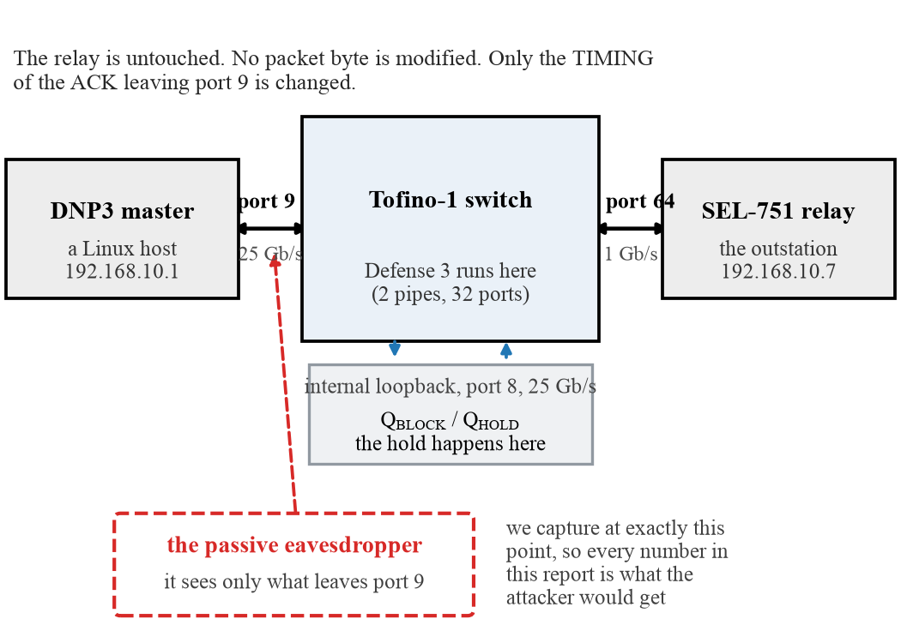
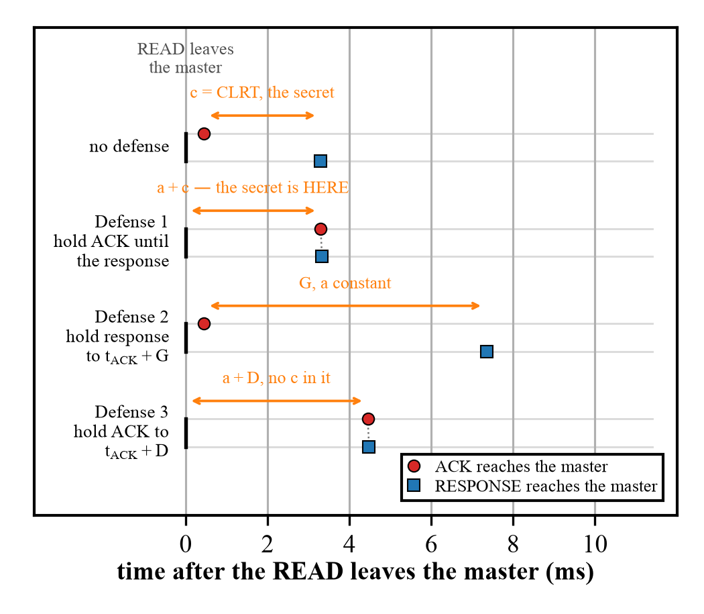
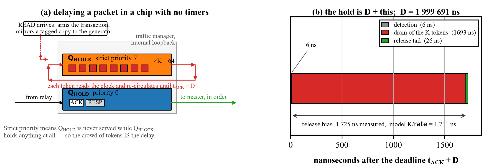
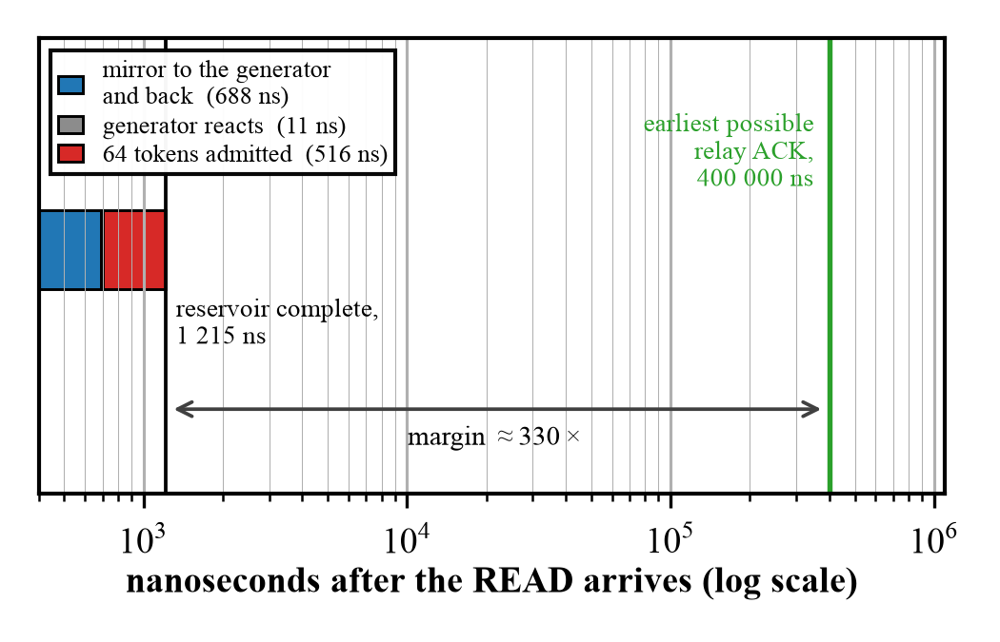
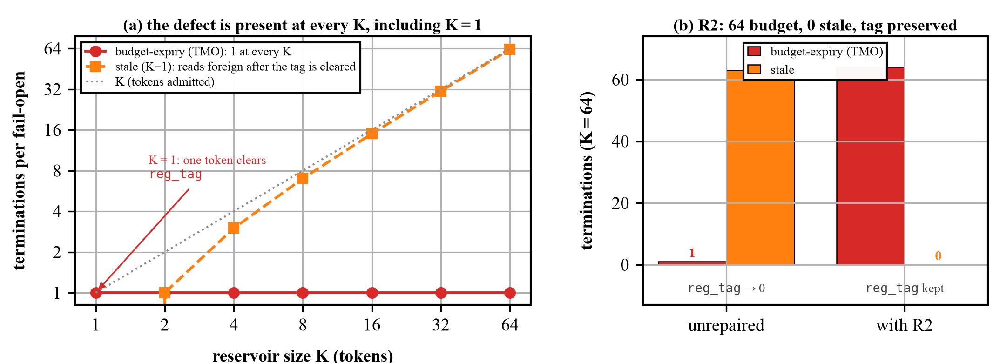
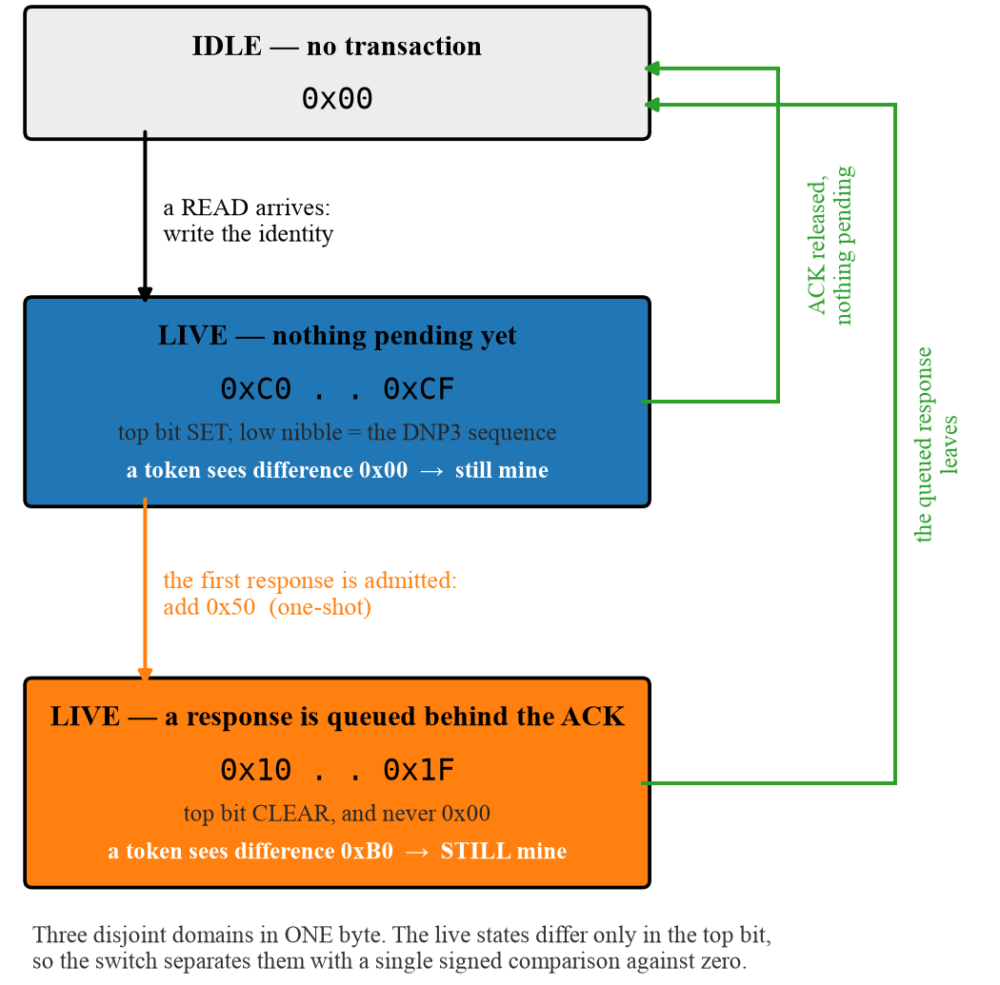
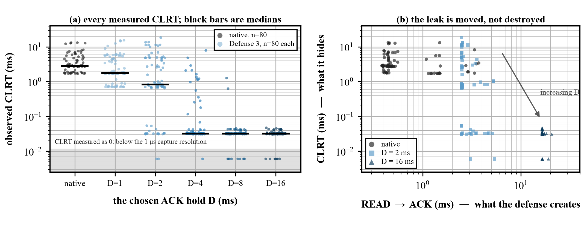
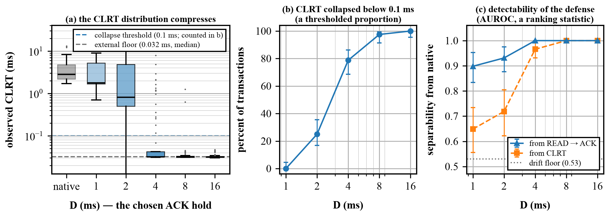
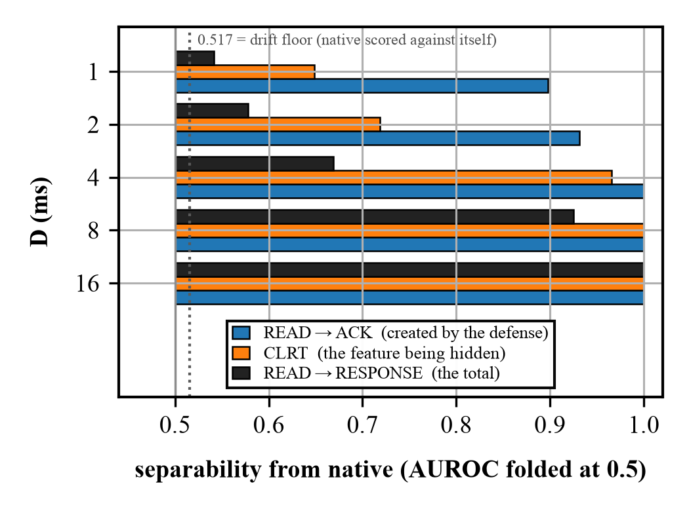

# Defense 3 — full report

A predetermined acknowledgement delay for DNP3, implemented in the data plane of an Intel
Tofino switch, and validated against a real SEL-751 protection relay.

> **⚠ CORRECTED 2026-07-30 after an external audit, then REPAIRED.** Every correction the
> audit demanded that I could verify is applied below and marked **[AUDIT]**. It found three
> defects; **all three are now repaired and each is validated on silicon** — R1 (a RESPONSE
> marking before validation) across two live campaigns totalling 1 920 transactions (1 600
> defended) plus Gate 4 case F; R2 (fail-open
> not generation-qualified) at two budgets, the path now crediting all 64 tokens instead of
> 1; R3 (a host-injected `0x88C1` entering the queue) via an in-switch forged-frame injector
> that R3 drops (§7.5–§7.8, §10.5). §9.8's stale-response PASS was withdrawn and
> **re-established on the repaired build with master-side capture**; the transaction count,
> the D = 16 ms distribution, the fail-open margin, the trap classification and the strength
> of the headline claims are all corrected. **What is not established is the repairs against
> a real network attacker** — the injectors are in-switch stand-ins, not wire frames from an
> external host (§12.2). Two further items stay open and are not claimed done: defect 2's
> *cross-transaction* generation-wrap case is model-checked rather than physically reproduced,
> and the parser uninitialized-`meta` compiler warning is unresolved — see the final-status
> matrix at the end of §12. It is **not** accurate to say every audit item is finished. Full
> verification: [`AUDIT_RESPONSE.md`](AUDIT_RESPONSE.md).

**A typeset single-column PDF of this report, with all nine figures, is
[`REPORT.pdf`](REPORT.pdf)** (36 pages, built from [`REPORT.tex`](REPORT.tex) with
`tectonic`). This Markdown file and the PDF carry the same content; the PDF is the one to
read on paper or to hand to someone else.

**This report assumes no prior knowledge.** It explains the problem, the vocabulary, the
arithmetic, the implementation, every mistake found along the way, all the measurements,
and what may and may not be claimed. Nothing is left out, including the parts that did not
work and the parts that are still unknown.

---

## Contents

1. [The setting, in plain terms](#1-the-setting-in-plain-terms)
2. [The vocabulary you need](#2-the-vocabulary-you-need)
3. [The leak: what CLRT is and why it identifies a device](#3-the-leak-what-clrt-is-and-why-it-identifies-a-device)
4. [The three possible defenses, and why this one](#4-the-three-possible-defenses-and-why-this-one)
5. [How you delay a packet inside a switch that has no timers](#5-how-you-delay-a-packet-inside-a-switch-that-has-no-timers)
6. [The arithmetic](#6-the-arithmetic)
7. [The implementation, and four hardware traps](#7-the-implementation-and-four-hardware-traps)
8. [The state machine, and the bug that took two attempts](#8-the-state-machine-and-the-bug-that-took-two-attempts)
9. [Validation on synthetic traffic: gates 1 to 4](#9-validation-on-synthetic-traffic-gates-1-to-4)
10. [Validation on the real relay](#10-validation-on-the-real-relay)
11. [The D-sweep campaign, the data, and the analysis](#11-the-d-sweep-campaign-the-data-and-the-analysis)
12. [What may and may not be claimed](#12-what-may-and-may-not-be-claimed)
13. [How to reproduce everything](#13-how-to-reproduce-everything)
14. [Every mistake made, and what it cost](#14-every-mistake-made-and-what-it-cost)

A typeset single-column version of everything below is [`REPORT.pdf`](REPORT.pdf).

---

## 1. The setting, in plain terms

An electrical substation contains **protection relays** — devices that watch the current
and voltage on a power line and trip a breaker if something goes wrong. A control centre
talks to them over a network using an industrial protocol called **DNP3**. A typical
exchange is boring and constant: the control centre asks "what is your status?", the relay
answers with a list of measurements. This repeats every second or so, forever.

An attacker who can see that network traffic — a passive eavesdropper, not someone who can
inject or modify anything — would like to know **what equipment is installed**. Knowing
that a particular cabinet contains an SEL-751 rather than some other relay tells them which
vulnerabilities to try, which firmware to study, and what the substation is protecting. In
security terms this is **reconnaissance**, and it is the step before an attack.

You might think encryption solves this. It does not, for two reasons. First, a great deal
of installed DNP3 is unencrypted. Second, and more importantly, **encryption hides the
contents of messages but not their timing**. If a device always takes about 3 milliseconds
to think before it answers, that 3 milliseconds is visible whether or not the answer is
encrypted. Timing is a side channel.

This project is about closing one specific timing side channel, in the network, without
touching the relay and without modifying a single byte of any packet.



**Figure 8.** Where the switch sits. The relay and the master are both untouched; the switch
between them runs the defense. Measurement is taken at the same point the eavesdropper is
assumed to observe, so every number in this report is a number the attacker could obtain.
Port numbers, front-panel positions and link speeds were read out of the live switch
configuration, not taken from a configuration file (§10.1).
Source: `figures/src/fig8_topology.py`.

---

## 2. The vocabulary you need

**DNP3** — the protocol. For our purposes it runs over TCP, and a "poll" is one
request/response pair.

**A Class-0 READ** — the most common DNP3 request: "send me your current static data". It
is read-only. Nothing in this project ever sends a command that could change the relay's
state; see §12.

**TCP acknowledgement (ACK)** — TCP is the transport underneath. When a machine receives
data it sends back a tiny, empty packet saying "got it". That is an ACK. It is generated by
the operating system's network stack, almost immediately, and carries no application data.

**Separate-ACK versus combined-ACK devices.** When the relay receives a READ, two things
have to happen: TCP must acknowledge the bytes, and the relay's application must compute
an answer. Some devices send the TCP ACK immediately and the answer later — two packets,
**separate ACK**. Others wait and put the acknowledgement and the answer in one packet —
**combined ACK**. This distinction is the whole ballgame, and it is why this work is
labelled **Case A**:

- **Case A = a separate-ACK device.** The SEL-751 is one. There are two packets, so there
  is a measurable gap between them. **This is the case Defense 3 addresses.**
- **Case B = a combined-ACK device.** One packet, so there is no gap to measure and
  nothing to hide. Out of scope.

**CLRT — Cross-Layer Response Time.** The gap, on a separate-ACK device, between the TCP
acknowledgement and the application's answer:

```
CLRT  =  (time the RESPONSE is seen)  −  (time the ACK is seen)
```

The name says what it is: a time interval measured *across* two layers — the transport
layer's ACK and the application layer's response.

**Tofino** — a programmable network switch chip. Unusually, you write a program that says
what the switch does to each packet. The language is **P4**. A Tofino is not a computer: it
has no loops, no waiting, and a strict budget of processing "stages" through which every
packet marches in lockstep. Everything in §5 follows from those constraints.

**D** — the parameter of this defense. The chosen amount of time to hold the ACK back.

---

## 3. The leak: what CLRT is and why it identifies a device

When a relay receives a READ, its TCP stack acknowledges the bytes within a fraction of a
millisecond. Then its application firmware wakes up, gathers measurements, formats a DNP3
response, and sends it. The time that second step takes depends on the relay's CPU, its
firmware, its scheduler, how much data it has to format — in other words, **on what the
device is**. Different models differ. That is what makes CLRT a fingerprint.

The prior work that established this (Formby et al.) treats CLRT as a **physical property
of the device** and uses it to identify equipment on a network. So the defensive objective
this project inherited is exactly: **make the observed CLRT stop revealing the device.**

Here is what we measured on the real SEL-751, with no defense running — 80 polls:

| | value |
|---|---|
| CLRT median | **2.828 ms** |
| CLRT standard deviation | **2.854 ms** |
| CLRT 95th percentile | 12.222 ms |
| CLRT maximum | 13.175 ms |

That spread is the information. A device whose CLRT is always about 2.8 ms with occasional
excursions to 13 ms looks different from a device whose CLRT is always 0.4 ms. The
**standard deviation** — how much the value moves around — is the number to watch
throughout this report, because a defense that leaves the spread intact has not hidden
anything.

---

## 4. The three possible defenses, and why this one

Given a two-packet exchange (ACK, then RESPONSE) and a switch sitting in the middle, there
are three things the switch can do to the gap between them.

**Defense 1 — hold the ACK until the response arrives, then release both.** The gap
collapses to nearly zero. Already built in this project. Its flaw: the switch releases the
ACK *when the response arrives*, so the ACK's own timing now depends on the response. The
interval from READ to ACK becomes (relay ACK time + CLRT), and the CLRT is still in there,
just moved.

**Defense 2 — forward the ACK immediately, hold the RESPONSE until a fixed deadline G.**
Also already built, and proven on this hardware against this relay. The observed CLRT
becomes G, a constant. Its cost is latency: the response is genuinely late by up to G.

**Defense 3 — this work. Forward nothing on demand; hold the ACK until a fixed,
predetermined instant `t_ACK + D`, independent of when the response arrives.** The
response, if it turns up during the hold, queues behind the ACK and goes out just after it.

The reasoning for Defense 3 is arithmetic. Write `a` for the relay's own ACK latency
(READ → ACK, about 0.45 ms) and `c` for the CLRT (the thing we want to hide):

| defense | what the observer sees for READ→ACK | what they see for CLRT | is `c` visible? |
|---|---|---|---|
| none | `a` | `c` | **yes, directly** |
| Defense 1 | `a + c` | ≈ 0 | **yes — inside READ→ACK** |
| Defense 3 | `a + D` | `max(c − D, δ)` | **no, when `D > c`** |

That third row is the point. Because the release instant is chosen *in advance* and does
not depend on the response, `c` appears in **neither** observable, provided `D` exceeds
`c`. `δ` is the small floor left by the release machinery, measured at **32 µs** (§11).

This is why the correct value of `D` is not "the average CLRT" but **larger than the CLRT
you want to hide**. Only transactions faster than `D` are concealed. That single sentence
drove the whole D-sweep in §11.



**Figure 4.** The same exchange with no defense and under each of the three defenses, drawn
to scale with the measured medians (`a` = 0.45 ms, `c` = 2.85 ms). The orange span in each
row is the interval that carries the secret. Under Defense 1 the secret has simply moved
from the CLRT into READ→ACK; under Defense 3 neither interval contains `c`, provided
`D > c`. ACK and RESPONSE are drawn in two lanes per row because under Defenses 1 and 3
they leave within microseconds of one another. Source: `figures/src/fig4_timelines.py`.

---

## 5. How you delay a packet inside a switch that has no timers

This is the hardest part of the whole project, and it is worth understanding because every
number later depends on it.

A Tofino processes a packet in a fixed pipeline and sends it out. **There is no
instruction that means "hold this packet for 2 milliseconds."** There is no timer you can
attach to a packet, no sleep, no delay queue you can program with a deadline. Packets go
in and come out.

What the chip *does* have is a **traffic manager** with queues and **strict priority**. If
queue 7 is set to strict priority over queue 1, then as long as queue 7 has anything in it
at all, queue 1 is not served. That is the lever.

So the mechanism is:

1. Put the ACK we want to delay into **Q_HOLD** (queue 1, low priority) on an internal
   loopback port.
2. Fill **Q_BLOCK** (queue 7, strict high priority) with dummy packets — we call them
   **blocker tokens** — so that Q_HOLD is starved and the ACK cannot leave.
3. Have each blocker token, when it is served, look at the clock, decide whether the
   deadline has passed, and if not, **send itself around the loop again**. A token that
   re-circulates keeps Q_BLOCK non-empty.
4. When the deadline passes, every token stops re-circulating and is dropped. Q_BLOCK
   empties. Q_HOLD is served. The ACK leaves.

The delay is therefore produced by **a self-sustaining crowd of dummy packets that get out
of the way at the right moment**. Nothing waits; everything is a packet being processed
normally, over and over.



**Figure 2.** *(a)* The construction. `Q_BLOCK` sits at strict priority 7 and `Q_HOLD` at
priority 0 on the same internal loopback port, so `Q_HOLD` is never served while a single
token remains in `Q_BLOCK`. Each token reads the clock as it passes and sends itself round
again until the deadline. *(b)* What happens after the deadline, at nanosecond scale,
measured on the physical relay — the hold is `D` plus these three terms, and `D` itself is
1 999 691 ns, three orders of magnitude larger. Source: `figures/src/fig2_mechanism.py`.

Three consequences that matter:

**Why 64 tokens and not one?** A single token would leave gaps: after it is served it takes
a fraction of a microsecond to come back around, and in that window Q_BLOCK is empty and
the ACK escapes. You need enough tokens in flight that the queue is *never* momentarily
empty. K = 64 was established by earlier work in this project as sufficient, and every
measurement here confirms it. The exact 64 is not claimed to be minimal.

**Where do 64 tokens come from?** The switch generates them itself. Tofino has a **packet
generator** that can be triggered by a pattern in a re-circulated packet. When the READ
arrives and arms a transaction, the switch mirrors a small tagged copy of it to the
generator's port; the generator recognises the tag and emits 64 tokens. No external host is
involved, which matters because a defense that needs a server to feed it is not a defense.

**What if something goes wrong?** Each token carries a **budget** — a maximum number of
loops. If the deadline somehow never arrives, tokens exhaust their budget and stop anyway.
This is the **fail-open** path: the defense gives up and lets the packet through rather
than holding it forever and breaking the connection. §6 gives the arithmetic that sets the
budget.

---

## 6. The arithmetic

Four numbers govern the mechanism. All are measured or derived, none are guessed.

### 6.1 The deadline, and why D is quantized

The switch stores the deadline as a 32-bit word. The low byte is reserved as a flag
("armed"/"not armed"), so the actual time lives in the upper 24 bits, counted in units of
**256 nanoseconds** — one "tick".

To hold for D milliseconds:

```
ticks   = round(D × 1 000 000 / 256)
word    = ticks << 8          (low byte zero, so the armed flag survives addition)
```

For D = 2 ms:

```
ticks = round(2 000 000 / 256) = 7 812
word  = 7 812 << 8            = 1 999 872        →  D_realized = 1.999872 ms
error = 2 000 000 − 1 999 872 = 128 ns short
```

**Every "D = 2 ms" in this report actually means 1 999 872 ns.** The 128 ns shortfall is
quantization and is not a defect. `D` is clamped at 40 ms, above which the hold would start
to overlap the next poll.

### 6.2 The release bias: why the hold is longer than D

When the deadline passes, the tokens do not vanish simultaneously. Each one only learns the
deadline has passed the next time it is *served*. Draining 64 tokens out of a queue at the
loop's packet rate takes time:

```
τ  =  K / rate_dp8  =  64 / 37 400 000 packets per second  =  1 711 ns
```

where 37.4 million packets per second is the **measured** rate of the 25 Gbit/s internal
loopback for the small frames involved. So the ACK is not released at the deadline; it is
released at approximately `deadline + τ`.

This matters enormously for honest measurement. If you score the hold against `D` you see a
systematic **+1 711 ns** error on *every* transaction and will be tempted to call it jitter.
The correct target is `D + τ`. Every deadline number in this report is reported both ways —
raw against `D`, and corrected against `D + τ`.

**And τ was verified independently, which is the part that matters.** Originally `τ` was a
model whose only evidence was the residual it removed — circular reasoning. Instrumentation
was added to timestamp the *first* and *last* token terminations, so the drain could be
measured directly:

```
predicted τ = 1 711 ns          measured drain = 1 692 – 1 696 ns        agreement: 1.1 %
```

The full decomposition of a hold, from the synthetic gate:

```
hold  =  2 001 505 ns
      =  1 999 763  (D, tick-quantized)
      +      1 692  (drain: first token termination → last)
      +         27  (release tail: last token gone → ACK out)
      +         23  (detection: deadline passed → first token noticed)
```

Each term is measured separately. Nothing in that line is inferred.

**[AUDIT] Two different quantities were both called "the release tail". They are not the
same event and they differ by three orders of magnitude.** From here on:

| name | value | what it measures |
|---|---|---|
| **internal release tail** | 26–27 ns | last token termination → the held ACK's loopback return, inside the switch |
| **external ACK→RESPONSE floor** | ~32 µs | the gap an observer captures at the master when both packets leave back to back |

The external floor is *not* the internal tail scaled up. It contains switch output queuing,
frame serialization, link traversal, NIC processing and host capture behaviour, none of
which the internal figure includes. Every later mention of "32 µs" means the external
floor.

**[AUDIT] The drain model is off by one.** The interval from the *first* termination to the
*last* spans K − 1 gaps, not K:

```
(K−1)/rate = 63 / 37.4e6 = 1 684.5 ns        measured 1 692–1 696 ns   (error  9.5 ns)
 K   /rate = 64 / 37.4e6 = 1 711.2 ns        measured 1 692–1 696 ns   (error 17.2 ns)
```

The measurement fits `(K−1)/rate` better. `K/rate` remains the right figure for the
reservoir's full circulation period, and the release bias it predicts is still correct to
about 1 %, but the earlier claim that the drain "independently verifies K/rate" was
imprecise.

### 6.3 The fail-open horizon

Each token may loop at most `B` times. With K tokens sharing the loop, the wall-clock time
before the last one gives up is:

```
H  =  B × K / rate_dp8  =  B × τ
```

With B = 18 000: `H = 18 000 × 1 711 ns = 30.802 ms`.

**[AUDIT] The constraint below was written against the wrong quantity.** The budget starts
when the reservoir is created, which is a few hundred nanoseconds after the READ — but the
deadline is `t_ACK + D`, and `t_ACK` can be milliseconds later. So the horizon has to clear
the relay's own acknowledgement latency as well:

```
H  >  a + D + detection + drain + tail          (a = the relay's READ→ACK latency)
```

Measured against the campaign's own worst-case `a` per arm:

| arm | worst observed `a` | `a + D` | margin `H/(a+D)` |
|---|---|---|---|
| D = 1 | 4.608 ms | 5.608 ms | 5.49× |
| D = 2 | 3.399 ms | 5.399 ms | 5.71× |
| D = 4 | 5.651 ms | 9.651 ms | 3.19× |
| D = 8 | 1.509 ms | 9.509 ms | 3.24× |
| **D = 16** | **4.673 ms** | **20.673 ms** | **1.49×** |

An earlier version of this section quoted **8.8×**, computed as `H / 3 ms` using a stale
design point and omitting `a` entirely. **The true worst-case margin in this campaign was
1.49×**, at D = 16 ms. Fail-open still never fired — but the headroom is a third of what
was claimed, and a transaction with the historically observed 22 ms READ→ACK would have
exceeded the budget at D = 16.

**And the advertised parameter range is arithmetically impossible.** The control plane
clamps `D` at 40 ms while `B = 18 000` gives `H = 30.802 ms`. At the clamp the budget
expires *before* the deadline can arrive, even with an instantaneous acknowledgement. Either
`B` must be computed from `a_max + D`, or `D_MAX` must come down to roughly `H − a_max − ε
≈ 24 ms`. §12.3's line that the 40 ms boundary "blocks nothing already claimed" was wrong:
it blocks the correctness of the supported range.

`H` has to sit in a window. Too small and it fires during a legitimate hold, silently
turning a D-governed delay into a budget-governed one. Too large and it approaches TCP's
retransmission timeout (~200 ms measured), at which point the master gives up and
retransmits, which is a real fault.

```
worst measured a + D (D = 16 ms):    H / 20.673 =  1.49 ×  thin but clear
TCP retransmission timeout:          200 / 30.8 =  6.5 ×   clear
D at the configured 40 ms clamp:     H / 40     =  0.77 ×  INFEASIBLE
```

An inherited comment in the code assumed 10 µs per loop, giving a horizon 5.8× wrong. It
was replaced with the formula, because a wrong model gives a wrong answer the moment K, B
or the port speed changes. **Fail-open fired zero times in every test in this report**, which
is the outcome you want: the safety net exists and was never needed.

### 6.4 The trigger chain

How long after the READ does the reservoir actually exist? Measured over **100 clean
trials**, with a total spread of **4 ns**:

| step | time |
|---|---|
| READ arrives → tagged copy returns to the generator | **688 ns** |
| generator recognises the pattern → first token admitted | **11 ns** |
| all 64 tokens admitted (the burst itself) | **516 ns**, ≈ 8 ns per token |
| **READ → full 64-token reservoir** | **1 215 ns** |

Compare that with the relay's own ACK latency — the earliest moment there is anything to
hold — measured at **0.453 ms median, 0.400 ms minimum**. The reservoir is ready **~330×
sooner than it needs to be**. There is no race here, and the cold first trial after a
program load sits inside the warm distribution, so there is no warm-up cost either.



**Figure 6.** The trigger chain against the deadline it has to beat, on a logarithmic axis
because the two live three orders of magnitude apart. The reservoir is complete 1 215 ns
after the READ; the earliest the relay's own ACK can arrive is 400 000 ns. The margin is
~330×, which is why the arming path never races the traffic it protects.
Source: `figures/src/fig6_trigger.py`.

---

## 7. The implementation, and four hardware traps

The switch program is `p4/case_a_defense3_fixed_ack_delay.p4`. Its shape is simple: decide
in the parser what each packet *is*, resolve every remaining condition in **one** table
lookup, then act. What is not simple is the hardware. Four separate traps were found.

**[AUDIT] They are not all the same kind of thing, and an earlier version of this section
wrongly said the compiler "accepted all four without complaint" — which contradicts §7.3,
where the compiler emits a hard error.** Classified honestly:

| # | trap | what the toolchain did |
|---|---|---|
| 7.1 | large constant in a stateful ALU | **confirmed silent target anomaly** — compiled, ran, wrote nothing, no diagnostic |
| 7.2 | unsigned `v < 0` | **programmer type error with a missing diagnostic.** `v < 8w0` on a `bit<8>` is *correctly* false; the compiler is not wrong, it simply never warned that the predicate is vacuous |
| 7.3 | a fifth RegisterAction | **hard compiler error** — loud, immediate, unmissable |
| 7.4 | a timer firing in both pipes | **documented target behaviour** we had not accounted for |

Only 7.1 is a case of the hardware doing something other than what the program said.

### 7.1 Trap one — a large constant in stateful hardware silently does nothing

The switch keeps a small amount of memory that a packet can read *and* modify as it passes:
a **register** with a tiny attached processor, the **stateful ALU** or SALU. One register,
`reg_tag`, holds the "which transaction is currently live" marker.

The code said: *if the marker says idle, write my transaction's identity into it.* Idle was
originally encoded as `0xFF`.

On hardware, **the write never happened.** The transaction never became live, so all 64
blocker tokens were rejected and the relay's ACK was refused. But the same tiny processor
also *returns* a value, and that return path worked perfectly — so a counter said "a new
transaction was armed" while the register said no transaction existed. That contradiction
produced two wrong diagnoses before the compiled assembly was read:

```
tag_arm:
- sub hi, phv_lo, lo        ; the RETURN value   -- worked
- equ lo, lo, -255          ; the PREDICATE      -- never true
- alu_a cmplo, lo, phv_lo   ; the conditional write, therefore never executed
```

Changing idle from `0xFF` to `0x00` made the predicate `equ lo, lo` — a compare against
zero, needing no embedded constant — and the write began to commit: tokens admitted went
from **0 to 64**.

**A correction against ourselves, which is why the probe exists.** The obvious explanation
is "255 is too big for the instruction's constant field". `p4/probe_salu_immediate.p4`
tests that by comparing thirteen registers against K = 1, 2, 7, 8, 15, 16, 63, 64, 127, 128,
192, 254, 255. **The compiler emits `equ lo, lo, -K` for every single one, identically, with
no error and no warning.** So the assembly *cannot* tell a safe constant from an unsafe one,
and the width explanation is an inference consistent with the evidence, not a proof. The
repair is confirmed behaviourally on silicon; the mechanism is not.

The usable rule is therefore structural, not an inspection:

> **Never compare stateful state against a large constant. Compare against zero, or against
> a value carried in the packet.**

It is enforced by a test (`analysis/test_tag_domain.py`), not by discipline. After the
repair, exactly **one** constant comparison remains anywhere in the program — against 2 —
and that one is proven working on hardware.

### 7.2 Trap two — a sign test that is always false

Later work needed "is the top bit of this byte set?", which is naturally written as "is this
value negative". Written the obvious way on an unsigned byte:

```p4
if (v < 8w0) { ... }        // compiles fine, emits:  lss.u lo, lo
```

`lss.u` is an **unsigned** less-than-zero. It is never true. The compiler reported success.
With an explicit signed cast:

```p4
if ((int<8>)v < 8s0) { ... }                        // emits:  lss.s lo, lo   -- correct
```

**[AUDIT] This is not a miscompile.** An unsigned less-than-zero really is always false;
P4's semantics here are correct and the fault is mine, in the type I wrote. What the
toolchain failed to do was *diagnose* a predicate it could prove vacuous. Calling it a
"silent miscompile", as an earlier version did, was wrong — but a provably-dead predicate
compiling without a word is still a real gap, and it cost the same as one.

One genuine silent anomaly and one undiagnosed type error in the same small piece of
hardware was enough to stop trusting inspection, so `analysis/assert_salu_asm.py` now **fails the build** if the compiled
assembly for the load-bearing predicates contains `lss.u`, or is missing the expected
instructions. It is mutation-checked: reverting the cast makes the compiler exit 0 while the
assertion exits 1.

### 7.3 Trap three — four operations per register, and it is a hard error

Adding a fifth way of touching `reg_tag`:

```
error: Ingress.reg_tag: too many RegisterActions attached to the Register
The target architecture limits the number ... to 4.
```

This forced a genuinely better design. One of the five was a plain read, used by the blocker
tokens. A read is just a modification that adds zero — so the read and the "mark this
transaction" operation were merged into a single operation whose increment arrives in the
packet's metadata: `0x50` to mark, `0` for a plain read. Four operations, no loss.

### 7.4 Trap four — the switch has two pipelines, and a timer fires in both

An early synthetic test emitted three events and observed six. The chip has two pipelines
(`num_pipes = 2`), and enabling a packet-generator application device-wide arms it in
*both*. A pattern-triggered application is masked from this — only one pipeline can see the
trigger — but a timer-triggered one fires everywhere it is armed. Every generator write is
now scoped to one pipeline. Related, from the same session: `pgrep -f bf_switchd`
over-counts (it returned 3 for one process); `pgrep -cx` is correct.

### 7.5 [AUDIT] Three defects — all three repaired and validated on silicon

An external audit found three defects — two state-ordering (defects 1 and 2) and a
host-injected-token admission path (defect 3) — and reading the source confirmed all three.
Since then **all three have been repaired and each validated on silicon**; defect 2's obvious
one-operation repair was shown *not* to fit and a second-register repair was built instead
(§7.6–§7.7). Current status, before the explanation:

| defect | repair | status |
|---|---|---|
| **1 — a RESPONSE marks before its identity is checked** | **R1** | **REPAIRED.** Compiles at 10/12 (live core), 11/12 (live + telemetry, and synthetic), critical path 10. **Validated on silicon in the synthetic build** (Gate 2 PASS, Gate 3 PASS 10/10, Gate 4 PASS on all six cases) **and run against the physical relay** for 960 transactions with the hold, the CLRT compression and the ordering invariant all unchanged (§10.5). |
| **2 — fail-open retirement is not generation-qualified** | **R2** | **REPAIRED, VALIDATED ON SILICON, AND RUN ON THE LIVE BUILD** (§7.7, §10.5). Fail-open now credits all 64 tokens instead of 1, `reg_tag` survives, the next transaction still arms — 28/28 trials at two budgets — and 960 live transactions against the relay show no harm. ⚠ Single-generation only; the *foreign*-token case is model-checked, not produced on hardware. |
| **3 — a host-injected `0x88C1` frame enters the priority queue** | **R3** | **REPAIRED and DEMONSTRATED ON SILICON** (§7.8). A forged `0x88C1` token injected in-switch is dropped at the fresh stage and never reaches the loopback; without R3 the same frame enters. Zero resource cost. |

**Everything measured in §10 and §11 — the physical campaign, the D-sweep, every number in
the results — was collected on the UNREPAIRED build**, with both defects present. The
repairs do not retroactively change any measurement; they change what the mechanism will do
next time.

The repair work, the compile evidence and the refutation of R2 are in
`design/REPAIR_R1_R2_R3.md`; the silicon rerun is in `evidence/repaired/RESULTS.md`.

**The rule both defects break: state is written before it is validated.** The switch
resolves a packet's conditions across pipeline levels, and in both cases the register write
happens at level 2 while the test that authorises it resolves at level 3.

**The rule they both break: state is written before it is validated.** The switch resolves a
packet's conditions across pipeline levels, and in both cases the register write happens at
level 2 while the test that authorises it resolves at level 3.

**Defect 1 — a RESPONSE marks the transaction before its identity is checked.**

```
level 1   class driver sets meta.tag_val = TAG_PENDING_DELTA for a RESPONSE   (p4 1924–1932)
level 2   meta.cur_gen = tag_read_or_mark.execute(0)   <-- THE WRITE HAPPENS HERE  (1973–1978)
level 3   tbl_state_decode.apply()  <-- seq / ack / learned-port resolve HERE      (1990)
```

`CLASS_RESP` is assigned on direction, session and DNP3 framing alone. The stateful ALU's
own guard is `(int<8>)v < 8s0` — a test on the *stored* state, not on *this packet's*
validity. So a correctly framed response on the tracked session with a **wrong TCP
sequence** still marks the live transaction. The legitimate response then reads the pending
marker, is treated as a duplicate and is **dropped**, and the acknowledgement's release
declines to retire — leaving the transaction stuck until fail-open.

**Defect 2 — a foreign zero-budget token can retire the current transaction.**

```
p4 1938   if (meta.budget_zero == 8w1) { meta.tag_val = TAG_INACTIVE; }
p4 1985   meta.tag_diff = tag_rmw.execute(0);   <-- writes it, guarded only by tag_val
p4 1990   tbl_state_decode.apply();             <-- the generation check is HERE
```

The documented `stale > deadline > budget` priority is evaluated in the action block, one
level *after* the write has already committed. A later table cannot undo a stateful-ALU
write. And the parser forces EtherType `0x88C1` to `ROLE_BLOCK` from **any** topology port,
with a legacy branch that enqueues such a frame into the strict-priority queue — so an
injected token with a zero budget reaches this path. The threat model is passive, so that
injection is outside the modelled adversary, but a production build should not carry it.

**Neither defect was observed firing.** Across 400 defended physical transactions,
duplicate suppressions were 0, stale terminations were 0 and fail-open fired 0 times. They
were latent, not manifested — but "not observed" is not "cannot happen", and defect 1
invalidated a test this report previously reported as passing (§9.8).

### 7.6 [AUDIT] What the repairs cost, and why one of them is refuted

**R1 — authorise the marker before writing it. It fits.** The RESPONSE rows of
`tbl_state_decode` mask `tag_diff` out entirely, so the RESPONSE verdict never depended on
`reg_tag` at all: it depends only on the three session-tracker differences, and all three
are produced *before* the tag access. The same conjuncts therefore resolve one level earlier
in a small table and choose the marker delta. An unauthorised RESPONSE now carries delta 0,
which makes the identical stateful operation a pure read. `reg_tag` keeps its placement and
its four operations. Cost: one table and one dependency level — 9 → 10 ingress stages,
critical path 8 → 10. Since stage count now equals critical path the program is
dependency-bound at 10, and with the telemetry registers it would sit at 11/12.

**R2 — generation-qualify the fail-open retire. Three refuted attempts, then a repair.**
The two operations look mergeable into one stateful arm (`if idle, arm` and `if it is mine,
retire` are the same shape). They are not.
`p4/probe_failopen_qualification.p4` reduces the first two walls to a minimal program:

| build | result |
|---|---|
| four operations, unmerged | **compiles** — the control |
| merged into one arm | `error: The input meta.tag_alt to stateful alu reg_tag is not allocated in a valid region on the input xbar to be a source of an ALU operation` |
| kept separate, i.e. a fifth operation | `error: too many RegisterActions attached to the Register` |

A third attempt, packing both operands into one 16-bit field, named the real constraint
outright: `error: Ingress.reg_tag requires more than 2 PHV inputs`. **`reg_tag`'s stateful
ALU has a budget of two PHV inputs shared across all four of its operations, and it was
already full** (`gen_in` and `tag_val`). No third source can be added, however packaged.

**The repair works by not needing one.** Two observations. The fail-open write never
released anything — the held ACK leaves because the budget-zero token *drops itself* and
`Q_BLOCK` empties — so its only job was to let the **next** READ arm. And on the ARM path
`meta.tag_val` is dead. So the note rides on `tag_val`, an operand `reg_tag` already has,
and **the generation qualification moves from the producer to the consumer**:

```
producer   a budget-zero token records the generation IT carries, in reg_failopen.
           Unconditional, and harmless: a note naming a generation is not a
           destructive write.
consumer   the next READ arms if reg_tag is idle OR equals the noted generation.
           A foreign token's note names a generation that is not the live one,
           so it can never authorise anything.
```

The note is cleared as it is read, so it authorises at most one arm. Cost: **none** on top
of R1 and R3 — 11/12 stages, critical path 10, identical without it.

**The note is an *observation*, not proof of ownership.** A stale or foreign budget-zero
token also writes `reg_failopen` (the injection matrix shows a foreign 0xC1 token recording
`note = 0xC1`), because the producer is unconditional. Safety comes entirely from the
*consumer*: the next READ arms over the note only if `reg_tag == reg_failopen`, so a
mismatching note can never authorise a takeover. Three invariants must stay tested — every
READ consumes or clears the note; a mismatching note cannot authorise; and an old matching
note cannot survive until the generation value is reused. R3 closes the external
forged-token route, but *internal* stale tokens can still write mismatching notes, so R2
must remain safe independently of R3 — which the consumer equality check ensures.

Verified offline three ways. The compiled assembly is *asserted* to contain both
comparisons and a write predicated on their OR (`alu_a (cmplo | cmphi)`), because a
predicate that compiles and is never true is exactly the trap of §7.1 and §7.2. The state
model gained 321 assertions over all sixteen generations and all ordered foreign pairs. And
the suite is mutation-checked: dropping the note comparison gives 16 failures, arming
unconditionally 224, making the note reusable 16. **R2 was subsequently loaded and validated
on silicon at two budgets; see §7.7.**

**R3 — refuse host-injected blocker frames. Free.** 9 ingress stages, critical path 8,
resources bit-identical to baseline. It matters more than its size: it removes the only
*practical* route to defect 2. Without an injectable token, reaching defect 2 requires a
blocker to outlive its own generation's deadline, which was never observed in 25 600 tokens.

**A repair that broke the mechanism, caught by Gate 2 on the first transaction.** R1's first
version gave its authorisation table a catch-all default action setting `tag_val = 0`. That
reaches every packet class, and for every class other than the RESPONSE the tag arm is
`tag_rmw`, whose write is guarded by `tag_val != TAG_NO_WRITE` — so it became an
unconditional write of `TAG_INACTIVE`. The READ armed the generation and the mirrored
trigger clone, returning ~700 ns later, wiped it: `PKTGEN_ADMIT=0`, `PKTGEN_DROP=64`,
`ACK_REJECT=1`. Fixed by making "not authorised" a CLASS_RESP *entry* rather than the table
default. It is worth recording that this defect passed 2 354 offline assertions and a
compile-fit check first: **the offline model covers the state machine, not which table
default reaches which packet class.**

### 7.7 [AUDIT] R2 on silicon, and a defect fingerprint that was already in the evidence

**A correction first.** I wrote that fail-open "has fired 0 times in every campaign, so the
path has never executed on silicon". That is true of the gates and both D-sweeps, where the
deadline always beat the budget — but `--check2` is READ-only by construction, so no ACK
arrives, no deadline is armed, and the tokens can *only* terminate on the budget. The path
had been executing all along. What had not been done was reading what it recorded.

**The defect was visible in evidence collected a day earlier.** Unrepaired build, 60
trials, every single one:

```
BLOCK_TERM_TMO = 1        BLOCK_TERM_STALE = 63        reg_tag afterwards = 0
```

One token terminates on the budget and sixty-three are credited as *stale*. That 1/63 split
**is** the defect: the first token to reach budget zero writes `TAG_INACTIVE` with no
generation test, and the other 63 then compute `gen_in − 0 ≠ 0`, read as a foreign
generation and are dropped. Both outcomes are "token terminated", so nothing looked wrong.

**R2 predicts 64 and 0, and that is what the hardware gives.** Two arms, 28 trials each:

| | unrepaired | R2, B = 18 000 | R2, B = 500 |
|---|---|---|---|
| `BLOCK_TERM_TMO` | 1 | **64** | **64** |
| `BLOCK_TERM_STALE` | 63 | **0** | **0** |
| `BLOCK_LOOP` | 1 152 000 | 1 152 000 | **32 000** |
| `reg_tag` afterwards | 0 (cleared) | **0xC0 (preserved)** | **0xC0 (preserved)** |
| next trial `ARM_FRESH` / `PKTGEN_ADMIT` | 1 / 64 | **1 / 64** | **1 / 64** |

The recovery property survives, which was the risk in not clearing `reg_tag`: the next READ
arms through the note and its reservoir is admitted in full, `ARM_BUSY = 0` throughout. And
the budget arithmetic is confirmed exactly — `BLOCK_LOOP = K × B` on the nose at both
budgets, which is the model `H = B·K/rate` rests on.

**One guard had to be scoped.** The shrunk budget was first *refused*: `H = 0.856 ms ≤
a_worst + D = 24 ms`, i.e. the budget would fire during a legitimate hold. Correct in
general — that is the §6.3 failure mode — but the wrong test for a READ-only trial, where no
ACK arrives and there is no hold to cut short. It is now gated behind an explicit
`--read-only-trial`; the general case is untouched. **A safety check that fires on the one
scenario a mechanism exists for is usually mis-scoped, not too strict, and the fix is to
narrow its precondition rather than remove it.**

**The single-token case is now pinned down (§7.8's K-sweep).** On the unrepaired build a
reservoir of *one* native token gives TMO = 1, STALE = 0, `reg_tag` cleared — so a single
budget-zero token does write the tag, and `1 / K−1` is the mechanical cascade at larger K.
R2 turns every K into K budget terminations, 0 stale, tag preserved.

⚠ **These trials are single-generation.** The token reaching budget zero always carries the
live generation, so they exercise note-and-recover and the within-transaction accounting,
**not** the *cross-transaction* case — a token from a retired transaction clearing a
*different* live one. That needs the generation-wrap coincidence and remains model-checked
(321 assertions over all ordered foreign pairs), not reproduced on hardware. Detail:
`evidence/failopen/RESULTS.md`, `evidence/ksweep/RESULTS.md`.

### 7.8 [AUDIT] Injecting the adversarial frames, and a defect narrower than it read

The three cases the relay will not produce — a mis-sequenced response (R1), a foreign token
at budget zero (R2), an injected `0x88C1` frame (R3) — all reduce to putting a chosen frame
on a switch port. The lab cannot do that from a host (no raw socket on the master, no host
on the relay leg), so the injector is built **inside the switch**, under a flag
`D3_INJECT`: a parser path that treats a tagged generator frame as a fresh, host-injected
`0x88C1` token carrying an attacker-chosen generation and budget. It compiles at the same
11/12 and is a no-op when the flag is absent.

**R3 is now demonstrated on silicon** — it had been completely unexercised. Injecting the
forged token across builds:

| | `reg_tag` after | note (`reg_failopen`) | reached the loopback? |
|---|---|---|---|
| no repairs, inject 0xC0 | 0xC0 | — | yes (TMO) |
| R1+R2, inject 0xC0 | 0xC0 | **0xC0** | yes (TMO) |
| **R1+R2+R3**, inject 0xC0 | 0xC0 | 0 | **no — dropped fresh** |

Under R3 the frame is dropped at the fresh stage and never reaches the strict-priority
queue; without R3 it enters. And **R2's note mechanism is shown executing** — with R2 the
injected token's generation is recorded in `reg_failopen` and `reg_tag` is preserved.

**[AUDIT] A counter that misreported the drop, corrected and re-verified.** The first
injector build counted the R3 drop with `BLOCK_ENQ`, the same counter that elsewhere means
*residence in* `Q_BLOCK` — so a dropped frame wrongly incremented an "enqueued" tally. The
P4 now increments a distinct `BLOCK_REJECT` on the R3 drop, and `BLOCK_ENQ` fires only on an
accepted `to_block()`. Re-run on silicon (foreign gen 0xC1, seq 0, 0xC0 live): the R1+R2
build gives `{BLOCK_ENQ:1, BLOCK_TERM_STALE:1}` with `reg_failopen = 0xC1` (the accepted
token is enqueued, then stale-dropped at dequeue, and R2 noted its generation), while
R1+R2+R3 gives `{BLOCK_REJECT:1}` alone — no enqueue, no dequeue-side termination,
`reg_failopen = 0`. The drop behaviour is unchanged; only the accounting is now correct.

**A puzzle the injector raised, and a microbenchmark that resolved it.** The *injected*
token above did **not** clobber `reg_tag` on any build — including the pure-defect one — which
seemed to say the write never fires. That was an **injection-harness artifact**, not a fact
about the mechanism, and a fail-open *K*-sweep on the **native** reservoir settled it.

The sweep runs a READ-only fail-open (no ACK, so the budget is the only terminator) at
reservoir sizes `K = 1, 2, 4, … , 64` on the pure-defect build, and reads the terminations
and `reg_tag`:

| K | 1 | 2 | 4 | 8 | 16 | 32 | 64 |
|---|---|---|---|---|---|---|---|
| budget-expiry (TMO) | **1** | 1 | 1 | 1 | 1 | 1 | 1 |
| stale | **0** | 1 | 3 | 7 | 15 | 31 | 63 |
| `reg_tag` after | **0** | 0 | 0 | 0 | 0 | 0 | 0 |

**TMO = 1 and STALE = K − 1 at every K, and `reg_tag` is cleared even at K = 1.** So the
write the audit predicted *does* fire — from a single **native** token — and the
`1 / K−1` cascade is its mechanical consequence: the first budget-zero token clears the tag,
and every later token then reads foreign and terminates stale. The injected token was the
anomaly, because a frame forged through the legacy path with `seq = 0` from the start does
not traverse the same write as a token that was admitted and looped its budget down. **The
defect is real and reproduces at K = 1**; my earlier "a single token does not clobber" was
wrong about the native path.

**What this does and does not settle.** It is a *within-transaction* effect — every token
carries the live generation, so clearing `reg_tag` is that transaction's own fail-open, and
the harm is the corrupted accounting (1 TMO / K−1 STALE instead of K / 0) and the lost
reservoir ownership. R2 fixes it to K TMO / 0 STALE with `reg_tag` preserved (§7.7). The
*cross-transaction* clobber — a token from a *retired* transaction clearing a *different*
live one — is a separate claim that still needs the generation-wrap coincidence and remains
model-checked, not reproduced; but the write it depends on is now confirmed real and
single-token on silicon. Detail: `evidence/ksweep/RESULTS.md`,
`evidence/inject/RESULTS.md`.



**Figure 9.** *(a)* On the unrepaired build the budget-zero terminations are 1 (budget) and
K−1 (stale) at every reservoir size, including K = 1 — one native token clears `reg_tag` and
the rest read foreign, so the defect is not an emergent effect of size. *(b)* R2 turns the
same event into K budget terminations and 0 stale, and preserves `reg_tag`. Source:
`figures/src/fig9_ksweep.py`.

---

## 8. The state machine, and the bug that took two attempts

### 8.1 What the state has to express

One register byte, `reg_tag`, has to express three things at once:

| meaning | encoding | how it is distinguished |
|---|---|---|
| no transaction in progress | `0x00` | the value zero |
| a transaction is live, no response has arrived yet | `0xC0`–`0xCF` | **top bit set** |
| a transaction is live and its response is already queued | `0x10`–`0x1F` | **top bit clear**, never zero |

The `0xC0`–`0xCF` range is not arbitrary. DNP3's application header byte for a
first-and-final, solicited, unconfirmed request is `0xC` in the top nibble and a 4-bit
sequence number in the bottom — so the protocol *hands us* a per-transaction identity in
the range `0xC0`–`0xCF`, and the parser only accepts a READ whose byte is in that range.
That is also the proof that **no live transaction identity can ever be zero**: there is no
arithmetic on it anywhere, the sequence advances inside the low nibble only, and the top
nibble is pinned by the parser's own acceptance test.

The third state is reached by **adding `0x50`**: `0xC0 + 0x50 = 0x10`. That is one hardware
instruction (`add`), it is one-shot for free (adding `0x50` clears the top bit, so the same
operation applied twice does nothing the second time), and it **keeps the identity** — the
low nibble still says which transaction. It is a state, not a flag.



**Figure 5.** The transaction state machine: three disjoint domains inside one byte. The two
live states differ only in the top bit, so the switch separates them with a single signed
comparison against zero (§7.2). The white lines inside the live boxes are what a circulating
blocker token computes — the identity it carries minus the value it finds. Because the
marking transition *adds* a constant rather than overwriting, that difference is `0x00`
before marking and `0xB0` after, so one extra table entry covers all sixteen identities and
the reservoir survives the state change. Source: `figures/src/fig5_statemachine.py`.

### 8.2 The bug: a missing exit from the state machine

Gate 4 case C tested the obvious failure: the relay acknowledges but never answers. The
result was clean on every count except one — **the transaction never ended**. `reg_tag` was
left holding a live identity forever, and the *next* poll was consequently refused as a
concurrent transaction: no reservoir, no hold, an unprotected transaction.

The cause is a two-line proof. There were exactly two ways to end a transaction:

1. the released response ends it, and
2. the fail-open budget ends it.

With no response, (1) cannot fire. And the tokens die on the *deadline*, so they never reach
their budget — the deadline **pre-empts** (2). Neither exit fires. The measured cost was
exactly **one** subsequent unprotected transaction, after which the system self-heals,
because the *next* transaction's own response clears the stale identity on its way out.

### 8.3 The repair that could not be built

The natural fix is to record "a response is pending for transaction *g*" in a second
register, and on the acknowledgement's release check whether it matches the current
transaction. It **does not compile**:

```
error: Table placement cannot make any more progress. Though some tables have not yet
been placed, dependency analysis has found that no more tables are placeable.
```

The reason is structural, not incidental. The response path needs to read the identity
register *before* writing the pending register. The acknowledgement-release path needs the
opposite order. Register placement in this hardware is **static** — each register lives in
exactly one pipeline stage — so two registers with opposite orderings on two paths are a
dependency cycle, even though the two paths are mutually exclusive at run time. The
condition that separates them is invisible to placement.

`p4/probe_retire_dependency.p4` reduces this to the smallest possible reproduction: two
byte-sized registers, two paths, opposite orders, nothing else. `-DPROBE_CYCLE` reproduces
the error verbatim. Keeping the state **inside the existing register** (`-DPROBE_ONE_REG`)
compiles in two stages. That is why the design is as it is.

### 8.4 The repair that was built

- when the first response of a transaction is admitted, add `0x50` (one-shot by
  construction);
- on the acknowledgement's release, **if the top bit is still set** — meaning nothing is
  pending — end the transaction immediately;
- if the top bit is clear, a response is queued, so leave the transaction live and let that
  response end it, exactly as before.

One extra table entry was required. When the marker changes, the circulating tokens are
comparing themselves against a value that just moved. The difference a token computes is
`carried_identity − stored_value`, which for a marked tag is `0xC*n* − (0xC*n* − 0xB0)` =
**`0xB0` for every one of the sixteen identities**. So it is a single exact entry, not
sixteen, and if it were wrong the failure would be immediate and loud: the tokens would read
as foreign, the reservoir would collapse before the deadline, and the counters would show it.
`BLOCK_TERM_STALE` was **0** in every subsequent test.

**A free bonus fell out of the encoding.** The "response pending" state is a *distinct
value*, not a flag, so every pre-existing test of the form "is this transaction live and
nothing pending yet" keeps its exact meaning — and a duplicate response therefore misses the
hold branch by itself, with no new code. That is how §9's duplicate case is handled.

### 8.5 A defect that the repair itself introduced

Moving "idle" to `0x00` collided it with a **different** constant already meaning "leave this
register alone" — also `0x00`. Both transaction-ending paths write "idle" through the
operation guarded by that constant, so **both silently became no-ops**. Nothing had run yet;
it was caught by an audit, not by a failure.

This is worth stating as a general lesson: **a fix that moves a sentinel value must enumerate
every other sentinel in the same field.** The distinct-value constant was moved to `0x01`,
which is safe because the field only ever holds that constant, idle, or an identity in
`0xC0`–`0xCF`.

### 8.6 The final state-transition table

| event | before | action | after | packet's fate |
|---|---|---|---|---|
| READ, nothing in progress | `0x00` | write the identity | `0xCn` | armed, mirror triggers 64 tokens |
| READ, something in progress | `0xCn`/`0x1n` | no write | unchanged | refused as concurrent, forwarded unprotected |
| blocker token, fresh | `0xCn` | read only (increment 0) | unchanged | admitted to Q_BLOCK |
| blocker token, difference 0 or `0xB0` | either live state | read only | unchanged | still ours, loops again |
| blocker token, foreign identity | any | read only | unchanged | stale, dropped |
| **first response, in window** | `0xCn` | **add `0x50`** | **`0x1n`** | queued in Q_HOLD **behind** the ACK |
| **duplicate response** | `0x1n` | nothing (top bit already clear) | `0x1n` | **suppressed** (see §9.6) |
| **ACK release, response pending** | `0x1n` | nothing | `0x1n` | forwarded; transaction stays live |
| **ACK release, nothing pending** | `0xCn` | **write idle** | **`0x00`** | forwarded; **transaction ends here** |
| queued response released | `0x1n` | write idle | `0x00` | forwarded; transaction ends here |
| response arriving after the end | `0x00` | nothing | `0x00` | forwarded once, never held |
| tokens exhaust the budget (fail-open, **R2**) | `0xCn` | note the carried gen in `reg_failopen`; **`reg_tag` unchanged** | `0xCn` | token drops; the transaction is **not** silently retired |
| next READ after a fail-open note (**R2** recovery) | `0xCn` + note | consume `reg_failopen`; arm iff `reg_tag` is idle **or** equals the noted gen | new `0xCn` | armed — the stuck slot is reclaimed |

The last two rows are the **repaired** fail-open (§7.7). The shipped design does **not**
write idle on budget exhaustion — that was defect 2, whose destructive `0xCn → 0x00` write is
now removed. A budget-zero token records its own generation in a second register
(`reg_failopen`) and leaves `reg_tag` alone; the next READ consumes that note and re-arms
only if `reg_tag` is idle or still carries the noted generation, so a fail-open recovers the
slot instead of clobbering it.

`analysis/test_tag_domain.py` checks this model **exhaustively rather than by example** —
all sixteen identities, all 240 ordered pairs of distinct identities, both markers, every
transition. The E1 transition model alone is **2 256 assertions** (its pre-R2 count); with
the R1 and R2 repair blocks added the full suite is **2 675 assertions, 0 failures** today.
The E1 core is mutation-checked four ways (revert the idle marker → 10 failures; re-collide
the sentinels → 66; change the increment from `0x50` to `0x40` → 317; to `0x00` → 195),
because a test that cannot fail proves nothing.

---

## 9. Validation on synthetic traffic: gates 1 to 4

Before touching the relay, the mechanism was exercised with packets the switch generated
itself. This is not a formality: it is the only way to test cases a real relay will not
produce on demand, such as a response that never comes.

**How the synthetic events are made, and one hardware law discovered doing it.** The events
(READ, ACK, RESPONSE) are emitted by the switch's own packet generator. The first attempt
put all three in one generator "run" spaced by a hardware gap. The reservoir then stood
**1 000 012 ns** after the READ instead of 1 215 ns — the ACK had already escaped.

The cause is a property of the chip worth recording:

> **The packet generator will not start a triggered burst while another generator run is in
> progress, and the wait equals the whole run's span — including its idle gaps.**

Measured at four points: a 3-packet run with a 200 µs gap delayed the burst by 400 µs; with
a 500 µs gap, by 1 000 µs; two 1-packet runs with a 500 µs inter-run gap, by 500 µs; three
with 200 µs, by 400 µs. In every case the tagged copy was emitted on time (688 ns) and the
delay was **inside the generator**. This was reproduced to the nanosecond — 1 000 012 ns.

Two more attempts failed for reasons worth knowing: a pattern-triggered generator
application **cannot label its own packets** (all three decoded as the same one, so roles
collapsed), and two applications sharing one trigger are served events-first with no
control-plane way to order them. The working schedule uses **two timer applications** —
one emits the READ alone, the other the ACK and RESPONSE — **armed in a single write** so
the software skew (measured at 1.15 ms with two writes) cannot leak into the offset. The
realised READ→ACK offset came out **10 ns** from target.

### 9.1 Gate 1 — does it load and is the hardware configured

Both compilers agree exactly (9 stages, no drift); the program loads; strict priority is
confirmed as 7 > 0; K = 64 is confirmed; the fail-open horizon is confirmed as 30.802 ms.

★ On the **first** attempt this gate **aborted** because the internal loopback port was at
10 Gbit/s instead of 25. That is not cosmetic: the token drain rate, and therefore both `τ`
and `H`, scale with it. The check that caught it is now permanent and blocking.

### 9.2 Gate 2 — one transaction, seventeen requirements

**PASS, 17/17.** The headline is the decomposition already given in §6.2:

```
hold 2 001 505 ns  =  D 1 999 763  +  drain 1 692  +  tail 27  +  detection 23
```

with `reservoir standing 678 ns`, `READ→ACK 500 010 ns`, `ACK→RESPONSE +28 ns`
(positive, so the order is right), and **fail-open zero**.

Evidence: `evidence/gate2/gate2_20260729T231747Z/`, scored by
`analysis/analyze_defense3.py`, whose self-test carries 17 negative controls proving each
requirement can actually fail.

### 9.3 Gate 3 — five consecutive transactions, no reset between them

**PASS, 5/5, 18 requirements each.** The identity was *advanced* each time
(`0xC0`→`0xC4`), so a transaction that failed to end could not be mistaken for one that
did — it would be refused as concurrent, which is exactly the signature §8.2 describes.

| quantity | min | max | **spread** |
|---|---|---|---|
| hold | 2 001 427 | 2 001 586 | **159 ns** |
| drain | 1 691 | 1 695 | **4 ns** |
| release tail | 26 | 28 | **2 ns** |
| reservoir standing | 1 193 | 1 195 | **2 ns** |
| READ→ACK | 500 009 | 500 011 | **2 ns** |

★ **The first attempt at this gate failed on our own criterion, not on the defense.** The
rule demanded that two registers be zero between transactions. They were not — they held the
previous transaction's deadline and identity — but the architecture never promised they
would be: both are *self-clearing by design* (the next READ overwrites the deadline
unconditionally; the response test is a *difference*, so a new identity reads non-zero with
no reset). The replacement rule is **stricter**, not looser: it keeps "the transaction
ended" and adds a check the old rule could not even see — that the inherited value must not
collide with the new identity, which would silently invert the early/late classification.

### 9.4 Gate 4A — a response arriving just before the deadline

**PASS 3/3**, with the response arriving **4 872 ns** before the deadline. Shrinking the
margin from 1.5 ms to under 5 µs changed nothing, which is the point of the case.

### 9.5 Gate 4B — a response arriving after the acknowledgement has gone

**PASS 3/3**, response **500 128 ns** late. It takes the normal forwarding path, forwarded
exactly once, never held, and cannot disturb a later transaction. Note this is a
**deliberate behaviour change** introduced by §8.4: before the repair a late response was
briefly held; now the transaction has already ended, so it simply goes through. That is
better — it costs one less internal loop.

### 9.6 Gate 4C — the relay never answers

**PASS 3/3 after the repair**, and this is the case that produced §8.2–8.4. The
acknowledgement's release now ends the transaction, `reg_tag` returns to idle, and — the
requirement that matters — **the very first following transaction is fully protected**, three
times out of three. Before the repair that transaction was completely unprotected.

### 9.7 A duplicate response, and an invariant that was being violated

If the relay retransmits its response while the first copy is still queued, what happens?
The first answer was "the duplicate is forwarded" — and measurement showed that was wrong:

| repetition | duplicate's departure relative to the held ACK |
|---|---|
| 1 | **−1 001 449 ns** |
| 2 | **−1 001 341 ns** |
| 3 | **−1 001 421 ns** |

The duplicate **overtook the very packet the defense exists to delay, by 1.0014 ms**,
because the forwarding path goes straight out while the ACK is still queued. The gate had
reported PASS: the rubric never tested ordering. It was found by adding a timestamp and
looking.

The repair — the term for it is
**current-transaction identity-matched response retransmission suppression** — drops such a
copy while a response of that identity is already pending, and counts it separately.
"Identity-matched" means: same TCP sequence position, same acknowledgement relationship,
same learned session port, the same DNP3 solicited-single-fragment framing, and the same
transaction identity.

**It is deliberately not called byte-exact.** The response's length and payload bytes are
**not stored anywhere**, so they are not compared. A retransmission carrying the same
sequence number but a *different* length is the one case this cannot distinguish. Storing
the length would mean new permanent state, which the design does not have room for.
Enqueuing a second copy instead of dropping it was rejected because a queued response ends
a transaction unconditionally, so a second copy could end a *later* one.

After the repair: **3/3**, first response held and marking, duplicate suppressed, nothing
forwarded early, and the bypass timestamp **never written at all**.

★ A second measurement bug of ours, found the same way: the first version of that timestamp
also fired on the *suppressed* copy — a packet that had been dropped and therefore departed
nowhere.

### 9.8 A stale response arriving during a live transaction

The hardest isolation case. Transaction *N* finishes, *N+1* arms with its reservoir standing
and its deadline set, and then a response belonging to *N* arrives.

Making this test honest required work, because **the transaction identity a response carries
is its TCP sequence position**, and the acknowledgement and the response are tested against
the *same* register — so one packet template cannot produce "stale response, valid
acknowledgement". A third generator application with its **own** packet buffer and a
sequence number offset by `0x1000` was added, firing 800 µs after the READ.

#### ⚠ [AUDIT] THIS TEST'S PASS IS WITHDRAWN

It was reported as **PASS 3/3**, on the grounds that *N+1*'s identity, deadline, pending
marker and 64 tokens were all unchanged and the stale copy took the bypass path. Two
independent problems make that unsupportable.

**First, the inference was backwards.** The pending marker was said to be untouched
"proven by the acknowledgement still finding the marker set". That proves only that *some*
response set the marker. It cannot distinguish which one — and §7.5's defect 1 means the
stale copy is itself able to set it before being rejected.

**Second, and worse, the run's own timestamps do not fit the intended schedule.** The
events were configured as READ +0.000 ms, ACK +0.500, **stale response +0.800**, legitimate
response +1.000. The internal timestamps, identical to within ~10 ns across all three
repetitions, read:

```
reg_ts_read         +0.000 ms
reg_ts_ack_arm      +0.500 ms     <- matches the configured ACK exactly
reg_ts_resp_bypass  +1.000 ms     <- the LEGITIMATE response's slot, not the stale one's
```

The bypass timestamp is written only by the arm that actually forwards, and only one bypass
occurred, so it is a single unambiguous write — and it lands 200 µs away from where the
stale copy was scheduled. Compounding this, the harness reads back the counters of the
blocker generator and of applications 2 and 3, **but never application 4**, the stale
injector. So there is no record that it fired, when it fired, or which of the two responses
the switch held.

Either the injector fired 200 µs late, or the legitimate response was the one bypassed and
the stale copy was held — an inverted test. **The evidence cannot tell these apart, so the
case is recorded as UNRESOLVED, not passed.**

What the counters *do* say, in all three repetitions, is `RESP_HOLD_EARLY = 1`,
`RESP_BYPASS = 1`, `RESP_DUP_SUPP = 0`. That specific pattern rules out the failure chain
the audit predicted — the stale copy marking and the legitimate response then being
suppressed — but it does not establish the intended behaviour either.

#### ✅ RESOLVED on the repaired build, 2026-07-30

The rerun was done, and the case now passes — on external evidence rather than inference.

Nothing inside the chip could ever separate the two RESPONSES: they share a session, a role,
a class and every counter. The fix was to make them separable where they genuinely can be —
**the stale injector was given its own ethertype** (`0x88C8`, against `0x88C7` for N+1's
own). That costs no state, changes nothing the mechanism can see, and compiles free.

The property then reduces to a sign: a bypassed copy is forwarded at once, a held copy waits
for the deadline. From the master-side capture, six repetitions:

**the stale copy left 1.514 ms BEFORE the held ACK in 6 of 6** (min 1.431, max 1.530). It
took the bypass path; N+1's own RESPONSE stayed behind the ACK and left with it. Scored by
`analysis/analyze_capture_f.py`, which carries four negative controls — a stale frame
arriving *with* the ACK fails, and an empty capture is INDETERMINATE rather than PASS.

The internal timestamp reconciles exactly: the stale copy arrives at READ + 1.000 ms and
bypasses immediately, the ACK is released at READ + 2.501 ms, and the difference of
1.501 ms matches the wire. So `reg_ts_resp_bypass` was the stale copy all along.

**And the thing that was actually wrong was the check.** The withdrawn version asserted that
the bypass timestamp equals the injector's *configured* offset. It does not, because **app 4's
one-shot timer does not fire where it is configured** — offsets of 600 µs and 800 µs both
realise at READ + ~1 000 µs. That harness-fidelity defect produced the original 200 µs
discrepancy that caused the withdrawal in the first place. It is now recorded as an
explicit INFO line so it stays visible, and the case still exercises the intended condition
because the realised arrival is well inside the hold window.

Full detail: `evidence/repaired/RESULTS.md`.

### 9.9 Resource cost of the whole thing

There are **two generations** of the build, and they must not be conflated: the *original
campaign* build (before the audit repairs) and the *final R1+R2+R3* build. The original
D-sweep (§10–§11) was collected on the first; the repaired campaigns (§10.5) and every §7
repair result on the second.

| build generation | core | + telemetry | synthetic / injector | egress stages | critical path | errors |
|---|---|---|---|---|---|---|
| **original campaign** (unrepaired) | 9 / 12 | **10 / 12** | 9 / 12 | 0 | 8 | 0 |
| **final R1 + R2 + R3** | 10 / 12 | **11 / 12** | 11 / 12 | 0 | 10 | 0 |

The state-machine repair of §8.4 cost **zero** stages (an intermediate version cost one — a
write-after-write on a single metadata field; collapsing it to one write recovered both the
stage and the critical path). The jump from the original 9/12-at-path-8 to the final
10/12-at-path-10 is **R1's** cost: authorising the marker before writing it adds one table
and one dependency level, and since stage count now equals critical path the final program is
dependency-bound at 10. R2 and R3 add **zero** on top of R1 (§7.6). So the final live core is
10/12 at path 10, live-plus-telemetry and synthetic/injector both 11/12 at path 10.

**[AUDIT] Which build produced the physical results.** Every physical number in the original
D-sweep (§10–§11) was collected on the **original 10-stage instrumented build**, because the
hold decomposition needs `reg_ts_last_block` and `reg_ts_last_term`, which exist only under
`D3_LIVE_FULL_TELEMETRY`; the 9-stage core of that generation has a compile and resource
result only. The **repaired campaigns of §10.5** ran on the **final 11-stage R1+R2+R3
build**. The added telemetry registers are write-only and the critical path was unchanged by
them, which supports functional similarity between core and instrumented — but on a timing
system that is an argument, not a proof, and a short physical parity run on the final core
build is listed as open work in §12.3.

---

## 10. Validation on the real relay

### 10.1 The physical setup, read from the hardware

The topology was read out of the switch's live configuration rather than assumed from file
names — which mattered, see the warning below:

| role | switch port | front panel | link speed | link |
|---|---|---|---|---|
| internal loopback (where the tokens circulate) | 8 | 15/0 | 25 Gbit/s | up, MAC-near loopback |
| **the master** (a Linux host, 192.168.10.1) | 9 | 15/1 | 25 Gbit/s | up |
| **the SEL-751 relay** (192.168.10.7) | 64 | 33/0 | 1 Gbit/s | up |
| replay injector (deliberately absent in the live build) | 11 | — | — | absent |

★ **On a freshly loaded program, none of this exists.** Before the control plane ran, the
port table had **no entry at all** for ports 8, 9 or 64, the traffic manager believed every
port was 10 Gbit/s, and **all three loopback queues were at low priority** — no strict
priority ladder whatsoever. A test started in that state would have had no reservoir
priority and would have silently measured nothing. Reading the state instead of trusting the
configuration file is what caught it.

### 10.2 Stage 2 — the connection only, no request

A TCP connection was opened to the relay and held for 25 seconds with **zero bytes sent**,
to check two things: that the switch learns the session correctly from real traffic, and
that ordinary non-transaction acknowledgements do not accidentally trigger the defense.

**Session learning was exact.** The switch learned the master's port number (**32997**) and
the expected relay sequence position, both matching the packet capture precisely. The
expected-acknowledgement register stayed **zero**, which is correct because only a READ
installs it, and none was sent.

**Nothing armed:** no transaction identity, no deadline, no tokens, no hold, no queue drops.

**The keepalive guard was exercised for the first time.** The relay emits a bare
acknowledgement roughly every ten seconds to keep the connection alive. The capture caught
two, at **+10.004 s** and **+20.024 s**, plus one more when the connection closed. All three
were **rejected** and forwarded normally. None armed a deadline, none entered the hold queue.

This matters more than it sounds. These keepalives look exactly like the packet the defense
wants to hold: same source, same size, same flags, no payload. The conjunct that separates
them is the TCP **sequence** position — a keepalive re-acknowledges data already
acknowledged, so its sequence does not match what the switch is expecting. Earlier analysis
over 8 captures had shown that the *acknowledgement*-based test accepts 61 of 61 keepalives
while the *sequence*-based test rejects 61 of 61. The synthetic test build cannot produce a
keepalive at all, so this guard had never been tested until this moment.

### 10.3 Stage 3, first attempt — a real failure worth recording

One Class-0 READ was sent. The frame was constructed and verified *before* it touched the
relay: 18 bytes, matching the length the switch was configured to expect; addressed from
master 1 to outstation 0; application byte `0xC0`; function code `0x01` (READ); object group
60 variation 1, "all objects" — Class 0, read-only.

A real transaction completed: 134-byte response, healthy TCP. And the acknowledgement was
**not held**: it reached the master 0.480 ms after the READ, when it should have been about
2 ms.

The registers gave the answer immediately: the packet generator was **not enabled**.
`app_enable = false`, zero triggers, zero packets, zero tokens admitted. The synthetic test
driver enables the generator itself as part of arming each transaction — the **live** control
path had no equivalent step, and the mandatory cleanup at the end of configuration disabled
it again.

This was a control-plane omission, not a mechanism defect: with an empty Q_BLOCK, every
observed value was exactly what the design predicts. The run was **stopped** and preserved
rather than being patched over by increasing D or delaying the relay.

Everything else in that run worked, on real traffic, and is worth listing because it was the
first physical evidence of each: the real DNP3 READ armed a transaction through the live
parse chain; the mirrored copy returned; **the real relay acknowledgement passed every
acceptance test including the sequence conjunct**; the deadline armed exactly once at
`t_ACK + D`; the state-machine repair of §8.4 fired and ended the transaction; and the
response was forwarded exactly once.

### 10.4 Stage 3, second attempt — the hold works

With the generator armed and left armed — "armed" is a standing condition in the live path,
because the trigger is the master's own READ, which can arrive at any time:

| quantity | value |
|---|---|
| first token admitted | 2 769 950 513 |
| **all 64 tokens admitted** | 2 769 951 029 → **516 ns** after the first |
| the relay's real acknowledgement arrives | 2 770 391 734 |
| **reservoir standing before the real acknowledgement** | **441 221 ns = 0.441 ms** |
| deadline armed | `t_ACK + 1 999 691 ns` = D, within quantization |
| first token notices the deadline | **6 ns** after it passed |
| last token gone | drain **1 693 ns** |
| acknowledgement leaves | release tail **26 ns** |
| **hold** | **2 001 415 ns** — corrected error **−168 ns** |
| transaction identity at the release | **`0x10`** — the pending marker, i.e. the response had already arrived and marked it |
| transaction identity afterwards | **`0x00`** — ended by the queued response |

Every Stage 3 requirement met: exactly one trigger and 64 tokens, no admission drops, no
duplicate hold, deadline armed once, no acknowledgement before the deadline, the response
queued **behind** the acknowledgement, all 64 tokens terminating on the deadline, no stale
terminations, **no fail-open**, transaction ended, no queue drops, TCP healthy.

And on the wire, which is what an observer sees:

| event | with the reservoir armed | with it disarmed |
|---|---|---|
| relay acknowledgement reaches the master | **+2.548 ms** | +0.480 ms |
| relay response reaches the master | **+2.590 ms** | +5.015 ms |
| gap between them | **+42 µs** | +4.535 ms |

The relay emits its acknowledgement at about +0.48 ms either way. Armed, it arrives at the
master at +2.548 ms — about **2.07 ms of added delay**, matching the switch's internal
2 001 415 ns. The response follows only 42 µs later because it was queued behind the
acknowledgement rather than travelling independently.

### 10.5 [AUDIT] The repaired build against the same relay

Everything above was measured on the build carrying both state-ordering defects. After R1
and R3 were repaired, the **live** repaired build was run against the same relay under the
same campaign design — same six arms, same interleaving, same 200 ms gap, same D values,
with polls per block doubled to 40. **960 attempted, 960 responded, 0 unanswered.**

**The hold is unchanged on the wire.** READ→ACK median, repaired against original:
1.519/1.514 at D = 1, 2.517/2.515 at D = 2, 4.514/4.508 at D = 4, 8.587/8.519 at D = 8 and
16.510/16.509 ms at D = 16. Differences of 1–6 µs against holds of 1–16 ms; R1 adds a table
and a dependency level inside the chip and nothing observable outside it.

**The CLRT result reproduces.** At D = 16 ms: median 0.031 ms, sd 0.011 ms, max 0.049 ms,
**160/160 collapsed** — against 0.032 / 0.012 / 0.047 and 80/80 originally. Still 22
distinct values, so still a distribution rather than a constant.

**The mechanism stayed clean over 800 defended transactions**: ordering invariant
**960/960**, admitted tokens **+51 200 = 800 × 64 exactly**, all deadline-terminated, zero
stale terminations, zero fail-open, zero duplicate suppressions, zero queue drops.

**The thin fail-open margin is confirmed by a second session**: 1.59× at D = 16 here
against 1.49× before, so §6.3's original 8.8× is now wrong on two independent campaigns.

⚠ **Two things this does not show.** This session's relay was noisier — native CLRT sd
3.504 ms against 2.854, drift floor 0.582 against 0.530 — so the *between-session*
separability differences must not be attributed to R1; that is precisely what interleaving
the arms guards against, and no claim rests on them. And the relay never sent a
mis-sequenced response, so **R1's rejecting arm never fired**: this campaign establishes
that the repair does no harm on the live path, not that it does good there.

**A third campaign then added R2**, same design, 960 more transactions. READ→ACK medians
land within 1–6 µs of the *unrepaired* original at every D — 1.513, 2.514, 4.514, 8.519 and
16.512 ms — and the CLRT result reproduces a third time (D = 16: median 32 µs, sd 13 µs,
160/160 collapsed). Ordering held 960/960, tokens were `+51 200 = 800 × 64` exactly, and
stale terminations, budget expiries, duplicate suppressions and queue drops were all zero.

That run also **settles a loose end**: the R1+R3 session showed D = 8 at 8.587 ms, 68 µs
high, which I attributed to session noise rather than to R1. With a cleaner session — drift
floor **0.511**, the lowest of the three — it returns to **8.519 ms, matching the original
exactly**. The attribution was right, and it is now evidence rather than an assertion.

**R2's own path was not exercised on the live path either**, by construction: fail-open
needs the budget to expire before the deadline, and in a healthy campaign the deadline
always wins (`TMO = 0`, `FAILOPEN = 0` in all six arms). Its positive behaviour is
established synthetically (§7.7). Detail: `evidence/physical_repaired/RESULTS.md` and
`RESULTS_R1R2R3.md`.

---

## 11. The D-sweep campaign, the data, and the analysis

One transaction proves a mechanism. It says nothing about whether the defense conceals
anything. That needs a campaign.

### 11.1 How it was designed, and why

**480 attempted transactions:** 6 arms × 4 rounds × 20 polls, one TCP connection per block,
200 ms between polls, D changed at run time with no reload.

Four design decisions, each forced by a known hazard:

**Arms interleaved round by round, not run one after another.** Earlier sessions with this
relay produced native-versus-native separability up to 0.985 — meaning two recordings of the
*same undefended device* on different days can look almost as different as defended versus
undefended. Session drift exceeds the effect. So every arm appears in every round and every
comparison is made inside one session.

**D = 1 ms is a pre-registered sub-threshold arm.** It is below the native CLRT, so theory
says it should collapse nothing, and declaring that in advance is what makes it a check on
the pipeline rather than a result. **[AUDIT] It was previously called a "null control",
which is wrong**: a null arm has no treatment effect, and D = 1 has exactly the effect the
model predicts — it shifts the CLRT median by about 1 ms (2.828 → 1.799). It is a low-dose
arm. **The true null is the native arm**, which is why every comparison in §11.2 is made
against it.

**Attempted transactions counted, not successful ones**, with the disposition of every one.
Counting only the ones that worked hides failures.

**A separability number reported beside every concealment number.** Concealment alone is
half a result.

**Separability** here is the area under the ROC curve — the probability that a randomly
chosen defended transaction and a randomly chosen undefended one can be told apart by that
one number — folded onto [0.5, 1.0], since an adversary may invert its own rule. 0.5 is
chance; 1.0 is perfect discrimination. It is computed on the **raw** measurement, with no
binning, deliberately: binning has previously *raised* an entropy figure by 0.26 bits on a
transform proven to be information-preserving, and a fully flattened feature can return
perfect accuracy through density degeneracy rather than information.

### 11.2 The result

480 attempted, **480 responded, 0 unanswered**. Native-versus-native separability, the
drift floor, was **0.530** — essentially chance, so this session was well behaved.

| arm | D | CLRT median | CLRT **sd** | CLRT max | collapsed <0.1 ms | READ→ACK median | **separability** |
|---|---|---|---|---|---|---|---|
| native | — | 2.828 | **2.854** | 13.175 | 0/80 | 0.453 | — (floor 0.530) |
| **d1** sub-thr. | 1 | 1.799 | 3.331 | 15.465 | **0/80** | 1.514 | **0.649** |
| d2 | 2 | 0.823 | 3.952 | 18.356 | **20/80** | 2.515 | **0.719** |
| d4 | 4 | **0.032** | 1.129 | 7.888 | **63/80** | 4.508 | **0.966** |
| d8 | 8 | **0.032** | 0.153 | 1.264 | **78/80** | 8.519 | **1.000** |
| **d16** | 16 | **0.032** | **0.012** | 0.047 | **80/80** | 16.509 | **1.000** |

All times in milliseconds. "Collapsed" means the observed CLRT fell below 0.1 ms.

**The hold tracks D exactly:** READ→ACK median is `D + 0.51 ms` at every single D. **The
ordering invariant held in 480 of 480 transactions** — the acknowledgement was committed
before the response, every time.



**Figure 7.** The same campaign as raw points rather than summaries. *(a)* Every measured
CLRT, one point per transaction, 80 per arm, on a log scale; black bars are medians and the
points are jittered horizontally only. The native cloud spans 1.7–13.2 ms; by D = 16 ms the
entire cloud has compressed onto an external floor of about 32 µs (median 0.0319 ms, sd
0.0120, max 0.0470 — it is a tight distribution, not a constant). Points in the grey band were measured
as exactly zero, i.e. below the 1 µs resolution of the capture (2 at D=2, 1 at D=4, 8 at
D=8, 7 at D=16). *(b)* The same data plotted as the two observables against each other. The
native cloud sits at the left, spread vertically — **that vertical spread is the
fingerprint**. As D grows the cloud moves right and flattens: the spread leaves the CLRT
axis and appears on the READ→ACK axis. Nothing is destroyed; it is moved.
Source: `figures/src/fig7_scatter.py`.



**Figure 1.** The central result: 480 transactions against the real relay, 400 of them
defended. *(a)* The observed CLRT distribution per arm on a log scale. The distribution
compresses onto an external floor of about 32 µs — the dashed line — as `D` grows past the
relay's own response time. That floor is the master-capture ACK→RESPONSE gap, **not** the
switch's 26 ns internal release tail (§6.2), and it is a tight distribution rather than a
constant (§11.2). *(b)* The percentage of transactions whose CLRT falls below 0.1 ms — a
thresholded sample proportion. *(c)* How well an adversary separates defended from
undefended traffic using each feature — a ranking statistic (AUROC). **[AUDIT] (b) and (c)
were previously one panel sharing a percentage axis. They are different kinds of quantity
and must not be compared arithmetically, so they are now separate.** The conclusion —
detection outruns collapse at every `D` — rests on (c) and on the held-out classifier in
§11.4, neither of which needs (b).
The dotted line in (c) is the native-versus-native drift floor, 0.53, which is what "no
information" looks like in this session. **Collapse and detectability rise together, and
detection is already near-perfect where the collapse is only partial.**
Source: `figures/src/fig1_dsweep.py`.

**Is the CLRT distribution compressed? Yes, by a factor of about 238.** At D = 16 ms the
standard deviation falls from **2.854 ms to 0.012 ms**.

**[AUDIT] It is not flattened to a constant, and an earlier version of this paragraph said
it was.** The measured D = 16 sample:

| | |
|---|---|
| n | 80 |
| distinct CLRT values | **18** |
| median | 0.0319 ms |
| standard deviation | 0.0120 ms |
| minimum / maximum | 0.0000 / **0.0470** ms |
| within ±0.5 µs of the median | **29 / 80** |
| at or below the 1 µs capture resolution | 10 |

"All 80 land on the same 32 µs constant", "flattened to a constant" and "the entire cloud
collapsed onto 32 µs" were rhetorical overclaims contradicted by this report's own table.
Compression is not equality. The defensible statement is the one above: **the distribution
compressed sharply around a median of about 32 µs**.

**[AUDIT] And "concealed" is the wrong word for the count in the table.** "Collapsed" there
means one thing only — the observed CLRT fell below an 0.1 ms threshold. That threshold is a
choice, and clearing it does not make the device unidentifiable. At D = 4 ms, 63/80 clear it
while the CLRT still rank-separates from native at 0.966: the feature has not been concealed,
it has been transformed into a different, highly recognizable distribution. Throughout this
report, read **"collapsed below threshold"** for the count, and reserve *concealment* for the
question §12.2 says this campaign cannot answer.

### 11.3 The mechanism held up over the 400 defended transactions

Per-arm counter totals, identical for every armed arm:

| measurement | value | meaning |
|---|---|---|
| tokens admitted | **5 120 = 64 × 80** | exactly K per transaction, every transaction |
| transactions armed | 80 | one per poll |
| tokens ending on the deadline | **5 120** | every token, the intended path |
| stale terminations | **0** | no token ever lost track of its transaction |
| budget expiries / fail-open | **0** | the safety net was never needed |
| admission drops | **0** | no token ever arrived to find no transaction |
| concurrent-transaction refusals | **0** | every transaction ended before the next began |
| duplicate suppressions | **0** | the relay retransmitted zero times in 480 transactions |
| queue drops | **0** | nothing was lost |

**And both state-machine exits partitioned exactly, 400 times:**

| arm | response arrived in the window | arrived after | ended by the ACK | ended by the response |
|---|---|---|---|---|
| d1 | 0 | 80 | **80** | 0 |
| d2 | 18 | 62 | 62 | 18 |
| d4 | 62 | 18 | 18 | 62 |
| d8 | 78 | 2 | 2 | 78 |
| d16 | 79 | 1 | 1 | 79 |

The two columns always sum to 80, and "ended by the ACK" always equals "arrived after". As D
grows past the relay's own response time, transactions migrate from one exit to the other.
This is the §8.4 repair sweeping across its own boundary on real traffic, 400 times, with no
exceptions — the strongest evidence in this report that the state machine is right.

### 11.4 The second analysis, which changes how the first should be read

The table in §11.2 scores **one** number. A real eavesdropper sees every timing the exchange
produces — and Defense 3 **creates** one: READ→ACK becomes `D + 0.51 ms`.

Drift floors, native versus native, are at chance for all three: READ→ACK **0.514**, CLRT
**0.530**, READ→RESPONSE **0.503**.

| arm | D | **READ→ACK** | CLRT | READ→RESPONSE (the total) |
|---|---|---|---|---|
| d1 sub-thr. | 1 | **0.898** | 0.649 | 0.542 |
| d2 | 2 | **0.931** | 0.719 | 0.578 |
| d4 | 4 | **1.000** | 0.966 | 0.669 |
| d8 | 8 | **1.000** | 1.000 | 0.925 |
| d16 | 16 | **1.000** | 1.000 | 1.000 |



**Figure 3.** Separability from native for each of the three timings an observer can
measure, at every `D`. **`READ→ACK` — the feature the defense creates — beats the CLRT at
every single `D`**, and the total `READ→RESPONSE` is the *least* separable, because while
`D` is below the native CLRT the defense conserves the total and merely moves time from one
term into the other. Bars below the dotted drift floor would mean no information. Source:
`figures/src/fig3_observer.py`.

And a classifier that is **not** fitted on the data it is scored on — a single threshold
chosen from rounds 1–2 and tested on rounds 3–4, balanced accuracy so class sizes cannot
flatter it:

| arm | D | threshold | **balanced accuracy on held-out data** |
|---|---|---|---|
| d1 sub-threshold | 1 | 0.985 ms | **0.863** |
| d2 | 2 | 1.495 ms | **0.950** |
| d4 | 4 | 2.485 ms | **0.963** |
| d8 | 8 | 4.490 ms | **1.000** |
| d16 | 16 | 8.485 ms | **1.000** |

#### [AUDIT] The 80 transactions in an arm are not 80 independent observations

They come from **four TCP connections of 20 polls each**. Polls inside one connection share
the relay's scheduler state, the connection's state, host load and clock drift, so the
effective replication is **4 blocks, not 80 transactions**, and every interval above is
narrower than it should be. The single rounds-1–2 / rounds-3–4 split is better than scoring
on the training data, but one split quantifies no uncertainty at all.

`analysis/analyze_blocked.py` redoes it properly: **the bootstrap resamples whole
connections**, and the held-out score is **leave-one-round-out** rather than a single split.
4 000 block resamples, seed 20260730:

| arm | D | READ→ACK separability (95 % CI) | CLRT separability (95 % CI) | leave-one-round-out balanced accuracy |
|---|---|---|---|---|
| d1 | 1 | 0.898 (0.853 – 0.933) | 0.648 (0.592 – 0.697) | **0.906** (0.875 – 0.925) |
| d2 | 2 | 0.931 (0.895 – 0.959) | 0.719 (0.668 – 0.763) | **0.956** (0.925 – 0.975) |
| d4 | 4 | 1.000 (1.000 – 1.000) | 0.966 (0.942 – 0.989) | **1.000** |
| d8 | 8 | 1.000 (1.000 – 1.000) | 1.000 (1.000 – 1.000) | **1.000** |
| d16 | 16 | 1.000 (1.000 – 1.000) | 1.000 (1.000 – 1.000) | **1.000** |

Every point estimate survives, and **the detectability conclusion strengthens rather than
weakens**: leave-one-round-out gives 0.906 at D = 1 ms where the single split gave 0.863,
and no confidence interval at any D reaches down to the drift floor. The block-resampled
drift floors are unchanged at 0.514 / 0.530 / 0.503.

This still does not make the campaign a four-fold replicated experiment in the strong sense —
four connections in one session against one device is what it is — but the widths above are
honest where the earlier point estimates were not.

Three things follow.

**The CLRT number was the flattering one.** READ→ACK beats it at every D, and the gap is
widest exactly where the defense looked best: at D = 2 ms the CLRT is only partly concealed
(20/80, separability 0.719) while one threshold on READ→ACK already gets 0.950 on data it
never saw.

**Detectability exceeds the collapse it buys, at every D.** Even at D = 1 ms — the
sub-threshold arm that collapses *nothing* — a leave-one-round-out classifier reaches 0.906.
There is no setting in this sweep at which Defense 3 is harder to detect than the CLRT
information it removes.

**[AUDIT] One caveat on how this is presented.** Figure 1(b) plots "% collapsed below
0.1 ms" and separability × 100 on a single percentage axis. Those are not the same kind of
quantity — one is a thresholded sample proportion, the other a ranking statistic — so the two
curves must not be compared arithmetically, and the panel is now split to stop inviting it.
The conclusion rests on the separability and the held-out classifier alone, neither of which
needs the proportion.

**The reason is now measured, not argued.** READ→RESPONSE, the *total*, is the **least**
separable feature: 0.542 at D = 1 against a 0.503 floor — essentially unchanged. While D is
below the native CLRT, Defense 3 approximately **conserves the total** and merely
**redistributes** time out of the CLRT and into READ→ACK. That is what "the leak is
relocated, not destroyed" means, quantitatively: the observable that survives is the sum, and
the leak is the redistribution. Only when D dominates the total (D = 16) does the sum
separate too — and by then everything separates at 1.000.

### 11.5 What survives, precisely

READ→ACK after the hold is `D + (the relay's own acknowledgement latency)`. Since D is our
own parameter and therefore known to anyone who measures a few transactions, subtract it:

| arm | READ→ACK median | READ→ACK **sd** | median − D | separability of (READ→ACK − D) vs native |
|---|---|---|---|---|
| native | 0.453 | **0.825** | — | — (floor **0.514**) |
| d1 | 1.514 | 0.798 | 0.514 | 0.690 |
| d2 | 2.515 | 0.771 | 0.515 | 0.702 |
| d4 | 4.508 | 0.680 | 0.508 | 0.679 |
| d8 | 8.519 | 0.347 | 0.519 | 0.683 |
| d16 | 16.509 | 0.588 | 0.509 | 0.660 |

**The spread is essentially untouched** — 0.35 to 0.80 ms after the defense against 0.825 ms
before. The hold *translates* the acknowledgement-latency distribution by D; it does not
compress it. Subtracting D recovers something only 0.66–0.70 separable from native against a
0.514 floor: not a perfect reconstruction, thanks to a systematic **+0.06 ms** the switch
adds, but far closer to native than the raw READ→ACK at 1.000.

So the relay's own acknowledgement latency — a *different* device property from CLRT —
passes through this defense with its shape intact.

---

## 12. What may and may not be claimed

### Established

**[AUDIT] Every claim below was rewritten to what the data supports.** The previous
wording of items 1, 3, 4 and 6 is quoted so the change is visible rather than silent.

1. **The mechanism ran on real hardware.** The campaign contained **480 completed
   transactions, of which 400 were defended** (5 armed arms × 80) and 80 were the native
   arm with no reservoir and no hold. Across the 400 defended: exactly 64 admitted tokens
   each, 25 600 tokens in total, all terminating on the deadline, zero fail-open, zero queue
   drops. The acknowledgement-before-response ordering held in **480 of 480**. Hold accuracy
   −168 ns on the physical relay.
   *Previously: "480 of 480 transactions, exactly 64 tokens each" — impossible under the
   stated campaign, since the native arm has no tokens by construction.*
2. **The hold is governed by D and nothing else.** READ→ACK = `D + 0.51 ms` at five values
   of D spanning 1 to 16 ms.
   *Refined: the dominant component tracks D. The realized release also carries tick
   quantization, detection, drain, output scheduling and capture-path effects — §6.2.*
3. **CLRT compression on this device.** Standard deviation 2.854 → 0.012 ms at D = 16 ms, a
   factor of about **238**; median ≈ 32 µs, maximum 47 µs, 18 distinct values.
   *Previously: "80 of 80 transactions flattened onto a 32 µs constant" — false, see §11.2.*
4. **The state model is exhaustively checked, and all three of the audit's defects are now
   repaired.** The Python reference model passes **2 675** assertions and is mutation-checked,
   and the two physical exits partitioned exactly across 400 transactions. Of the three
   defects the audit found (§7.5): **R1** (a RESPONSE marking before validation) is validated
   on silicon and across two live campaigns (1 920 transactions, 1 600 of them defended);
   **R2** (fail-open not generation-qualified)
   is validated on silicon, the fail-open path now crediting all 64 tokens to the budget
   instead of 1 (§7.7); **R3** (a host-injected `0x88C1` entering the queue) is demonstrated
   on silicon, the forged frame dropped before it reaches the loopback (§7.8). Full
   compiled-state correctness is still not *proven* — the reference model is not the
   silicon — but no known defect remains unrepaired.
   *Previously: "the state machine is correct across its whole domain."*
5. **Graceful degradation.** When D is smaller than the CLRT the output is `CLRT − D`, not
   the untouched CLRT — a partial rather than a cliff-edge failure.
6. **The observed non-transaction traffic was not disturbed.** Three real relay keepalive
   acknowledgements were rejected and forwarded, plus 61 further captured examples used in
   offline predicate analysis.
   *Previously: "non-transaction traffic is not disturbed" — a general claim from three
   physical observations.*
7. **Packets are not modified.** No byte of any forwarded packet is changed; only the
   time at which it leaves. This is unaffected by anything above.
8. **[AUDIT] The three repairs behave as designed on silicon.** R1's authorisation table,
   R2's fail-open note and R3's injection drop were each exercised on the switch — R1 across
   1 920 live transactions (1 600 defended) doing no harm plus Gate 4 case F, R2 at two
   fail-open budgets and the K-sweep, R3
   with an in-switch forged-frame injector. Their *positive-against-a-live-adversary*
   behaviour has limits, stated in §12.2.

### Not established, and why

1. **Device anonymity.** Compressing CLRT is not the same as making the device
   unidentifiable, and this report does **not** demonstrate the latter. **[AUDIT] The two
   are different classification problems and this campaign only measures the first:**
   *task A* is native SEL-751 versus defended SEL-751 — which is what §11.4 measures, and
   which is a **defense-detectability** result; *task B* is defended SEL-751 versus a
   defended relay of another model — which is what the threat model actually concerns, and
   which no data here touches. A high score on task A does not refute device concealment;
   it is a genuine secondary leakage finding and is presented as one. The relay's own
   acknowledgement latency survives with its spread intact (§11.5). Worse, the question
   cannot be answered with this data at all: **there is no confusion set.** The other devices
   in the corpus are combined-ACK, which are separable on packet count alone. **One relay
   cannot answer a discrimination question**, no matter how many transactions are run against
   it. Settling this needs a second **separate-ACK** device measured under the same D.
2. **"Better than Defense 2".** No iso-latency Defense 2 arm was run — it needs a different
   switch program. And it must be matched on **added latency**, not on the parameter:
   comparing D ≤ 3 ms against G = 25 ms is uninterpretable in both directions. The numerical
   target is now known: Defense 3's added latency is ≈ D.
3. **Undetectability.** The opposite is established. Detection is perfect at D ≥ 8 ms and
   0.906 (leave-one-round-out) even at the sub-threshold arm.
4. **A steady-state CLRT for the SEL-751.** One relay, one session, one 200 ms poll rate.
   The relay has at least two timing regimes — a connection-cold first poll and a steady
   state — and the 2.828 ms median here is this session's distribution, not the device's.
5. **K = 64 is minimal.** It is sufficient and it is what was measured. No smaller value was
   tested.
6. **Concurrency.** One active protected transaction at a time. This is the *measured
   capacity* of the mechanism — a hold consumes roughly 24 Gbit/s of the 25 Gbit/s internal
   loopback — not a prototype simplification that a later version removes.
7. **Segmentation.** Every response in the corpus and in every test was a single segment.
   Multi-segment responses are detected and forwarded unprotected, not handled.
8. **[AUDIT] Full compiled-state correctness is checked, not proven.** All three defects
   are repaired and each behaves as designed on silicon (§7.7, §7.8, §10.5), and the
   reference model passes 2 675 mutation-checked assertions — but the reference model is not
   the silicon, and no exhaustive proof over the compiled program exists.
9. **[AUDIT] The repairs against a *real wire adversary*.** R3 is demonstrated with an
   **in-switch** forged-frame injector (§7.8), not a frame arriving from an external host on
   a real port — the lab has no such injection vector. R1's rejecting arm is demonstrated
   **synthetically** (Gate 4 case F); on the live relay it never fired, because the relay
   sent no mis-sequenced response and the topology has no host on the relay-facing port to
   forge one. So the repairs are shown correct against the switch's own generated traffic,
   not against a network attacker.
10. **[AUDIT] The cross-transaction clobber of defect 2 was never produced on hardware.** The
   *within-transaction* defect is fully reproduced: a single native budget-zero token clears
   `reg_tag` at K = 1, giving the `1 / K−1` cascade (§7.8's K-sweep), and R2 fixes it. But the
   *cross-transaction* case — a token from a retired transaction clearing a *different* live
   one — needs the generation-wrap coincidence the harness cannot arrange, so it stays
   model-checked (321 assertions over all ordered foreign pairs). The write it relies on is
   confirmed real and single-token; the cross-transaction *reach* of that write is not.
11. **[AUDIT] The sub-nanosecond retirement boundary.** Gate 4B placed the late response
   500 µs after the acknowledgement's release. The dangerous interval — after the
   acknowledgement has retired the transaction but before it has left the master-facing
   queue — was never tested. It needs a sweep at 0 / 32 / 64 / 128 / 256 / 512 ns / 1 µs
   measuring master-facing **egress** order, not ingress timestamps.
12. **[AUDIT] That the measurement point is the attacker's wire view.** Captures were taken
   with `harness/block.py` **on the master host**, and a host PCAP timestamp is not a
   port-9 wire egress timestamp: send timestamps can precede transmission, receive
   timestamps follow reception, and the capture resolves to about 1 µs. The ~32 µs floor may
   therefore be partly a capture-system artifact. Read every number as *measured at the
   master host interface, used as a proxy for the port-9 observer* — not as *exactly what
   the attacker gets*. Settling it needs a hardware-timestamped tap or switch egress
   timestamps.

### [AUDIT] What the implementation requires, which the earlier text did not disclose

None of these is a defect; all were undisclosed, and several determine whether a real
substation deployment would be protected at all.

| requirement | consequence if unmet |
|---|---|
| **Plaintext DNP3 over TCP** — the parser reads the function code, application control byte, transport FIR/FIN and TCP fields | end-to-end TLS or IPsec makes the exchange invisible to this parser. §1 argues correctly that encryption does not remove timing leakage, but **this implementation cannot act on encrypted traffic**; it must sit at a plaintext point |
| **Ethernet II, no VLAN tag** — the parser transitions on EtherType `0x0800` directly | VLAN-tagged substation traffic bypasses the defense entirely |
| **IPv4 with `ihl == 5`, `MF == 0`, `frag_offset == 0`** | IP options or fragments bypass |
| **TCP options ≤ 12 bytes on DNP3-bearing packets** (`data_offset` 5–8; pure acknowledgements accept 5–15) | a response with more than 12 bytes of options bypasses unprotected |
| **One configured TCP session, one active transaction** | every state register has size 1, so the limit is one protected *connection*, not merely one transaction; a second matching connection would overwrite the learned port and sequence trackers |
| **Fixed configured READ payload length; any DNP3 READ matches** | the parser checks `(app_control & 0xF0) == 0xC0` and `func == READ` only. It does **not** parse object group 60, variation 1 or the qualifier, so this is *evaluated using* Class-0 READs, not restricted to them |
| **TCP sequence 0 is treated as a sentinel** — `if (meta.seq_w != 32w0)` | after sequence-space wraparound the tracker silently declines to update. Rare, but it contradicts "full-width exact tracking" |
| **Duplicate suppression discards a retransmission** | ordering is preserved, but if the queued original is later lost on the master-facing link that recovery opportunity is gone. TCP recovers, later |
| **"Zero dropped packets" needs qualifying** | the mechanism deliberately drops blocker tokens at the deadline, trigger clones, stale tokens, matching duplicate responses and off-topology frames. The defensible claims are **zero queue drops** and **zero unintended host-packet drops** |

### Open work, and what each item blocks

Listed so that nobody has to reconstruct it. The first two are required by the evaluation
constraints in `design/defense3_panel/CONSENSUS.md` §9, which govern this work.

| # | open item | what it blocks | why it is not done |
|---|---|---|---|
| 1 | **iso-latency Defense 2 arm** | any Defense 2 vs Defense 3 statement, in either direction | needs a different switch program loaded. `G` must be chosen to match **added latency**, not the parameter; the target is now known, since Defense 3's added latency is ≈ `D`, so `G ≈ D + native CLRT` |
| 2 | **a `D` calibrated on one campaign and tested on another** | selecting an operating point | §9 forbids fitting and testing `D` on the same campaign. The sweep here does not fit, so nothing is violated — but nothing is selected either |
| 3 | **a second separate-ACK device** | the device-anonymity question in any form | not available. This is a corpus limitation, not a schedule one |
| 4 | safety tests as a named stage | nothing already covered — fail-open, keepalive, concurrent, stale and duplicate cases are all exercised above — but the stage was never run under that name | superseded in substance, never in form |
| 5 | **the `D` = 40 ms clamp is INFEASIBLE, not merely untested** | **the correctness of the supported parameter range** | **[AUDIT] `H` = 30.802 ms < 40 ms, so at the clamp the budget expires before the deadline can arrive even with an instantaneous acknowledgement. Either compute `B` from `a_max + D`, or reduce `D_MAX` to ≈ 24 ms. The earlier claim that this boundary "blocks nothing already claimed" was wrong** |
| 6 | multi-segment responses | nothing claimed; they are detected and forwarded unprotected | every response in the corpus and in every test was a single segment, so the path has never been taken |
| 7 | rollback to Defense 2 | nothing; it is deliberate | the switch is intentionally left running Defense 3 with the reservoir armed |
| 8a | ~~repair defect 1~~ **DONE (R1)** | — | repaired, validated on silicon in the synthetic build (§7.6) **and against the physical relay over 960 transactions** (§10.5). Remaining: an adversarial live case that actually presents a mis-sequenced response |
| 8b | ~~repair defect 2~~ **DONE and validated on silicon (R2)** | — | second-register design, free on top of R1+R3, assembly-asserted, model-checked and confirmed on hardware at two budgets (§7.7). **Remaining: a FOREIGN token reaching budget zero while a later transaction is live** — the case the defect was dangerous in, which the harness cannot currently arrange; and the live build |
| 9 | ~~remove the host-injected `0x88C1` path~~ **DONE and DEMONSTRATED (R3)** | — | closed in source, and an in-switch injector shows the forged frame dropped at the fresh stage under R3 and entering without it (§7.8) |
| 10 | **[AUDIT] eliminate the uninitialized-metadata compiler warning** | nothing observed — if the metadata really is zeroed the default is `port_ok = 0`, i.e. fail-**closed** — but that is exactly what the compiler declines to prove | present in every build log; assign every load-bearing field on every terminal parser path |
| 11 | ~~rerun §9.8 with the stale injector identifiable~~ **DONE** | — | resolved on the repaired build with master-side capture, 6/6 (§9.8). **Remaining: wrong-port and wrong-acknowledgement response variants, and the app-4 timer defect** (its one-shot fires at ~1 000 µs regardless of the configured offset) |
| 12 | **[AUDIT] sweep the acknowledgement-retirement boundary at 0–1 µs** | the narrowest ordering guarantee | must measure master-facing egress order, not ingress timestamps |
| 13 | **[AUDIT] a physical parity run on the 9-stage core build** | that the stripped build behaves as the instrumented one | all physical timing came from the 10-stage variant |
| 14 | **[AUDIT] hardware-timestamped capture** | that the ~32 µs floor is a wire property and not a capture artifact | host-side PCAP only, ~1 µs resolution |
| 15 | **[AUDIT] a control-plane guard on the poll rate** | R2's residual generation-wrap window is an *operating assumption*, not a logical impossibility | the margin is `16 × T_poll` (3.2 s at 200 ms) against the blocker lifetime `H + drain` (≈ 30.8 ms) — strong, but the control plane should refuse a poll rate for which the generation-reuse interval approaches the maximum blocker lifetime |

### [AUDIT] Final status — what is closed and what remains open

Stated as one line: **all three identified behavioural defects have been repaired and tested
on silicon; the parser-metadata compiler warning and the broader validation limitations
remain open.** It is *not* accurate to say every audit item is finished.

| area | status |
|---|---|
| R1 — response authorisation | **closed** — synthetic rejection evidence (Gate 4 case F) + live non-regression over 960 transactions |
| R2 — fail-open accounting / recovery | **closed** for the demonstrated *within-transaction* defect (K TMO / 0 STALE, `reg_tag` preserved; K-sweep reproduces the write at K = 1) |
| R2 — cross-transaction generation-wrap reach | **model-checked, not physically reproduced** (needs the wrap coincidence the harness cannot arrange) |
| R3 — fresh external-token admission branch | **closed on silicon** using the in-switch injector (dropped fresh, counted `BLOCK_REJECT`) |
| `BLOCK_ENQ` / `BLOCK_REJECT` accounting | **closed and re-verified on silicon** |
| broad relay campaigns | **sufficient** — do not repeat |
| external *wire* adversary (R1/R3 from a real host port) | **not tested** — no injection vector in the lab (§12.2) |
| acknowledgement-retirement egress sweep (0–1 µs) | **not tested** (open-work #12) |
| hardware-timestamped observer capture | **not tested** (open-work #14) |
| parser uninitialized-`meta` compiler warning | **still open** (open-work #10) |
| documentation / artifact consistency | **reconciled 2026-07-30** — report, README, P4 header, resource ledger, assertion/page/figure counts and campaign totals all made consistent |

### Stated head-on rather than buried

At the values of D that actually collapse the CLRT, **the output is physically
implausible.** A device
that took 16.5 ms to acknowledge a 20-byte read and then answered 32 µs later, every single
time, does not resemble any real relay: generating an acknowledgement is cheap and computing
an answer is expensive, so the defense **inverts the natural ordering of costs**. Defense 2's
output stays inside the space of plausible device behaviour. Defense 3's, at the D that
conceals, leaves it.

**Safety.** Every physical transaction in this report was a **read**. No SELECT, no OPERATE,
no DIRECT OPERATE, no configuration write, no setting change, and no cold restart was ever
sent to the relay — not once in the **2 400 transactions across the three physical campaigns**
(480 original + 960 + 960) plus the smoke tests. The defense never modifies a byte of any
packet; it only changes *when* packets leave.

---

## 13. How to reproduce everything

### Software only, no hardware

```bash
cd defense3
python3 analysis/test_tag_domain.py          # 2 675 assertions; exit 0
python3 analysis/analyze_defense3.py --self-test   # 17 negative controls
python3 analysis/analyze_gate34.py  --self-test    # 20 controls
python3 analysis/analyze_check2.py  --self-test    #  6 controls
python3 analysis/analyze_dsweep.py   evidence/physical/dsweep_blocks.jsonl /tmp/a.json
python3 analysis/analyze_observer.py evidence/physical/dsweep_blocks.jsonl /tmp/b.json
```

The last two regenerate every table in §11 from the raw per-transaction data.

### Compiling

```bash
bf-p4c --target tofino --arch tna -g \
       [-DD3_SYNTH_EVENTS | -DD3_LIVE_FULL_TELEMETRY] \
       -o <outdir> p4/case_a_defense3_fixed_ack_delay.p4
python3 analysis/assert_salu_asm.py <outdir>     # MUST pass; see §7.2
```

Three configurations: no flag = the core live build (9/12 stages); `D3_LIVE_FULL_TELEMETRY`
= live plus the two internal timestamps (10/12); `D3_SYNTH_EVENTS` = the synthetic test
build (9/12). Never compile the synthetic flag for live use — it relaxes an acceptance
conjunct so that generated packets can reach the real hold path.

### The figures

```bash
$RESEARCH_PYTHON figures/src/fig1_dsweep.py       # the D-sweep result            (double col)
$RESEARCH_PYTHON figures/src/fig2_mechanism.py    # construction + hold breakdown (double col)
$RESEARCH_PYTHON figures/src/fig3_observer.py     # per-feature separability      (single col)
$RESEARCH_PYTHON figures/src/fig4_timelines.py    # the four defenses on one axis (single col)
$RESEARCH_PYTHON figures/src/fig5_statemachine.py # the transaction state machine (single col)
$RESEARCH_PYTHON figures/src/fig6_trigger.py      # the trigger chain and margin  (single col)
$RESEARCH_PYTHON figures/src/fig7_scatter.py      # every raw CLRT                (double col)
$RESEARCH_PYTHON figures/src/fig8_topology.py     # the physical setup            (single col)
$RESEARCH_PYTHON figures/src/fig9_ksweep.py       # the fail-open K-sweep         (double col)
```

The five single-column scripts also honour `D3_FIG_W`, which regenerates them at a
different printed width **without changing any font size**, into `figures/out/report/`.
That is how the PDF gets its figures at natural size — nothing in `REPORT.pdf` is scaled,
so a 9 pt label really is 9 pt on the page:

```bash
for f in 3_observer 4_timelines 5_statemachine 6_trigger 8_topology; do
  D3_FIG_W=4.35 $RESEARCH_PYTHON figures/src/fig$f.py
done
~/.local/bin/tectonic -X compile REPORT.tex        # -> REPORT.pdf, 36 pages
```

Each script reads `evidence/physical/dsweep_blocks.jsonl` or the measured constants quoted
in this report, recomputes every number it plots, and prints them so the figure can be
checked against the tables. Output is vector PDF for a manuscript plus 300 dpi PNG, at IEEE
column widths (3.5 in single, 7.16 in double) with 9 pt Times New Roman, so nothing is
rescaled on the page. Palette: `alessandretti-nature`, one colour per meaning across all
nine figures.

The one deviation from the figure conventions: the schematics (Figures 2(a), 4, 5, 6 and 8)
are drawn in matplotlib rather than Inkscape. That trades a little typographic polish for the figure
being **regenerable from the same script as the data panels** — no manual step between the
measurements and the diagram.

### On hardware

Loading displaces whatever is running and needs explicit authorization. The synthetic gates:

```bash
./run/run_defense3.sh --gate2      # one transaction
./run/run_defense3.sh --gate3      # five consecutive
./run/run_defense3.sh --gate4      # the boundary cases
./run/run_defense3.sh --check2     # trigger latency, 100 trials
```

The runner loads nothing itself, asserts the loopback speed before and after, refuses to
start on dirty state, and always restores — deliberately delegating restoration to the one
existing copy of that code rather than reimplementing it.

The physical campaign:

```bash
harness/campaign.sh out.jsonl 4 20 0.2      # rounds, polls per block, gap in seconds
```

with `harness/setarm.py` on the switch (sets D, arms the reservoir, clears per-transaction
state) and `harness/block.py` on the master (captures, polls, parses the capture into
per-transaction rows).

---

## 14. Every mistake made, and what it cost

Recorded because the pattern is more useful than the individual bugs: **in this project,
tests and criteria were wrong about as often as the code was.**

| # | mistake | how it was found | cost |
|---|---|---|---|
| 1 | Graded the design against a broader objective than the threat model sets, and concluded "do not build" | corrected by the project lead | one wrong verdict, reversed |
| 2 | Quoted D = 12 ms as reaching a 99th percentile of 12.607 ms | caught in review | corrected to 13 |
| 3 | Pooled a connection-cold poll into a "steady-state" sample | found by a review pass | D for a full clamp was 13 ms, not 22 |
| 4 | Large constant in stateful hardware; the write silently never committed | reading the compiled assembly, after two wrong theories | the whole of §7.1 |
| 5 | Then claimed the *cause* was proven from the assembly | a 13-constant probe showed identical output for all K | claim narrowed to an inference |
| 6 | Moving the idle marker collided it with a different sentinel; both transaction exits became no-ops | an audit, before it ever ran | would have broken every second transaction |
| 7 | Counted the defense's own mirrored copy as an off-topology packet | the same audit | made a gate requirement unsatisfiable whenever the defense worked |
| 8 | Left a stale `0xFF` in the scoring code | the same audit | a gate could never pass again |
| 9 | Put all synthetic events in one generator run | measured 1 000 012 ns, reproduced to the nanosecond | discovered the generator run-span law |
| 10 | Assumed a pattern-triggered generator can label its packets | three roles collapsed into one | forced the two-timer design |
| 11 | Set the token increment in the wrong branch of the classifier | 16 admitted then 48 dropped — `0xC0 + 16 = 0xD0` leaves the valid range exactly at token 17 | one silicon run |
| 12 | Clean-state criterion demanded zeros the architecture never promised | Gate 3 stopped at transaction 2 | replaced with a **stricter** rule |
| 13 | Sign test written unsigned; always false | the assembly assertion, which now blocks it | §7.2 |
| 14 | Duplicate-response rubric never tested ordering | added a timestamp and looked | the duplicate was overtaking the held ACK by 1.0014 ms |
| 15 | That new timestamp also fired on the *dropped* copy | the gate failed against a packet that departed nowhere | one analysis pass |
| 16 | Scored a boundary case with the normal-transaction rubric, which forbids the bypass the case exists to produce | the gate failed on its own purpose | one analysis pass |
| 17 | No live arming step, so the first physical run had an empty hold queue | the registers said `app_enable = false` | one physical run, stopped and preserved |
| 18 | Per-block counter zeroing failed silently; cumulative snapshots were summed | the totals were absurd (307 arms for 80 polls) | one arm's counters unusable; recovered by differencing |
| 19 | Reported concealment on one feature | asked what an eavesdropper actually gets | §11.4 — the headline result changed |
| 20 | **Wrote state before validating it, twice** — the response marker and the fail-open retire both commit at pipeline level 2 while their authorising test resolves at level 3 | an external audit read the source | §7.5; two confirmed unfixed defects, and it invalidates §9.8 |
| 21 | **Called a stale-response case PASS on an inference that could not distinguish the two responses**, and the run's own timestamps put the single bypass 200 µs from where the stale copy was scheduled | the same audit, then re-reading my own evidence file | §9.8 withdrawn |
| 22 | **Sized the fail-open horizon against D alone**, quoting 8.8× from a stale design point and omitting the relay's own ACK latency | the same audit | the true worst case was 1.49×, and the advertised 40 ms clamp is infeasible |
| 23 | **Said "480 of 480 transactions, exactly 64 tokens each"** when only 400 were defended | the same audit; my own §11.3 table already totalled 400 | an internal contradiction that survived every read |
| 24 | **Said 80 transactions "land on the same 32 µs constant"** when the sample has 18 distinct values and a 47 µs maximum | the same audit, contradicted by my own table on the same page | compression restated as compression |
| 25 | **Used "release tail" for two quantities three orders of magnitude apart** | the same audit | §6.2 now names them separately |
| 26 | **Said the compiler "accepted all four traps without complaint"** in a section whose third trap is a hard compiler error | the same audit | §7 reclassified; the unsigned comparison is a type error, not a miscompile |
| 27 | **Treated 80 transactions as 80 independent observations** when they came from 4 connections | the same audit | §11.4 now block-bootstraps by connection; the conclusion strengthened |
| 28 | **Called D = 1 ms a null control** when it produces the predicted 1 ms shift | the same audit | relabelled a sub-threshold arm; the native arm is the null |
| 29 | **The repair for defect 1 broke the mechanism**: its authorisation table used a catch-all default that set `tag_val = 0`, which for every non-RESPONSE class turned the tag write into an unconditional `TAG_INACTIVE` | Gate 2, on the first transaction, on silicon | the trigger clone wiped the generation ~700 ns after the READ armed it. The defect had already passed 2 354 offline assertions and a compile-fit check |
| 30 | **Asserted the stale injector arrives where it is configured.** It does not — 600 µs and 800 µs both realise at ~1 000 µs | the master-side capture, after the check failed 6/6 and the mechanism turned out to be right | the check was scoring harness fidelity, not switch behaviour; rewritten, and the timer defect recorded rather than absorbed |
| 31 | **Said the capture could not label which frame is the ACK.** The synthetic ethertypes are deliberate labels, not corruption | re-reading `synth_ack()` / `synth_resp()` | understated what the external evidence proves |
| 32 | **Called defect 2 "refuted" when only three *implementations* were.** All three tried to qualify the write at the producer, inside a stateful ALU that had no room; the constraint was real but the conclusion was too broad | asked what the write was actually for, and found it only had to let the next READ arm | the qualification moved to the consumer and cost nothing |

The two that generalise:

> **A test that cannot fail proves nothing.** Every checker in this directory has negative
> controls, and the state-machine model is mutation-checked four ways. Three of the bugs above
> were found *by* those controls; four were bugs *in* the checkers.

> **When a correction term and the residual it explains are the same measurement, the term is
> unfalsifiable.** The `K/rate` release bias was exactly that until instrumentation was added
> to measure the drain independently. It then agreed to 1.1 % — but it could have disagreed,
> and that is the whole point.
