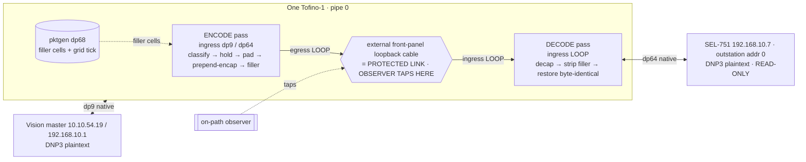

# Defense 4 — architecture specification

**2026-08-04. The frozen contract for the minimum viable Defense 4, plus the forward profiles.
Derived from `defense4_arch.md` reconciled against the four-specialist wave and the evidence ledger.
Every design choice carries a label; where evidence does not force a choice, two bounded alternatives
are given with a recommendation.**

---

## 1. Threat model and claim boundary

| element | specification |
|---|---|
| Observer | passive, on-path, sees BOTH directions on the protected link; knows the defense (Kerckhoffs) |
| Observer location | the **protected segment only** (the loop cable / inter-edge link), NOT the native endpoint ports. If the observer can also tap the master- or outstation-facing native ports, the defense is void — this MUST be pinned. |
| Payload | **plaintext** DNP3-over-TCP in the base contract. Opacity (MACsec) is a stated optional deployment assumption for the strong claim only. |
| Adversary goal | operation fingerprinting (READ vs SBO), device fingerprinting (Formby CLRT), request-complexity (CROB count) |
| Endpoints | DNP3 master and SEL-751 outstation **unmodified**; the operator owns both switch edges |
| **Claim (plaintext, base):** | Defense 4 **reduces** the size, timing, packet-count, and direction differences between READ and SBO (Profile A + Profile-B shape match). |
| **Claim (with external MACsec on the loop):** | Obs(READ) ≈ Obs(SBO) on the **shape** axes (size/timing/count/direction). NOT semantic indistinguishability even then (function code is opaque but operation *rate/occurrence* may remain). |
| **Never claimed:** | semantic READ/SBO indistinguishability on plaintext; device anonymity (k=1). |

Rationale (VERIFIED): the DNP3 function code is one byte at a fixed offset (offset 12 in the TCP
payload), an O(1) perfect READ-vs-SBO classifier; Tofino-1 cannot make the inner opaque (residual never
in PHV). See `agent_notes/size_and_topology.md`.

## 2. Testbed topology and port-role table

The protected link MUST be an **external front-panel cable** so it is genuinely observer-visible;
internal recirculation is invisible and would void the observer model.



| dp | role | connects | pass logic |
|---|---|---|---|
| dp9 | master-facing | Vision master | ingress ⇒ encode; egress ⇒ decoded native to master |
| dp64 | outstation-facing (physical) | SEL-751 (addr 0, **READ-ONLY**) | ingress ⇒ encode; egress ⇒ decoded native to relay |
| dp11 | outstation-facing (emulator) | Hulk simulated outstation | SBO corpus / SELECT-OPERATE without the relay |
| dp10 ⇄ dp65 | **protected-link external loop (TAP HERE)** | FP15/2 ⇄ FP33/1 DAC | ingress(loop) ⇒ decode; egress(loop) ⇒ encoded cell |
| dp68 | pktgen (internal) | — | filler + grid tick |

All stateful ports pipe-0 (Registers/Counters are per-pipe). Pass discrimination: single ternary on
`ig_intr_md.ingress_port == LOOP` → decode; else encode. Cost: +2 front-panel ports + 1 DAC.
Label: PROPOSED; requires a `$PORT_HDL_INFO` readback (gated on authorization) to confirm the ports are
free before any build. If two free front-panel ports are unavailable, the closest alternative is an
inline media-converter on a single external cable.

## 3. READ and SBO state machines

Full mermaid in `agent_notes/dnp3_sbo_safety.md`. Key rules (VERIFIED against `multi_crob_sbo.pcap` and
opendnp3):

- **Transaction key (line-rate parseable):** canonical 5-tuple + DNP3 DEST + SRC + direction + phase
  (internal) + generation (internal). `app_seq` (offset 11 low nibble) and `func` (offset 12) are
  per-phase correlators; `tcp.len==0` + seq/ack are pure-ACK / ordering evidence.
- **SBO linkage MUST be state-table + generation, NEVER app-seq** — SELECT carries app-seq 3, OPERATE
  app-seq 4; the next M→O func=4 on the same flow+link+generation binds to the SBO entry regardless of
  app-seq. The CROB object list crosses block CRCs (variable length) → a **bounded max CROB count** or
  opaque treatment is required; it cannot be part of the key.
- **Absent/piggybacked ACK:** the response gate anchors to the **scheduled public ACK slot**, never
  waits for a nonexistent native ACK.
- **SELECT failure → suppress the OPERATE slot, abort the template, fail open.** OPERATE-after-slot →
  abort+fail-open (default). **Never invent, replay, or synthesize a real OPERATE.**

## 4. Timing modes, predicates, queue plan, state table

### 4.1 Unified release engine (one binary)

Per protected phase p, policy `Θ_p = (M_A,p, D_A,p, G_R,p, T_FO,p)` selects a mode:

| mode | ACK release | RESPONSE release | reproduces |
|---|---|---|---|
| IMMEDIATE | at once | at once, ordered | no shaping |
| MATCHING_RESPONSE_EVENT | on the matching RESPONSE event | after ACK | **Defense 1** |
| ABSOLUTE_DEADLINE | at `now ≥ T_A` | `T_R = A_ref + G_R` | **Defense 3** (ACK) / **Defense 2** (resp) |
| PREDECESSOR_PLUS_OFFSET | at grid slot `k` | at grid slot `k+N` | **Defense 4 grid** |
| bounded FAIL_OPEN | at `now ≥ T_FO,A` | at `now ≥ T_FO,R` | safety net for all modes |

Predicates (from `defense4_arch.md` §4):
```
ACK_release  = match ∧ [ M_A=IMMEDIATE ∨ (M_A=EVENT ∧ response_seen)
                         ∨ (M_A=DEADLINE ∧ now≥T_A) ∨ now≥T_FO,A ]
RESP_release = match ∧ ack_gone ∧ [ now≥T_R ∨ M_R=IMMEDIATE ∨ now≥T_FO,R ]
T_R = A_ref + G_R      A_ref = scheduled ACK-release point + characterized drain correction
```
Defense 4 does NOT sum three delays; it exposes one gate with selectable predicates.
`t_RESP ≈ max(t_RESP_ready, T_R, t_ACK_out + δ_ord) + ε_R` — neither release is "exact"; `ε` absorbs
the ~1.72 µs release tail.

### 4.2 Reverse-path four-queue plan (per phase, one scheduler domain)

`Q_ACK_BLOCK(7) > Q_ACK_HOLD(5) > Q_RESP_BLOCK(3) > Q_RESP_HOLD(0)` — a 4-level extension of the
silicon-proven 3-level strict priority (Part 11). The 4th level gives the RESPONSE its own
independently-terminable blocker, so it releases on `A_ref + G_R` regardless of the ACK's own deadline.
Rules (VERIFIED for the reverse path, Parts 11/12): response blocker primed before the ACK blocker
ends; **absolute timestamps** (a starved lower blocker accrues no recirc passes); pass-count only as
bounded fail-open; generation on every token; internal blockers never egress; real ACK/RESPONSE stay
queue-resident (do not recirculate). Queues are per-port: reverse 4 on the master port, forward ≤3 on
the outstation port — no contention, "8 shared queues" is a non-issue.

### 4.3 Bounded transaction state (arch doc §8)

`valid, generation, flow_tag, operation{READ,SBO}, phase{READ,SELECT,OPERATE}, app_seq, tcp_marker,
size_profile, slot_bitmap, ack_seen, response_seen, ack_gone, T_A, T_R, fail_open_time, error_flags`.
For SBO the entry links SELECT and OPERATE; `operate_window = t_SELECT_RESP + selectTimeout_margin`.

## 5. Size plane

- **Placement: EGRESS** (`egress_intrinsic_metadata_t.pkt_length`; ingress has no length field). Defense
  3's egress is 0/12 empty and PHV exhaustion is ingress-only → the size plane is ~2–4 egress stages,
  **zero ingress cost.**
- **Encapsulation: PREPEND** a self-describing outer header, then the residual (DNP3-over-TCP is
  self-delimiting). Decode `setInvalid` the outer → inner byte-identical; inner IP/TCP checksums stay
  valid (no recompute), only the outer needs its own. GridCloak-proven.
- **Public size pattern** `P = [S_0..S_{L-1}]`, each `S_i` the cross-operation max for that slot's
  direction (padding cannot shrink). `C_i = S_i − H_outer`, `pad_i = C_i − L_i`, valid iff `0 ≤ L_i ≤ C_i`.
  Overflow (`L_i > C_i`): map to a larger state, or declared fail-open (v1); no arbitrary splitting.
- **Minimum READ/SBO template (measured):** 4 data slots, directions [M→O, O→M, M→O, O→M],
  `P = [50,134,50,52]` (low CROB) or `[256,134,256,52]` (≤16 CROBs). READ occupies slots 0–1; SBO's 2nd
  exchange forces slots 2–3, which for READ are **filler** (Profile B only — an M→O and an O→M dummy
  cell). Every unit ≤256 B ≤ MSS → one cell per slot; a multi-fragment READ needing k cells is the
  cellization case, deferred (declare a bounded READ envelope).
- **CROB-count concealment (Profile A):** master-side padding to a fixed `N_max` with valid-but-unwired
  decoy CROBs normalizes BOTH request and response size in one move (the outstation echoes CROBs).
  Master-side only; the switch never injects a control. Gated on V1 (decoy inertness on the real relay).

## 6. Control-plane vs data-plane responsibilities

Controller: installs policy `Θ_p`, seeds bounded state, configures queues/pktgen/size states, collects
offline telemetry. **The controller never participates in per-packet or per-transaction release.** All
gating, matching, generation, slot assignment, encap/decap and fail-open are data-plane.

## 7. Failure, cleanup, concurrency policy

- **Concurrency:** one active protected transaction per scheduler domain (shared FIFO cannot
  mid-release). A concurrent attempt **bypasses (fails open, unshaped)** until the bank frees.
- **Fail-open:** bounded absolute-deadline release of any held packet; the horizon `H = B·K/rate` must
  satisfy `H > N·T + a_bound + overhead + M` and `H < RTO_min − margin`, and for SBO additionally
  `2·(N+1)·T + turnaround + M < selectTimeout` (device value, BLOCKED until read).
- **Cleanup:** on RESP_OUT, FIN/RST, or fail-open, retire the entry and its generation; internal tokens
  die on their absolute deadline and never egress.
- **Corner cases:** the 22-row table (`agent_notes/dnp3_sbo_safety.md`) is the acceptance checklist;
  retransmission/duplicate handling must be idempotent (a duplicate OPERATE bound twice = double
  actuation risk); a fabricated CONFIRM is prohibited (permanent SOE deletion).

## 8. Phase-specific parameters (mandatory)

A single `D`/`G` must NOT serve all phases. `Θ_READ`, `Θ_SELECT`, `Θ_OPERATE` differ:
`G_R,SELECT` is bounded by the select-timeout budget (a SELECT-response hold delays the OPERATE);
`G_R,READ` is bounded only by RTO; `G_R,OPERATE` by the master app timeout. See
`agent_notes/dnp3_sbo_safety.md` for the inequality and measured emulator terms (SELECT-resp 1.37 ms,
master-proc 0.41 ms, OPERATE-resp 1.34 ms; total 3.12 ms vs 10 s emulator selectTimeout).
