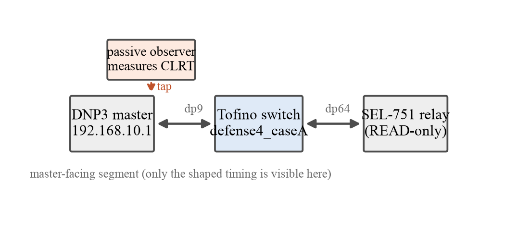
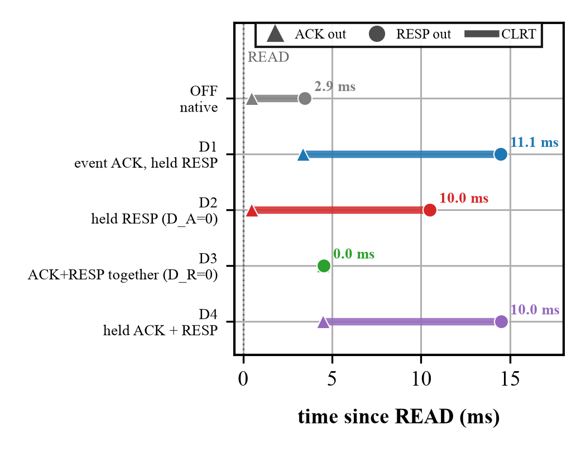
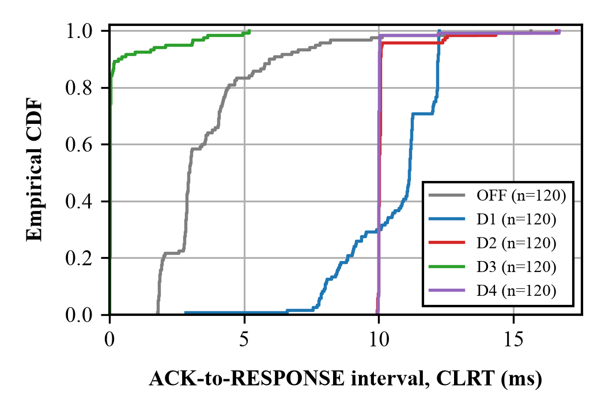
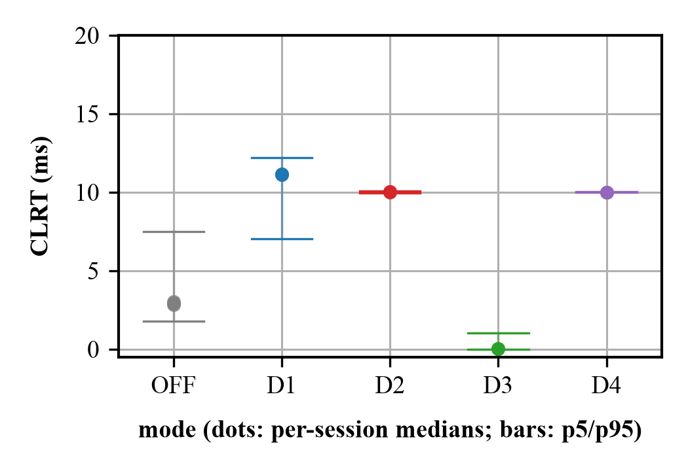

# Defense 4, in full detail

This is the detailed tutorial. It explains, from the ground up, what D1, D2, D3, and D4 do, the
mechanism that makes them possible on a switch, how the whole thing is implemented in P4 and in the
control and measurement code, and what the experiments measured. It is long on purpose, with worked
examples and the measured numbers, so that after reading it you can explain Defense 4 to someone else.

---

# Part I. The problem and the idea

## 1. The fingerprint we are hiding

A DNP3 master polls an outstation, here a physical SEL-751 protective relay, with a READ. The relay
answers in two separate pieces on the wire:

1. a **pure TCP acknowledgment**, an empty TCP segment with the ACK flag, sent by the relay's TCP stack
   soon after it receives the READ, and
2. a little later, the **DNP3 RESPONSE**, a TCP segment carrying the DNP3 application data.

The gap between these two, measured at the master, is the **cross-layer response time, the CLRT**. It
is the interval from the pure TCP acknowledgment to the first byte of the matching DNP3 response.
Every device model has its own habitual CLRT, set by its firmware and its processing. A passive
observer who watches the traffic, decoding nothing, measures the CLRT over many polls and uses its
shape as a fingerprint: "this timing belongs to an SEL-751." We measured the relay's native CLRT over
240 transactions: median 2.92 ms, with the middle 90 percent spanning about 1.8 ms to 7.6 ms and a
tail to about 16 ms. That spread is the fingerprint.

## 2. Why general traffic obfuscation cannot work here

The obvious defense is traffic obfuscation: add cover packets, pad sizes, reshape flows. That toolkit
was built for the encrypted Internet, where the traffic is opaque and the shaper can invent packets and
reshape flows because the observer cannot tell a real exchange from a fake one. Legacy industrial
traffic breaks every one of those assumptions:

- **It is plaintext and checksummed.** A DNP3 frame is readable and each link block carries a
  validating CRC, so an injected dummy or an edited byte is detectable by inspection. Cover traffic and
  byte edits, the staples of general obfuscation, are off the table.
- **The endpoints cannot be changed.** The outstation is vendor firmware and DNP3 is a deployed
  standard, so the defense cannot ask the device or the protocol to shape their own traffic.
- **Correctness is not optional.** Every poll must receive its real response, in order, within the
  protocol's timing, retransmission, and quality-of-service bounds.
- **The fingerprint is in the timing.** Size- and volume-oriented defenses do not touch the
  response-time signature.

So a defense here must live in the network (endpoints fixed), preserve every byte (plaintext and CRC),
preserve correctness, and act on the timing itself. That is a different problem from general
obfuscation, and it is the one Defense 4 solves.

## 3. The one hard fact about a switch data plane

A programmable switch is not a general computer. Its data plane processes each packet in a few
nanoseconds as the packet flies through a fixed pipeline. **It cannot take a packet, put it to sleep,
and wake it up 10 ms later at a software-chosen time.** There is no "sleep and recall." Once a packet
is enqueued for a port, the traffic manager decides when it leaves based on queue priority and
scheduling, not a software timer that reaches back in and grabs a specific packet. Every design
decision below follows from working with this fact instead of against it.

---

# Part II. The mechanism

## 4. Hold the real packet, race it against a token

The trick makes the switch's own scheduler do the waiting, using two ingredients:

1. **Queue residency.** When the relay's acknowledgment (or response) arrives, the switch does not
   forward it. It sends it to a **low-priority hold queue**, still the original unmodified packet.
2. **Blocker tokens.** At the same time the switch generates small internal packets, the blocker
   tokens, carrying a private EtherType 0x88C1, and puts them in a **high-priority blocker queue**.
   These tokens recirculate through the pipeline. As long as a blocker outranks the held packet, the
   scheduler keeps serving the token and the held packet stays put.

Each time a blocker comes around, the data plane checks the clock against the deadline. While the
deadline has not passed, the token is re-sent to keep blocking. When the deadline passes, the token
retires, the held packet is now the highest-priority thing left in its direction, and the traffic
manager releases it. The release time is set by the deadline, though no software ever grabbed the
packet. The blocker tokens never leave toward the master; only the original packet does, unchanged.

## 5. The four queues and their strict priority

Four queues, in strict priority order (higher number wins):

- **Q_ACK_BLOCK, qid 7** holds the acknowledgment's blocker tokens (highest).
- **Q_ACK_HOLD, qid 6** holds the real acknowledgment.
- **Q_RESP_BLOCK, qid 5** holds the response's blocker tokens.
- **Q_RESP_HOLD, qid 4** holds the real response (lowest).

Strict priority means the scheduler always serves a non-empty higher queue before a lower one. Two
consequences matter. While an acknowledgment blocker (qid 7) recirculates, the real acknowledgment
(qid 6) cannot leave; when the acknowledgment deadline passes and the blocker retires, qid 6 is served
and the acknowledgment is released. And because the acknowledgment queues (7, 6) outrank the response
queues (5, 4), the acknowledgment is never released after the response. Ordering is guaranteed by the
queue structure, not by luck.

## 6. The transaction lifecycle and the generation

The switch must know which acknowledgment and response belong to which READ, and must not confuse one
poll with the next. It uses the DNP3 **application-control octet**, which the master advances
C0, C1, ..., CF and then rolls back to C0. This is the **generation**. One stateful register, reg_tag,
remembers the generation of the active transaction. The lifecycle of one transaction:

1. **Arm.** A READ is classified; reg_tag records its generation; the switch triggers the packet
   generator to create the blocker tokens.
2. **Hold the acknowledgment.** The relay's acknowledgment goes to Q_ACK_HOLD; its blocker recirculates
   in Q_ACK_BLOCK checking the acknowledgment deadline T_A.
3. **Release the acknowledgment.** At T_A the acknowledgment blocker retires and the acknowledgment is
   released.
4. **Hold the response.** The relay's response goes to Q_RESP_HOLD; its blocker recirculates in
   Q_RESP_BLOCK checking the response deadline T_RESP.
5. **Release the response.** At T_RESP the response blocker retires and the response is released.
6. **Retire and re-arm.** The transaction retires; the next READ (next generation) arms a fresh one.

## 7. The timing math and the four arrival buckets

Let `t_A` be the moment the acknowledgment arrives. Two configured delays set the deadlines:
`D_A` gives the acknowledgment deadline **T_A = t_A + D_A**; `D_R` gives the response deadline
**T_RESP = t_A + D_A + D_R**. So `D_R` is the intended CLRT, the interval from the released
acknowledgment to the released response. Delays are encoded as a "tick" word (one tick is about one
nanosecond) shifted so the low byte is zero; 10 ms is the word 9,999,872.

A response can arrive in one of four places, and all four are handled safely:

- **before T_A** (the relay was fast): held in Q_RESP_HOLD, released at T_RESP. Counter
  RESP_HOLD_EARLY.
- **between T_A and T_RESP** (after the acknowledgment was released): still held to T_RESP. Counter
  RESP_HOLD_LATE. This is the case the lifecycle bug used to get wrong.
- **after T_RESP** (the relay was slow): released as soon as it arrives, a **late safe release**. This
  is not deadline normalization; it is honest slack, reported as a tail.
- **after the fail-open horizon** (the reservoir of blocker tokens drains first): released early by the
  **fail-open** path so nothing is stranded. Counter RELEASE_FAILOPEN.

## 8. A complete worked packet journey (D4, D_A = 4 ms, D_R = 10 ms)

Follow one transaction end to end, with the measured medians:

| time | event | switch action | queue | counter |
|---|---|---|---|---|
| 0.00 ms | master sends READ, app-control C0 | classify from_master, func READ; arm reg_tag=C0; trigger pktgen (128 tokens, 64 ACK-slot, 64 RESP-slot) | forward to relay | ARM_FRESH, PKTGEN_ADMIT |
| ~0.47 ms | relay sends pure TCP ACK | classify from_relay, len 0; hold | Q_ACK_HOLD (qid6); its blocker recirculates in qid7 checking T_A | |
| ~1.9 ms | relay sends DNP3 RESPONSE, C0, 134 B | classify from_relay, func 129, gen C0 matches; hold (arrived before T_A) | Q_RESP_HOLD (qid4); its blocker recirculates in qid5 checking T_RESP | RESP_HOLD_EARLY |
| 4.00 ms | T_A reached | ACK blocker retires; qid6 now top; TM releases the ACK; transaction stays alive (D4 must-hold) | ACK leaves to master | ACK_RELEASE |
| 14.00 ms | T_RESP reached | RESP blocker retires; TM releases the RESPONSE; retire reg_tag | RESPONSE leaves to master | RELEASE_DEADLINE |
| next READ, C1 | | arm a fresh transaction | | ARM_FRESH |

The master sees the acknowledgment at 4 ms and the response at 14 ms, so the CLRT it measures is
exactly 10 ms, whatever the relay's real 1.9 ms processing time was. That is the normalization.

---

# Part III. The five modes, each explained with its measured behavior

OFF is the baseline: forward everything unchanged, so the observer sees the native CLRT. The four
defenses are the same machinery with different gates on. The figure below plots, from the measured
medians, exactly where each mode releases the acknowledgment (triangle) and the response (circle), and
the CLRT that results (the coloured span).

## 9. D1, event mode (measured CLRT median 11.14 ms, wide)

**Idea:** release the acknowledgment when the matching response arrives, not on a fixed acknowledgment
deadline. **Mechanism:** the response is held to a deadline (in our runs ~14.5 ms after the READ) while
the acknowledgment is released on the response event, at a variable time (median ~3.4 ms). **Effect:**
D1 ties the acknowledgment to the response but tracks the response's real arrival, so it shifts the
timing without tightening it: its CLRT stayed at a 5.17 ms spread, only 0.24 bits below OFF's entropy.
D1 is the weakest normalizer, and we say so.

## 10. D2, response-deadline mode (measured CLRT median 10.02 ms, spread 0.12 ms)

**Idea:** let the acknowledgment go immediately, then hold the response to a fixed deadline.
**Configuration:** `D_A = 0` (acknowledgment released at once), `D_R = 10 ms`. **Mechanism:** the
response goes to Q_RESP_HOLD and is released at T_RESP = t_A + 10 ms. Because the acknowledgment left
at t_A and the response leaves at t_A + 10 ms, the observed CLRT is a fixed 10 ms. **Effect:** the pure
normalizer. p5-p95 spread 0.12 ms, a 45.6x reduction from OFF, 0 bypass across 240 transactions. D2
depends entirely on the response obligation surviving the acknowledgment release (with D_A = 0 the
acknowledgment is already gone when every response arrives), which is exactly why the lifecycle bug hit
D2 hardest.

## 11. D3, acknowledgment-deadline mode (measured CLRT median 0.03 ms)

**Idea:** hold the acknowledgment to a fixed deadline, then let the response go as soon as it is ready.
**Configuration:** `D_A = 4 ms`, `D_R = 0`, so T_RESP = T_A. **Mechanism:** the acknowledgment is held
to T_A; the response deadline equals it, so acknowledgment and response leave together (or a response
after the deadline is forwarded). **Effect:** the CLRT collapses toward zero, because both leave at
almost the same instant. Their capture timestamps coincide, which is why the scorer had to be made
mode-aware: for D3 that coincidence is the design, not an inversion. A response arriving after the
acknowledgment deadline is forwarded (a legitimate D3 "bypass," since D_R = 0), not the lifecycle
defect.

## 12. D4, dual-deadline mode (measured CLRT median 10.00 ms, spread 0.05 ms)

**Idea:** hold both. **Configuration:** `D_A = 4 ms`, `D_R = 10 ms`, so T_A = t_A + 4 ms and
T_RESP = t_A + 14 ms, and the observed CLRT is D_R = 10 ms. **Mechanism:** both gates on; the
acknowledgment is held to T_A and the response to T_RESP, each released on its own deadline. **Effect:**
a fixed acknowledgment timing and a fixed CLRT. p5-p95 spread 0.05 ms, a 118x reduction from OFF, 0
bypass across 240 transactions. **The hard part D4 exposes:** with D_A = 4 ms the acknowledgment is
released 4 ms after it arrives, but the relay's real response often arrives after that release (27 to
33 of every 120 responses in our runs). The switch must still hold a live transaction for that
response. This is "the response obligation survives the acknowledgment release," exactly what the
lifecycle bug broke.

---

# Part IV. The bug and the fix, in detail

## 13. The bug

The pre-fix program retired the transaction whenever the acknowledgment was released. That is correct
for D1 and D3 (acknowledgment-only shaping: once the acknowledgment is dealt with, the transaction is
done). It is wrong for D2 and D4, where a response is still owed after the acknowledgment release. On
the broken binary a response arriving after the acknowledgment release found a dead transaction and
slipped through unshaped: D2 bypassed 240/240, D4 bypassed 80/240.

## 14. The two-part fix (no new register, SALU, header field, or counter)

1. **Mode-aware retirement.** The acknowledgment-release retirement now runs only for the
   acknowledgment-only modes D1 and D3. For the must-hold modes D2 and D4 the acknowledgment release
   keeps the transaction alive so the later response is still held. A read-only companion action on the
   acknowledgment register restores the early-versus-late response distinction without a write hazard,
   and the acknowledgment-release counter splits (ACK_RELEASE versus ACK_REL_RETIRE) so the evidence
   shows which path ran.
2. **A response blocker that does not vanish.** The response blocker (qid 5) now drains on the deadline
   only when a response is actually pending; otherwise it loops to the bounded budget instead of
   disappearing at T_RESP. A missing or late response no longer strands the reservoir.

The register reg_tag keeps its four RegisterActions; the design cannot add a fifth on this stateful
ALU, which is why the fix had to reuse existing operands.

## 15. Fail-open: never strand a packet

Holding is safe only if it always ends. Each transaction has a **budget** of blocker-token
recirculations, which sets a **fail-open horizon**. If the reservoir drains before the release
condition is met (for example a response that never comes), the held packet is released early by the
fail-open path and the next transaction re-arms cleanly. Proven on silicon: with a small budget forcing
a 1.37 ms horizon, all 30 responses were still delivered, all 30 via the fail-open path, every
transaction re-armed, and no stale tag remained.

---

# Part V. The implementation

## 16. The P4 program (`timing/p4/defense4_caseA.p4`, ~3000 lines)

- **Parser and direction.** Each packet is sorted by origin: from the relay (the shaped flow, ingress
  port dp64), from the master (dp9), from the recirculation loopback (blocker tokens returning), or
  from the packet generator (fresh blocker tokens). Direction drives the forwarding port and the
  classification.
- **Policy tables.** `tbl_params` holds the run-time policy (mode, the deadline words D_A and D_A+D_R,
  the budget, the read length); `tbl_session` pins the one protected flow. The control plane writes
  these between drained transactions; the data plane only reads them.
- **The reg_tag register.** One stateful register tracks the active generation, with four
  RegisterActions (arm-once, read-modify-write, read-or-mark, retire-if-unmarked).
- **Queue selection.** Based on packet class (blocker versus original, acknowledgment versus response)
  and the deadline check, each packet is assigned qid 7, 6, 5, or 4; blocker tokens recirculate on dp8.
- **Counters.** `ctr_fresh` records the fresh path (ARM_FRESH, RESP_HOLD_EARLY/LATE, RESP_BYPASS, ...);
  `ctr_deq` records the dequeued path (release causes and the acknowledgment-release split). These are
  the counters the scorer reconciles against the wire.

## 16b. How Defense 4 uses the Tofino-1 pipeline

The Tofino-1 is a programmable switch ASIC with four **pipes**; each pipe has a 12-stage match-action
(MAU) **ingress** pipeline and a 12-stage **egress** pipeline. Defense 4's logic runs entirely in the
ingress pipeline of one pipe (pipe 0), where the relay port (dp64), the master port (dp9), the internal
loopback (dp8), and the packet-generator port (dp68) live. A packet's path is: **parser** to sort it by
origin, then the **twelve ingress MAU stages** that classify it and pick its queue, then the
**deparser**, then the **traffic manager** (the queues and the scheduler), and from there either back
onto the loopback (a blocker token) or out to the master port (a released original).

**The pipeline resource footprint** (from the BF-SDE 9.13.2 compile, `mau.resources.log`, confirmed by
a fresh reproducible build):

- All **12 of 12 ingress stages** are used, with zero stage headroom.
- **SRAM 47** blocks, **Map RAM 42**, **TCAM 10**.
- **107 logical table IDs**, and crucially **stages 8 through 11 are saturated at 16 logical tables
  each** (16 is the per-stage cap). This LTID-saturated tail is the program's tightest resource. The
  lifecycle fix had to fit its extra gateways and counting into that tail, which is why it was
  engineered to add no new register, stateful ALU, PHV field, or counter, and why `reg_tag` kept its
  four RegisterActions.
- **12 stateful (meter) ALUs** and **9 statistics ALUs**, **69** VLIW action instructions, **67**
  gateways. Estimated pipeline power about **11.6 W**; ingress latency about **168 clock cycles**.

**The stateful registers** (the transaction state lives in the stateful ALUs):

- **`reg_tag`** tracks the active transaction's generation (C0..CF). It has four RegisterActions
  (arm-once, read-modify-write, read-or-mark, retire-if-unmarked) and takes two PHV inputs (the
  incoming generation and the tag value). It is **full at two inputs and four actions**, so a fifth
  action or a third input is a hard compile error. That cap is what forced the lifecycle fix to reuse
  existing operands (the read-only acknowledgment-release companion) rather than add state.
- **`reg_deadline`** holds T_A and **`reg_tresp`** holds T_RESP. These must be **separate registers**:
  an earlier attempt to co-locate both deadlines in one register failed to place (the register
  co-location wall), because one stateful ALU cannot compare against and update two independent deadline
  words in a single pass. Keeping them separate is what lets the acknowledgment gate and the response
  gate run independently, which is exactly what D4 needs.
- **`reg_ack_rel`** records the acknowledgment-release generation; the fix's read-only companion action
  reads it to tell an early response (arrived before the acknowledgment release) from a late one
  (after), without a write hazard.

**PHV pressure.** The packet header vector is the set of containers that carry the headers and the
program's metadata through the twelve stages. Defense 4 carries a lot of metadata: the direction, the
generation, the mode, the two deadline words, the packet class and role, and several verdict flags. The
**32-bit PHV group is full**, a second reason the fix could add no new metadata field.

**The packet generator (pktgen).** On a classified READ, the switch triggers its on-chip packet
generator to emit a burst of **128 blocker tokens** (a 2K batch, 127-plus-1 packets per batch) on the
pktgen port dp68, carrying the private EtherType **0x88C1**. The 128 tokens are split by their
`packet_id` into **64 for the acknowledgment reservoir** (SLOT_ACK, qid7) and **64 for the response
reservoir** (SLOT_RESP, qid5). K = 64 per reservoir sits above the measured hold-continuity floor of
about 44 tokens (a ~1.45x margin); fewer tokens and a reservoir can drain before its deadline.

**The recirculation loop and the traffic manager.** Blocker tokens recirculate on the internal loopback
port dp8 (PORT_L). On each pass a token re-reads its deadline register and, if the deadline has not
passed, is re-sent to keep blocking; if it has, the token retires. The four queues (qid 7, 6, 5, 4)
live on the loopback port's scheduler domain, configured by the control plane with strict priority
(`max_priority` 7 > 6 > 5 > 4, scheduling enabled, min and max shaping off) so the ladder is exact. The
held original packets wait in the hold queues (qid6, qid4) on this domain until their blocker retires.
A mirror/clone session injects the blocker tokens onto the loopback without touching the original.

**The deparser.** The deparser reassembles and emits each packet. For an original acknowledgment or
response it emits the bytes unchanged, which is the byte-preservation property: the P4 writes no byte of
any host frame, only the internal token's own header. For a blocker token it emits the 0x88C1 frame
back onto the loopback.

## 17. The control plane (`timing/control/defense4_caseA_setup.py`)

One authority for the policy. Operations: `initialize` (establish the fixed function once),
`set-policy` (mode and delays, refuses while a transaction is active), `clear-evidence`, `verify-only`
/ `evidence-dump` / `snapshot` (read-only), `restore-only`. Delays are given in milliseconds and
quantized to the tick encoding. No other code writes the policy table.

## 18. The measurement pipeline, and why it is trustworthy

The result is only as good as the tool that scored it, so the pipeline is built to fail closed, to
refuse bad data loudly rather than pass it quietly. This matters because an earlier pipeline exited
"clean" on bad evidence; the rebuilt one is proven against 78 adversarial fixtures.

- **`score_campaign.py`** exits with an error on any hard anomaly: a must-hold response bypass, an
  ordering inversion, a stale tag left behind, counters that do not reconcile, an internal token on the
  wire, a queue or port drop, a missing or invalid capture, an absent counter. It passes only a fully
  valid block, and it is mode-aware, so D3's coincident timestamps are not misread as an inversion. A
  declared negative test must actually be exercised.
- **`campaign_driver.py`** runs on the master: one sustained TCP connection, 60 READs advancing
  C0..CF, full-Ethernet capture, one rich JSON row per poll (the 4-tuple, seq/ack, timestamps, CLRT,
  duplicates, retransmits, FIN/RST, segment count).
- **`pair_bytes.py`** matches the same frame at the relay-facing and master-facing capture points and
  compares the bytes, to prove the switch released exactly what it received; it catches a one-byte
  change, a drop, an inject, or a MAC change.
- **`analyze_campaign.py`** reports full distributions with tails and a session-level bootstrap, and
  requires one passing score per expected block.
- **`make_manifest.sh`** hashes every file; the manifest is verified with `sha256sum -c`.

## 19. The controlled software outstation (`timing/control/outstation/`)

A deterministic DNP3 software outstation for exercising edge cases a hardware relay cannot produce on
command (missing acknowledgment, missing response, FIN/RST at three points, combined response,
multi-segment, SELECT, OPERATE). Its scenario engine emits exactly the frames each of 21 cases needs
and is validated offline by 58 checks. In the experiment reported here the outstation is the physical
SEL-751; the software outstation is available for a future controlled-negatives study.

---

# Part VI. The evidence

## 20. The campaigns

Two campaigns on the corrected binary against the physical SEL-751, READ-only: Campaign A in fixed
order, Campaign B in randomized order with a recorded seed. Five modes, two sustained sessions per
mode, 60 READs per session: 120 valid transactions per mode per campaign, 1200 total. Every block
passed the fail-closed scorer, and the two campaigns agree.

## 21. The result

Recomputed independently from the raw counter dumps: **D2 and D4 held every response, 0 bypass across
240 transactions each**, where the pre-fix binary bypassed D2 240/240 and D4 80/240. Quantified over
both campaigns (n = 240 per mode):

| mode | median CLRT | p5-p95 spread | spread reduction | entropy (bits) | effective states |
|---|---|---|---|---|---|
| OFF | 2.92 ms | 5.69 ms | 1x | 3.63 | 12.4 |
| D1 | 11.14 ms | 5.17 ms | 1.1x | 3.39 | 10.5 |
| D2 | 10.02 ms | 0.12 ms | 45.6x | 1.23 | 2.3 |
| D3 | 0.03 ms | 1.05 ms | 5.4x | 0.76 | 1.7 |
| D4 | 10.00 ms | 0.05 ms | 118.2x | 1.10 | 2.1 |

D2 and D4 collapse the timing observable from about 12 effective states to about 2. Targeted tests
confirmed the response-survives-acknowledgment-release lifecycle, the C0..CF rollover on one
connection, and the fail-open bounded release. We report the whole distribution: a small fraction of
responses arrive after the deadline and are released late but safely (D2 max 16.6 ms, D4 max 18.8 ms).
The bulk is normalized; there is a late tail. It is never described by the median alone.

## 22. Resources (per ingress stage)

The program fits a single Tofino-1 ingress pipeline at 12 of 12 stages, 0 errors. The stage-by-stage
allocation (from `mau.resources.log`) shows why the tail is tight: stages 8 through 11 are saturated at
16 logical tables each, the per-stage cap.

| stage | SRAM | Map RAM | TCAM | stateful ALU | stats ALU | logical tables |
|---|---|---|---|---|---|---|
| 0 | 4 | 2 | 3 | 0 | 1 | 9 |
| 1 | 6 | 6 | 0 | 3 | 0 | 11 |
| 2 | 2 | 2 | 0 | 1 | 0 | 5 |
| 3 | 2 | 2 | 0 | 1 | 0 | 3 |
| 4 | 1 | 0 | 3 | 0 | 0 | 1 |
| 5 | 2 | 2 | 0 | 1 | 0 | 6 |
| 6 | 2 | 0 | 4 | 0 | 0 | 2 |
| 7 | 6 | 6 | 0 | 3 | 0 | 6 |
| 8 | 4 | 4 | 0 | 0 | 2 | **16** |
| 9 | 4 | 4 | 0 | 0 | 2 | **16** |
| 10 | 4 | 4 | 0 | 0 | 2 | **16** |
| 11 | 10 | 10 | 0 | 3 | 2 | **16** |
| **total** | **47** | **42** | **10** | **12** | **9** | **107** |

A fresh reproducible compile of the corrected source on BF-SDE 9.13.2 yields a same-size binary with
the same placement, confirming the source-to-binary chain.

## 23. What is proven, and the boundary

Proven, corrected binary, fail-closed, reproduced, for the master-plus-physical-SEL-751 experiment: D2
and D4 normalize the CLRT to a fixed 10 ms, hold every response, and collapse the timing information for
this device; D1 and D3 shape as designed; the lifecycle fix, fail-open, and rollover are proven by the
counters. Bounded and not claimed: cross-device classification (needs a second Case-A device),
controlled software-outstation negatives (out of the experiment's scope), size concealment, and device
indistinguishability across vendors. The accepted verdict is TIMING EXPERIMENTS PARTIAL WITH CLOSED
CLAIM BOUNDARY.

## Glossary

- **CLRT** cross-layer response time: acknowledgment-to-response interval, master-facing.
- **Generation** the DNP3 application-control octet C0..CF, used to match a transaction.
- **Blocker token** an internal 0x88C1 packet that recirculates to hold a queue's place.
- **Queue residency** the original packet waits in a switch queue, unmodified, until released.
- **T_A, T_RESP** the acknowledgment and response deadlines (t_A + D_A, and + D_R).
- **Fail-open** releasing a held packet early when the reservoir drains, so nothing is stranded.
- **reg_tag** the stateful register that tracks the active transaction's generation.
- **SALU** stateful ALU, the switch unit that reads and updates a register in one pass.
