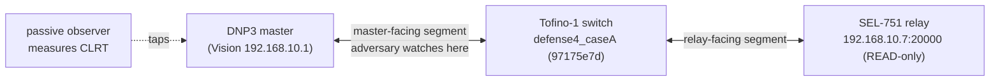
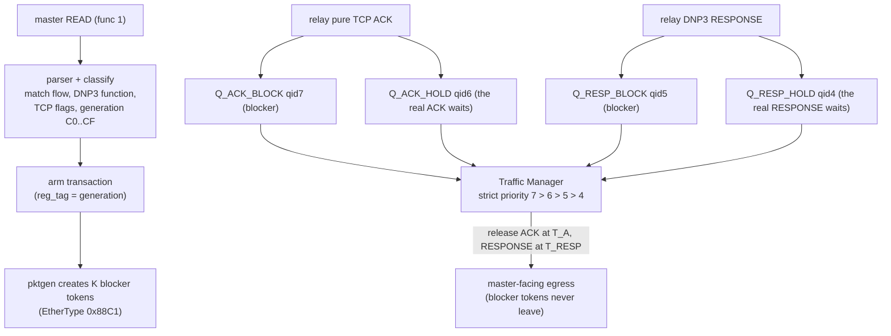
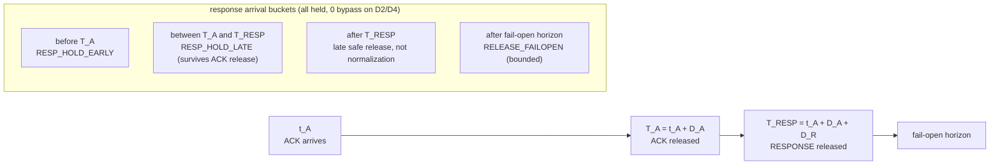
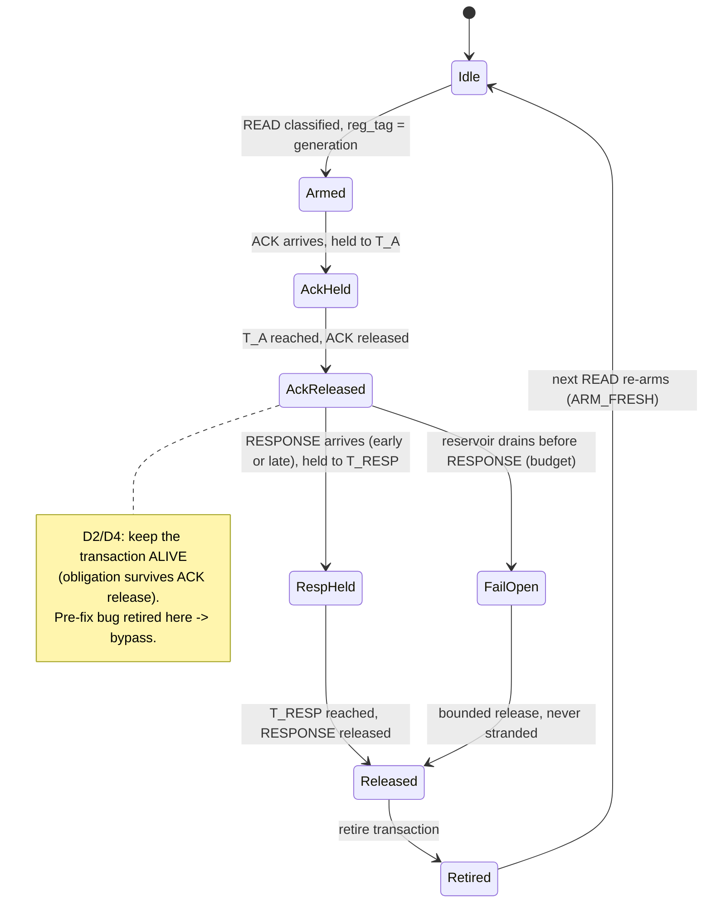
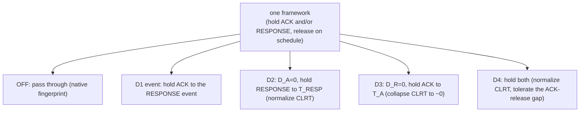

# Defense 4 mechanism, in diagrams

Exact causal, topology, timing, and state diagrams for Defense 4. These are checked against the P4 and
the setup code, not invented. Measured plots (the CLRT ECDFs) live with the campaign evidence; these
are the mechanism schematics.

## 1. Topology and the adversary

The switch sits between the master and the relay. The passive adversary watches the master-facing
segment, where only the released, shaped timing is visible.

## 2. The four queues and the packet journey

The original acknowledgment and response wait in the hold queues. Higher-priority blocker tokens
recirculate to hold their place, and the traffic manager releases the held packets on schedule.
Strict priority (7 > 6 > 5 > 4) guarantees the acknowledgment is never released after the response.

## 3. Timing semantics and the arrival buckets

`t_A` is when the acknowledgment arrives. `T_A = t_A + D_A` is the acknowledgment deadline.
`T_RESP = t_A + D_A + D_R` is the response deadline. A response can arrive in three places, and all
three are held safely; only after the fail-open horizon does the fail-open path release early.

## 4. Transaction lifecycle (the state machine, including the bug that was fixed)

The pre-fix bug retired the transaction at the acknowledgment release, so a later response found a dead
transaction and bypassed. The fix keeps the response obligation alive after the acknowledgment release
for the must-hold modes.

## 5. The modes as one framework

Measured outcome (corrected binary, physical SEL-751, 1200 transactions): OFF spreads the CLRT from
about 1.8 to 7.6 ms across the middle 90 percent; D2 and D4 pull that band to about 0.1 ms around a
fixed 10 ms, with a small late tail; D3 collapses it to about zero; D1 shapes it to about 11 ms. See
`../timing/evidence/final_run/campaignA_corrected_binary/fig_clrt_ecdf.png`.
