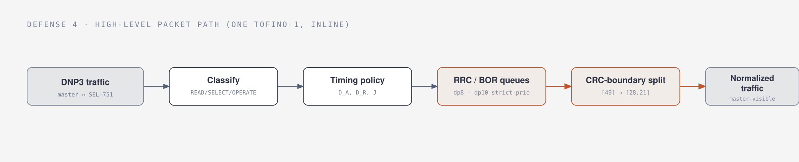
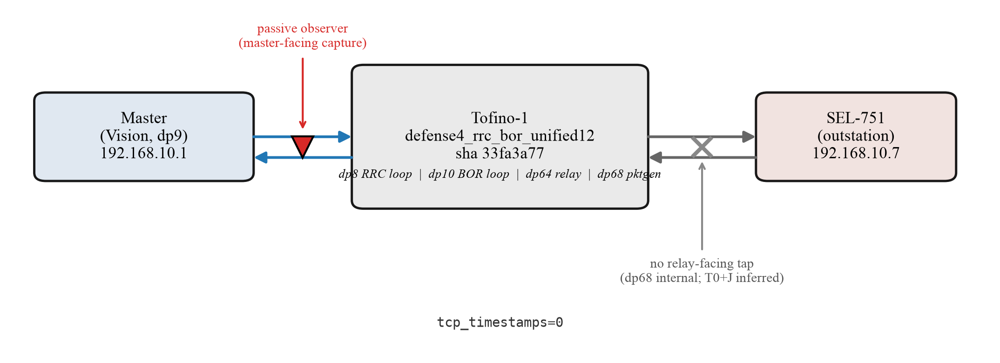
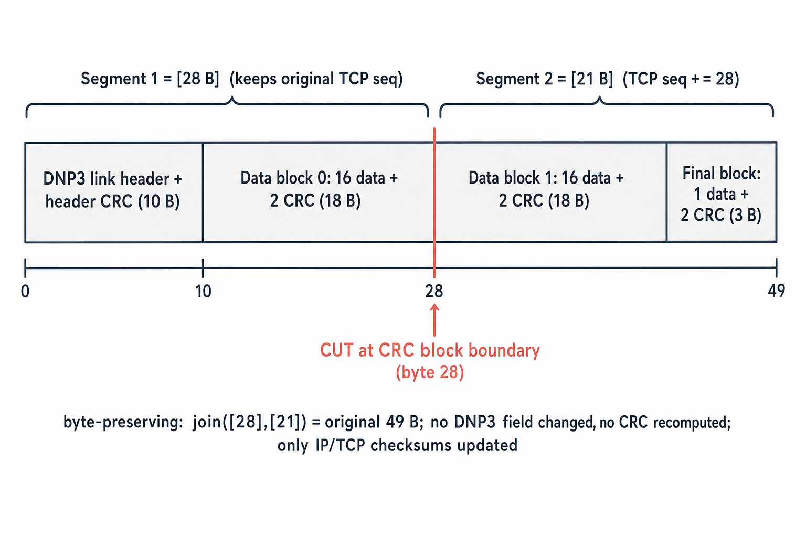
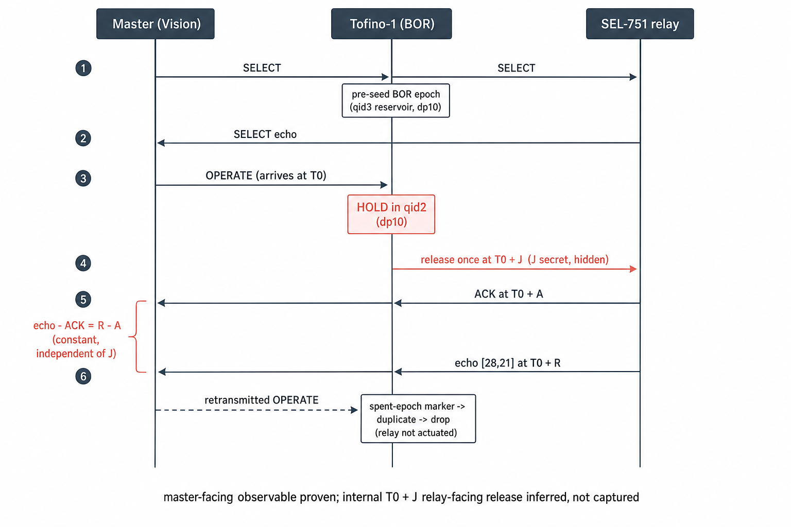
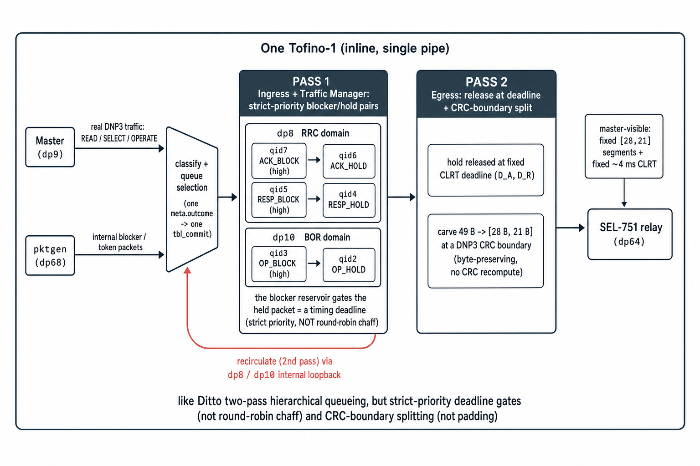
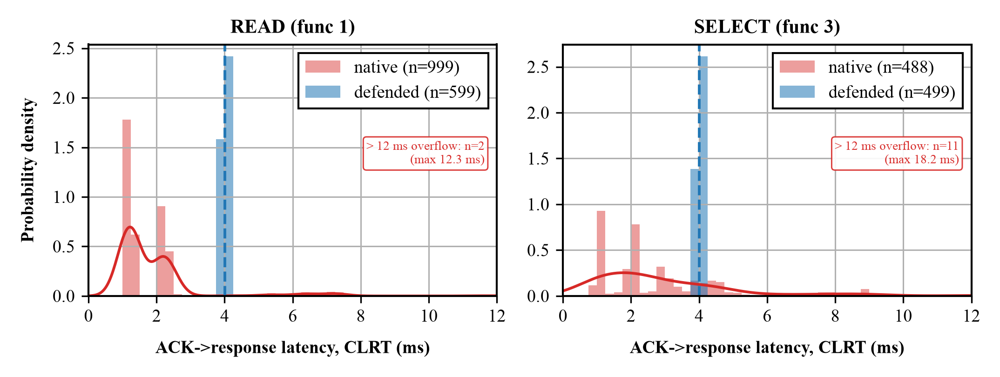
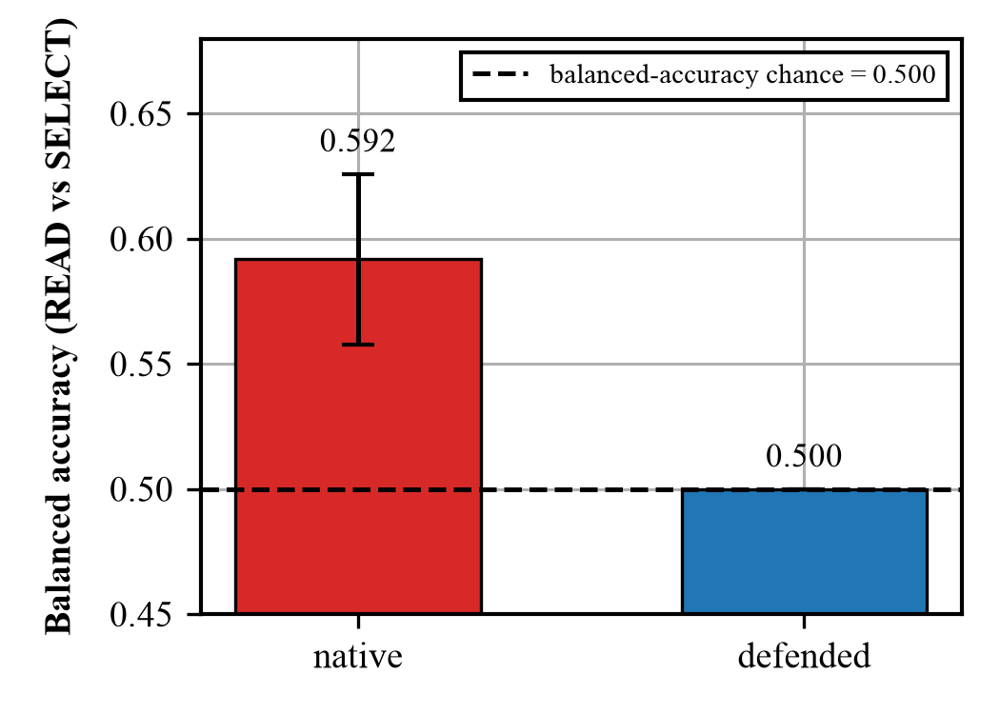

## The problem in one picture

A control room ("the master") talks to a power relay ("the SEL-751") over the network. Even if
someone watching the wire cannot read the messages, they can still recognize the relay — and guess
what it is doing — just from the *shape* and *timing* of the packets. That is called
**fingerprinting**. Our goal: put one switch in front of the relay and make its traffic always look
the same, so the watcher learns nothing. We never change a single byte of the DNP3 message.

{width=98%}

## What gives the relay away

Three things leak, and none of them need reading the message:

1. **Size** — the relay's answer is 49 bytes. Different devices send different sizes.
2. **How it is split** — how the answer is broken into network segments is itself a tell.
3. **Timing** — the gap between the network "got it" (the TCP ACK) and the real answer. This is
   called **CLRT**. It is set by the relay's own electronics, so it is like a fingerprint.

A researcher named Formby showed two ways to fingerprint these devices: the **CLRT** timing above,
and how long the device takes to **physically act** on a command (a relay closing a switch takes a
characteristic amount of time). We hide both.

## The setup: three boxes in a line

{width=80%}

The master is a computer. The switch is one Intel Tofino-1 (a switch you can program). The relay is
a real SEL-751. Everything runs on real hardware. A watcher sits on the master's side and sees only
what the master sees.

## Trick 1 — RRC: make every answer look the same (for reads)

When the master asks the relay to READ, the relay answers. Our switch does three simple things to
that answer:

- **Cut it on a safe line.** A DNP3 message has built-in checkpoints (CRC blocks). We cut only on
  one of those checkpoints, so the pieces still add back up to the exact original. The 49-byte
  answer becomes two pieces: **28 bytes + 21 bytes**. No byte is changed.

{width=98%}

- **Delay it to a fixed time.** We hold the answer inside the switch and let it out at a set moment,
  so the timing (CLRT) is always the same number instead of the relay's own varying one.

- **Result:** every read answer now looks identical — same two pieces, same timing — no matter what
  the relay actually did.

## Trick 2 — BOR: hide the command timing (for control)

Control is the dangerous part. To operate something, the master first sends **SELECT** (arm it),
then **OPERATE** (do it). Our switch:

- lets exactly **one** OPERATE through (no accidental double-fire),
- **holds** it inside the switch, and lets it out at a **secret delay** the watcher cannot guess,
- but shows the master the "got it" and the echo at **fixed** times.

The clever part: because those fixed times are anchored to when the OPERATE *arrived*, the watcher
cannot subtract one from the other to figure out the secret delay. So the relay's real reaction time
stays hidden.

{width=92%}

## How the switch does it (the short version)

Think of it like Ditto (a known traffic-hiding system) but simpler and purpose-built. Packets go
through the switch **twice**: the first pass parks each answer in a hold queue behind a small stack
of "blocker" packets that act as a timer; the packet loops back and the second pass releases it at
the right time and cuts it. Reads and commands use **two separate lanes inside the switch** so they
never get in each other's way.

{width=98%}

## What we found (on the real relay)

- **Size:** every defended answer came out as **28 + 21 bytes** — 1,280 out of 1,280, with **none**
  slipping through as the original 49.
- **Timing:** the relay's natural timing (about 1.3–2.1 ms, and jumpy) became a **flat 4.0 ms**
  every time.
- **Command timing:** the visible gap stayed a constant **4.0 ms** no matter what secret delay we
  used — so the secret is unrecoverable.
- **The attacker's guesser:** a tool trying to tell "read" from "select" by timing dropped from 59%
  to **50%** — a coin flip.
- **Safety:** the relay never operated by mistake; all 32 outputs stayed open the whole time.

{width=78%}

{width=68%}

## What we can and cannot claim

- **We can say:** the timing is normalized, the size and splitting are uniform, the timing
  fingerprint is gone, the relay was never mis-operated, and it all fits on one switch.
- **We are careful to say:** we proved this on **one** relay (so we *replace* its fingerprint, we
  don't claim it's now indistinguishable from every other device); and we watched only the master's
  side, so the "exactly one command reaches the relay" part is strongly expected but not directly
  filmed.

## Say it in one sentence

> We put one programmable switch in front of a power relay and rewrote its network traffic — same
> size, same splitting, same timing, and control commands released on a hidden delay — so a watcher
> can no longer fingerprint the device, and we did it without changing any of the relay's actual
> messages.

*A full technical version (with the P4 code, control-plane steps, and every exact number) is in
`DEFENSE4_EXPLAINER.pdf`; the one-page meeting card is `MEETING_REFERENCE.pdf`.*
