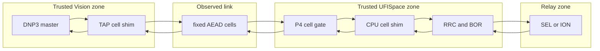

# Selected Design: Packet-Preserving Fixed-Volume Cell Bridge

Gate: S2

Status: **conditional selection awaiting author approval**

No implementation or live mutation is authorized by this document.

## Selection

Select a packet-preserving Layer-2 fixed-volume AEAD cell bridge between a Vision master-side shim and a UFISpace onboard-CPU relay-edge shim.

The design uses:

- Vision software as trusted boundary 1;
- a dedicated fixed-cell EtherType on the observed Vision-to-`dp9` link;
- Tofino P4 only for classification, CPU steering, fixed-path gating, and existing timing/release behavior;
- UFISpace `ens1`/`bf_kpkt` userspace as conditional trusted boundary 2;
- a standard AEAD implementation in software;
- the unchanged SEL/ION relay leg on `dp64`.

The design does not use Hulk, another host, a SmartNIC, an added gateway, or P4 cryptography.

## Initial security policy

The first implementation should target **RN-L** from `SIZE_SECURITY_DEFINITION.md`: real response-length hiding conditioned on a declared transaction class.

The initial evaluation domain must contain at least two different inner lengths. READ-like traffic on the existing SEL/ION leg plus synthetic/offline boundary cases can satisfy that prerequisite without claiming complete transaction-class concealment.

RN-T remains a compatible extension, but no transaction-class-concealment claim is selected at S2. Multi-device indistinguishability remains **NOT DEMONSTRATED** until both existing devices or two stacks are evaluated under the same policy.

## Reader-first architecture

The editable and exported figure is `SIZE_ARCHITECTURE.svg` (and `SIZE_ARCHITECTURE.pdf` when exported). The compact logical view is:



The `D <-> E` CPU path is the unproven edge. The architecture is selected only conditionally until that exact path is demonstrated after approval.

## Why packet preservation matters

The shims carry complete inner Ethernet frames, excluding physical FCS, rather than terminating the master-relay TCP session. After decellization, the original inner Ethernet/IP/TCP/DNP3 bytes are restored at the trusted boundary.

This preserves:

- endpoint TCP sequence and acknowledgment semantics;
- DNP3 checksums and framing;
- the current RRC/BOR ability to inspect clear inner packets in the switch trust zone;
- a future byte-equality oracle between shim inputs and outputs.

The Vision boundary should use a TAP/virtual-Ethernet arrangement so clear inner frames never reach the physical observed NIC. Host offloads must be disabled or normalized at the virtual/physical boundary before evidence collection; S0-S2 do not change them.

## Outer cell protocol

### Public outer fields

The observed frame contains only fixed-format public data:

```text
outer Ethernet header with dedicated EtherType
| protocol version
| fixed policy identifier
| key epoch identifier
| per-direction 96-bit AEAD nonce/counter
| fixed-length ciphertext
| 16-byte authentication tag
```

All frames under one policy have the same complete wire size `C`. Public fields are fixed-size and do not encode inner length, type, occupancy, or final-cell state.

### Authenticated encrypted plaintext

```text
epoch
| protected type
| true inner length
| inner frame count and offsets
| cell index
| data-or-cover state
| inner bytes
| random padding
```

The cell index may also be derivable from the public nonce for replay/order handling, but its authenticated copy remains inside the ciphertext. The cover/data distinction and every padding boundary are encrypted.

### Cryptographic construction

Use a reviewed library implementation of ChaCha20-Poly1305 as the initial software default. AES-GCM is a permitted versioned alternative only after a benchmark and implementation review. No cipher, MAC, PRNG, or key exchange is implemented in P4.

Requirements:

- distinct keys and nonce spaces per direction;
- nonce layout `key_epoch[32] || cell_counter[64]` or another reviewed 96-bit injective layout;
- counter persistence, or fresh keys before any counter restart;
- authenticated protocol/policy version as AAD only when it is already public and fixed across the domain;
- replay window and monotonic epoch lifecycle;
- rekey before counter exhaustion and outside measured epochs;
- prototype keys provisioned out of band and never committed or logged.

The installed Tofino crypto stack proves API availability, not deployment suitability. Its old package/OpenSSL versions require a separate dependency and patch-level review before hardware use.

## Fixed-volume schedule

Each protected transaction uses one symbolic, versioned directional schedule:

```text
request slot       -> exactly K_req cells of size C
ACK/control slot   -> exactly K_ack cells of size C
response slot      -> exactly K_resp cells of size C
tail/ACK slot      -> exactly K_tail cells of size C, if required by the captured TCP lifecycle
```

Every declared slot is emitted whether or not it contains inner bytes. Unused capacity is filled with valid encrypted cover records. Exact slot vocabulary, `C`, `K_*`, offsets, and `L_max` are selected only after S3 replays the full trace corpus, including both directions, reconnects, ACK-only packets, fragmentation, and outliers.

The public epoch begins at a declared Vision-shim event. The relay-edge shim reinjects decoded requests at a fixed deadline so CPU/AEAD processing time does not move the downstream RRC/BOR schedule. Response cells are released at fixed slots after RRC's inner timing decision. If real content misses a deadline, the outer schedule still emits cover and the inner epoch fails closed.

The physical Vision interface is exclusive to the cell protocol while protected mode is active. ARP, IPv6 neighbor discovery, LLDP, TCP setup/teardown, and other clear host traffic must not escape beside the cell stream. Required inner link-control frames are either eliminated through reviewed static configuration or carried in separately declared fixed-volume control epochs; all other host traffic is dropped. The S3 corpus and S4 network-namespace prototype must exercise startup, reconnect, teardown, and idle behavior rather than evaluating only established DNP3 payload packets.

## Request path

```text
master clear inner frame
-> Vision TAP shim buffers the declared epoch
-> shim emits fixed AEAD cells on the physical observed link
-> dp9 P4 gate accepts the cell EtherType and punts only to the CPU
-> ens1 shim authenticates, decrypts, orders, and reconstructs
-> CPU reinjects a trusted internal frame at a fixed deadline
-> P4 strips internal metadata and enters the normal clear RRC/BOR path
-> dp64 delivers original traffic to the selected existing relay
```

## Response path and RRC/BOR ordering

```text
relay clear response on dp64
-> existing clear RRC/BOR classification and timing release
-> P4 diverts the released inner frame to the trusted CPU, not dp9
-> CPU shim cellizes into the fixed response slot
-> CPU reinjects fixed outer cells
-> P4 permits fixed cells, and only fixed cells, to dp9
-> Vision shim authenticates, decellizes, and restores the original inner frame
-> master receives the original TCP/DNP3 packet
```

Mechanism roles remain separate:

- BOR controls whether/when an inner OPERATE is intended for the relay;
- RRC controls the inner ACK/response release policy;
- fixed-volume cellization controls the observer-visible size/count/direction schedule.

The historical `[28,21]` carve is excluded from the public protected transcript. It may remain only as frozen history or an internal trusted-zone experiment; it supplies no new size-security value.

## Loss, duplication, and reordering

The initial cell layer has no public retransmission, NACK, or adaptive recovery. That avoids data-dependent recovery transcripts.

- Receiver buffers at most one configured bounded window per session/direction.
- Nonces and encrypted indices detect duplicate, stale, and reordered cells.
- Cells may arrive out of order within the bounded epoch and are reassembled only after all required authenticated records arrive.
- A missing cell, invalid tag, duplicate conflict, overflow, or deadline miss drops the inner epoch.
- The outer schedule continues with valid cover where the transmitting shim remains alive.
- Inner TCP may recover later through a new full fixed-volume epoch; it never causes variable-sized cell-layer retransmission.

An active attacker can still deny service. The security objective is fixed leakage and safe failure, not guaranteed availability under active loss.

## Overflow and fail-safe policy

If an inner epoch exceeds `L_max`, the shim must not spill a variable number of public cells. It emits the configured fixed cover transcript, delivers no partial inner bytes, increments a local overflow metric, and fails the transaction. A later design may define fixed buckets, but that result must be labeled **PARTIAL: bucketed normalization**.

Protected mode is fail closed:

- `dp9` admits only valid fixed-cell outer traffic into the protected pipeline;
- clear DNP3/TCP from `dp9` is dropped rather than bypassed;
- CPU-origin traffic requires an internal trust marker that never leaves the switch;
- shim crash, missing key, authentication failure, or state desynchronization never opens a native clear path;
- public error packets are not generated inside protected epochs;
- non-cell host and link-control traffic cannot share the physical protected interface in clear form;
- local logs omit keys, payloads, true per-transaction lengths, and padding occupancy.

## Parameter-selection method

S3 will select provisional parameters from:

1. all current physical SEL/ION request and response lengths;
2. larger committed OpenDNP3 traces and synthetic boundaries;
3. complete Ethernet/IP/transport overhead, not DNP3 payload alone;
4. AEAD nonce/tag and cell metadata overhead;
5. current 1500-byte MTU without assuming a jumbo-MTU change;
6. the full fixed directional schedule, including cover and TCP lifecycle frames.

The objective is the smallest `C` and `K_*` that cover the declared RN-L domain without escape while staying safely below MTU. No value is frozen at S2.

## Conditional hardware feasibility contract

The selected architecture becomes deployable only if a later approved proof establishes:

1. exact ASIC CPU-port/value-set and `bf_kpkt` metadata semantics;
2. deterministic `dp9 cell -> CPU -> clear timing path -> dp64` forwarding;
3. deterministic `dp64 -> RRC/BOR -> CPU -> cell -> dp9` forwarding;
4. no clear or variable-length bypass to the observed link;
5. compile/resource fit beside the intended RRC/BOR authority;
6. bounded CPU queueing, latency, throughput, and restart behavior.

Failure of any mandatory condition returns the phase to **blocked by current topology**. It does not authorize a weaker workaround.

## Post-approval gate sequence

After author approval only:

- S3: deterministic offline codec, trace transformation, recovery/error tests, and observer analysis;
- S4: dual-shim network-namespace prototype with synthetic/replayed DNP3;
- S5: isolated integration with RRC/BOR models/replay and fixed-slot timing;
- S6: attended runbook and minimal CPU-port/hardware proof before relay traffic;
- S7: separate evidence package if every earlier gate passes.

No SELECT or OPERATE is needed for initial validation.

## Author decision required

Approve or reject this single conditional decision:

> Proceed after S2 with the packet-preserving Layer-2 AEAD cell bridge, targeting RN-L first, while treating the Tofino CPU punt/reinject path as a hard S6 feasibility condition and accepting that failure ends the mechanism on the current testbed.

## Evidence and standards anchors

- Local security contract: `SIZE_SECURITY_DEFINITION.md`
- Actual capability boundary: `SIZE_TOPOLOGY_CAPABILITY_AUDIT.md`
- Architecture comparison: `SIZE_DESIGN_OPTIONS.md`
- Cryptographic review: `agents/crypto_options.md`
- Trace inventory: `agents/trace_inventory.md`
- ChaCha20-Poly1305: RFC 8439, <https://www.rfc-editor.org/info/rfc8439/>
- Python AEAD API: <https://cryptography.io/en/stable/hazmat/primitives/aead/>
