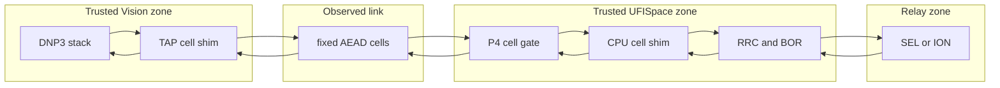

# Size Threat Model v2

Gate: S2

Status: design threat model awaiting architecture approval

## Executive summary

The core risk is not weak packet shaping but any path that lets protected inner length reappear in the observed transcript. The highest-risk surfaces are the fixed-volume invariant, the unproven Tofino CPU punt/reinject boundary, nonce/key lifecycle, fixed-slot deadlines, and fail-closed routing. A cleartext bypass, variable cell count, or reused nonce invalidates the primary security claim; a CPU-path failure that cannot be repaired with current hardware terminates the architecture.

## Scope and assumptions

In scope:

- `defense4/size/real_size_normalization/` design and later shim/P4 integration;
- Vision DNP3 stack and proposed TAP/virtual-Ethernet shim;
- observed physical Vision-to-Tofino `dp9` link;
- Tofino P4 cell gate and existing RRC/BOR functions;
- UFISpace onboard CPU, `ens1`, and `bf_kpkt` candidate boundary;
- unchanged `dp64` SEL/ION relay leg;
- passive size confidentiality and active-fault integrity/safe failure.

Out of scope:

- Hulk, added hosts, SmartNICs, gateways, relays, or Internet deployment;
- endpoint, administrator, supply-chain, or physical compromise;
- availability against an active on-path denial-of-service attacker;
- transaction-class concealment until RN-T is separately selected and tested;
- multi-device indistinguishability without two-device/stack evidence;
- any S0-S2 live dataplane or relay mutation.

Key assumptions already validated with the user and directive:

- only the current lab testbed may be used;
- the primary observer is passive, protocol-aware, and sees the full Vision-to-Tofino transcript;
- active loss/injection is a robustness case, not required to infer a leaking length;
- keys are provisioned out of band for prototypes and never stored in the repository;
- protected mode has no cleartext fallback.

Open questions that materially change risk:

- Can the installed CPU path provide exact bidirectional punt/reinject through the intended timing pipeline?
- Can a compiled integrated P4 design fit without weakening RRC/BOR or the cell gate?
- What fixed `C`, `K_*`, `L_max`, and slot deadlines cover the complete declared corpus?
- Is the Tofino CPU cryptographic runtime updated to an acceptable supported version before hardware use?

## System model

### Primary components

- **Vision DNP3 master and TCP/IP stack** — unmodified endpoint that must receive original inner frames.
- **Vision TAP cell shim** — trusted encoder/decoder and fixed-slot scheduler.
- **Observed link** — dedicated physical link carrying only fixed-format AEAD cells in protected mode.
- **Tofino P4 cell gate** — classifies cell EtherType, gates cleartext, and steers CPU traffic; performs no crypto.
- **UFISpace CPU cell shim** — candidate trusted decoder/encoder on `ens1`/`bf_kpkt`.
- **RRC/BOR pipeline** — trusted clear-zone timing and release mechanisms.
- **SEL/ION relay leg** — unchanged DNP3 endpoints on `dp64`.

### Data flows and trust boundaries

- **Vision stack -> Vision shim** — complete clear Ethernet/IP/TCP/DNP3 frames cross a local virtual-Ethernet boundary. Channel: TAP/veth or equivalent. Guarantee: local trusted process boundary. Validation: frame bounds, supported policy, checksum/length consistency, bounded epoch admission.
- **Vision shim -> observed link** — fixed `C`-byte AEAD Ethernet cells cross the hostile observation boundary. Channel: dedicated outer EtherType on the physical NIC. Guarantee: confidentiality/integrity from reviewed AEAD; fixed `K_*` and slots. Validation: fixed encoder, unique nonce, no clear egress.
- **Observed link -> P4 gate -> CPU shim** — opaque cells cross from untrusted link into the candidate UFISpace trust boundary. Channel: Tofino CPU-port packet DMA through `bf_kpkt`. Guarantee: P4 allowlist plus AEAD authentication. Validation: outer format/size gate, then tag/replay/epoch checks in userspace.
- **CPU shim -> P4 RRC/BOR -> relay** — reconstructed clear frames cross an internal trusted CPU/data-plane boundary. Channel: CPU reinjection plus internal P4 metadata. Guarantee: trusted-origin marker stripped before external egress. Validation: exact frame reconstruction, direction/port allowlist, fixed reinjection deadline.
- **Relay -> RRC/BOR -> CPU shim** — clear response frames cross from unchanged relay into the trusted timing and cellization zone. Channel: `dp64`, internal P4, CPU packet path. Guarantee: existing timing policy plus no direct `dp9` clear egress. Validation: admitted DNP3 class, epoch match, bounded response.
- **CPU shim -> observed link -> Vision shim** — fixed response/cover cells cross the observer boundary. Channel: CPU reinjection, P4 `dp9`, physical link. Guarantee: identical size/count/direction schedule. Validation: P4 fixed-cell allowlist and Vision AEAD/replay checks.
- **Operators -> keys/configuration** — trusted administrative input crosses into both shims. Channel: local files/process environment or later key service. Guarantee: least privilege and no repository/log storage. Validation: strict permissions, key length/version checks, startup fail closed.

#### Diagram

## Assets and security objectives

| Asset | Why it matters | Security objective (C/I/A) |
| --- | --- | --- |
| True DNP3 length/type/occupancy | The phase exists to hide these values from the observer. | C |
| Complete outer transcript invariant | Size, count, direction, and slots must not depend on inner length. | C/I |
| Inner Ethernet/IP/TCP/DNP3 bytes | Endpoints require exact reconstruction and valid semantics. | I/A |
| Directional AEAD keys | Disclosure permits decryption/forgery; reuse can destroy security. | C/I |
| Nonce counters and key epochs | Uniqueness and monotonicity are mandatory for AEAD safety. | I/A |
| Replay/epoch state | Prevents stale or duplicate cells from becoming inner traffic. | I/A |
| P4 cell gate and trust marker | Prevents cleartext bypass and CPU-origin spoofing. | I/C |
| RRC/BOR state and deadlines | Cellization must not weaken timing/release safety. | I/A |
| Relay contact state | A size experiment must not cause physical actuation. | I/A |
| Evidence and logs | Must prove behavior without retaining keys or clear sensitive payloads. | I/C |

## Attacker model

### Capabilities

Primary confidentiality attacker:

- passively records both directions of the full observed link;
- measures wire sizes, counts, directions, flows, exact timestamps, loss, fragmentation, and visible control traffic;
- parses all public formats and knows the design/source/policy;
- compares many epochs, trains classifiers, and conditions on known transaction class under RN-L.

Robustness/integrity attacker:

- injects, duplicates, reorders, corrupts, delays, or drops outer cells;
- replays previously captured valid cells;
- causes queue pressure or process restarts without compromising trusted code or keys;
- sends malformed public cells at line rate within the lab threat exercise.

### Non-capabilities

- cannot read shim memory, keys, or clear trusted-zone traffic;
- cannot modify P4, host binaries, configuration, or relay firmware;
- cannot authenticate as an operator or replace key material;
- cannot obtain a separate relay-facing passive tap not present in the testbed;
- cannot demand availability after arbitrary active packet loss.

## Entry points and attack surfaces

| Surface | How reached | Trust boundary | Notes | Evidence (repo path / symbol) |
| --- | --- | --- | --- | --- |
| Vision clear-frame ingress | Local TAP/veth | Vision stack -> shim | Variable inner frames enter the encoder; bounds and epoch parsing are security critical. | `SIZE_SELECTED_DESIGN.md` |
| Vision physical egress | Physical `enp59s0f0np0` | Shim -> observed link | Any clear or variable frame violates the claim. | `SIZE_TOPOLOGY_CAPABILITY_AUDIT.md` |
| P4 outer parser/gate | `dp9` cell EtherType | Observed link -> switch | Must accept only exact fixed cells and never expose public error variation. | `SIZE_SELECTED_DESIGN.md` |
| `ens1`/`bf_kpkt` receive | CPU packet DMA | P4 -> CPU shim | Candidate boundary is present but endpoint-transparent semantics are unproven. | `agents/topology_capability.md` |
| AEAD decoder and epoch buffer | Authenticated cell input | Untrusted cell -> trusted plaintext | Nonce, replay, index, bounds, and deadline logic are critical. | `agents/crypto_options.md` |
| CPU reinjection | Raw inner/internal frames | CPU shim -> P4 | A forged direction/trust marker could bypass policy or misroute traffic. | `SIZE_TOPOLOGY_CAPABILITY_AUDIT.md` |
| RRC/BOR handoff | Clear relay traffic | Cell layer -> timing layer | Ordering mistakes can leak timing or alter delivery safety. | `defense4/README.md` |
| Overflow/deadline path | Oversize or late inner record | Trusted control path | Must emit fixed cover and deliver no partial bytes. | `SIZE_SELECTED_DESIGN.md` |
| Key/config loading | Local operator surface | Admin -> shim | Invalid or leaked keys defeat AEAD; missing key must fail closed. | `HARNESS_BOUNDARIES.md` |
| Metrics/logging | Local files/telemetry | Trusted data -> operators | Length, occupancy, plaintext, and keys must not leak through evidence. | `SIZE_SELECTED_DESIGN.md` |

## Top abuse paths

1. **Recover inner length from variable volume:** observe many epochs -> group cells by public schedule -> detect a size/count/slot variation -> map variation to protected length -> defeat RN-L.
2. **Trigger a cleartext escape:** crash or desynchronize one shim -> P4/host fallback forwards native DNP3 -> parse length/function/TCP sequence directly -> defeat confidentiality.
3. **Exploit the unproven CPU boundary:** send a cell that takes an unexpected parser/reinjection path -> expose clear inner bytes on `dp9` or misroute them to `dp64` -> break confidentiality or integrity.
4. **Reuse a nonce after restart:** force restart or counter rollback -> collect two ciphertexts under one key/nonce -> exploit AEAD nonce misuse -> recover/forge protected content.
5. **Create a recovery oracle:** drop selected cell indices -> compare NACK/retransmission/error timing for data versus cover -> infer occupancy or true length.
6. **Force overflow or deadline spill:** submit an admitted-looking inner epoch above `L_max` or delay a real response -> observe extra cells or a late native response -> infer a size bucket or exact length.
7. **Infer length from compute timing:** compare cell release jitter under different padding/AEAD workloads -> learn occupied bytes or frame count despite fixed volume.
8. **Leak through control traffic:** observe clear ARP/NDP/LLDP, or correlate rekeys, keepalives, PMTU errors, and session setup with transaction boundaries -> recover endpoints, class, or workload changes.
9. **Exhaust CPU/epoch buffers:** flood fixed-cell input -> starve scheduled cover generation -> observe gaps or cause unsafe fail-open forwarding -> break security/availability.
10. **Corrupt endpoint semantics:** exploit frame-offset or ordering bugs -> deliver malformed/reordered TCP bytes -> trigger retransmissions/resets whose pattern correlates with inner workload.

## Threat model table

| Threat ID | Threat source | Prerequisites | Threat action | Impact | Impacted assets | Existing controls (evidence) | Gaps | Recommended mitigations | Detection ideas | Likelihood | Impact severity | Priority |
| --- | --- | --- | --- | --- | --- | --- | --- | --- | --- | --- | --- | --- |
| TM-001 | Passive observer | Can group protected epochs | Learns length from variable outer size, count, direction, or slot | Core claim failure | Inner metadata; transcript | Fixed-volume invariant specified in `SIZE_SECURITY_DEFINITION.md`; no implementation yet | `C/K_*` and corpus not selected | One versioned schedule; invariant assertions; cover every slot; whole-transcript tests | Per-epoch transcript hashes; size/count invariant alarm; MI/classifier regression | High | High | critical |
| TM-002 | Process/P4 failure | Shim or rule fails while native path exists | Sends clear or variable DNP3 on `dp9` | Immediate confidentiality failure | Inner bytes; transcript | Fail-closed design in `SIZE_SELECTED_DESIGN.md`; design-only | No implemented cell-only gate/watchdog | Default-drop clear EtherType/IP; atomic protected-mode enable; no bypass rule; negative tests | Clear-DNP3 signature detector on observer capture; gate counters | Medium | High | critical |
| TM-003 | Malformed cell / integration bug | CPU metadata contract is wrong or spoofable | Misclassifies CPU-origin/outer/inner traffic and leaks or misroutes frames | Confidentiality, integrity, availability failure | P4 gate; endpoint bytes; relay state | S1 explicitly marks path unproven | Exact CPU dev-port/header and resource fit unknown | Dedicated internal header; strict parser state; direction/port allowlist; compile and isolated path proofs before relay use | Per-path counters; forbidden-egress assertions; CPU trust-marker strip check | Medium | High | high |
| TM-004 | Restart, state loss, or operator error | Same key survives nonce rollback | Reuses AEAD nonce or direction key | Decryption/forgery risk and invalid evidence | Keys; inner data; transcript | Crypto review requires directional counters in `agents/crypto_options.md` | No key store/counter implementation | Fresh key on every counter reset; atomic persisted epoch; distinct direction keys; startup refusal | Nonce uniqueness ledger; monotonic counter metrics; duplicate-nonce hard stop | Medium | High | critical |
| TM-005 | Active network attacker | Can replay/drop/reorder cells | Creates data-dependent retry/error transcript or delivers stale bytes | Leakage, corruption, DoS | Replay state; transcript; endpoint bytes | Selected design forbids public retransmission/NACK | Buffer/replay logic unimplemented | Fixed deadline; bounded reorder window; authenticated indices; epoch drop; cover-only public continuation | Replay/auth-failure counters; fixed-gap monitor; no public error packets | Medium | High | high |
| TM-006 | Passive timing observer | AEAD/serialization or queue delay varies with occupancy | Infers length from release jitter | RN-L failure despite fixed size | Schedule; inner length | Fixed-slot requirement in S0/S2; RRC historical timing evidence | CPU cellization timing unmeasured | Precompute cover; constant slot scheduler; budget worst-case crypto; drop late real data | Slot-deadline histograms; occupancy-vs-jitter tests; deadline-miss alarm | Medium | High | high |
| TM-007 | Oversize input or late relay | Can trigger boundary/timeout conditions | Causes spill cells, bucket escape, partial delivery, or late native forwarding | Exact/bucket leakage and corruption | `L_max`; transcript; endpoint bytes | S2 specifies fixed cover and fail-closed overflow | Parameters and overflow code absent | Admission before release; never spill; fixed cover; no partial decode; label any bucket policy PARTIAL | Overflow metric local only; observer invariant check; partial-delivery assertion | Medium | High | high |
| TM-008 | Passive observer | Host/link/tunnel control shares the protected interface | Observes clear ARP/NDP/LLDP or correlates handshake, rekey, keepalive, or PMTU traffic with epochs | Endpoint/class/arrival leakage; confounds evidence | Transcript; policy metadata | Selected design makes the physical interface cell-exclusive; design-only | Startup, rekey, and inner link-control epochs still require implementation | Drop non-cell physical egress; static neighbor state or fixed control epochs; rekey outside measured epochs at fixed maintenance slots; public silence on errors | Full-EtherType classifier; clear-frame alarm; maintenance-slot counter | Medium | Medium | medium |
| TM-009 | Active flood or benign overload | Reaches `dp9` or CPU queue | Exhausts CPU, buffer, or scheduler and creates gaps/fail-open state | DoS and possible leakage | CPU availability; transcript; relay safety | Bounded-buffer/fail-closed intent in S2 | Capacity and backpressure unmeasured | Strict per-session quotas; bounded memory; reserved cover scheduler; P4 rate limit after profiling; no fail open | CPU/queue high-water alerts; cover-gap monitor; watchdog state | Medium | High | high |
| TM-010 | Local logs/evidence operator | Has access to artifacts or debug mode | Records keys, plaintext, true length, or occupancy | Bypasses wire confidentiality and contaminates evidence | Keys; inner data; evidence | Harness forbids secrets; S2 logging rule | No implementation/log schema | Redact by construction; aggregate metrics; file permissions; secret scan; never log nonce-key pairs with plaintext | CI secret scan; artifact manifest review; log-field allowlist | Low | High | medium |
| TM-011 | Codec implementation bug | Valid cells reconstruct wrong frame offsets/order/checksum | Delivers altered TCP/DNP3 and triggers resets/retries or unsafe semantics | Integrity/availability; possible timing leak | Inner bytes; relay state; transcript | Existing frozen reconstruction tools; S3 exact-byte requirement | New codec absent | Property tests; paired byte oracle; CRC/checksum verification; mutation tests; READ-only first | Byte-diff oracle; checksum counters; TCP reset/retransmission alarms | Medium | High | high |

## Criticality calibration

**Critical** means the core confidentiality construction is broken or standard cryptographic safety is lost:

- any clear DNP3 frame or variable cell count appears on the protected observer link;
- a repeated AEAD nonce under the same key is accepted or emitted;
- the observer recovers exact protected length above calibrated chance from the full transcript.

**High** means a realistic path can corrupt endpoint behavior, leak a strong length signal, or defeat safe failure:

- CPU reinjection can reach the wrong external port;
- overflow or loss creates a data-dependent public recovery pattern;
- CPU timing makes slot release depend on occupied inner bytes.

**Medium** means a bounded or conditional weakness complicates evidence or reveals metadata outside the initial RN-L objective:

- maintenance rekey traffic reveals session boundaries but not protected length;
- logs expose per-epoch aggregate counts to trusted operators but contain no keys/plaintext;
- an endpoint reset causes availability loss while the public transcript remains fixed.

**Low** means no protected data, transcript invariant, endpoint integrity, or relay safety is affected:

- cosmetic metric naming or diagram drift;
- inefficient offline tooling that preserves exact output;
- local warnings outside protected epochs with no correlated wire event.

## Focus paths for security review

| Path | Why it matters | Related Threat IDs |
| --- | --- | --- |
| `defense4/size/real_size_normalization/SIZE_SECURITY_DEFINITION.md` | Defines the invariant and claim boundary all tests must enforce. | TM-001, TM-006, TM-007 |
| `defense4/size/real_size_normalization/SIZE_SELECTED_DESIGN.md` | Defines record format, key lifecycle, schedule, fail-closed behavior, and integration order. | TM-001-TM-011 |
| `defense4/size/real_size_normalization/SIZE_TOPOLOGY_CAPABILITY_AUDIT.md` | Contains the decisive unproven CPU-boundary dependency. | TM-002, TM-003, TM-009 |
| `defense4/size/real_size_normalization/agents/crypto_options.md` | Grounds AEAD, nonce, replay, rekey, and tunnel choices. | TM-004, TM-005, TM-008 |
| `defense4/size/real_size_normalization/agents/trace_inventory.md` | Defines corpus gaps that affect `L_max`, slots, and overflow. | TM-001, TM-007, TM-011 |
| `defense4/size/native_parity/evidence/E_FINAL/scripts/size_reconstruct.py` | Existing TCP-aware reconstruction is the negative-control observer. | TM-001, TM-011 |
| `defense4/size/native_parity/p4/defense4_rrc_bor_unified12.p4` | Future CPU steering must preserve the authoritative timing/release semantics. | TM-002, TM-003, TM-006 |
| `defense4/size/native_parity/p4/defense4_rrc_bor_unified12_setup.py` | Future protected-mode rules and port gating will meet existing control-plane state here or in a reviewed successor. | TM-002, TM-003, TM-009 |
| `defense4/size/offline/transport_oracle.py` | Reusable endpoint stream and retransmission invariant surface for S3/S4. | TM-005, TM-011 |
| `defense4/size/real_size_normalization/HARNESS_BOUNDARIES.md` | Prevents unsafe live mutation and secret/evidence boundary crossing. | TM-002, TM-009, TM-010 |

## Quality check

- Entry points include clear-frame admission, public cells, CPU receive/reinject, timing handoff, overflow, key loading, and logs.
- Every trust boundary appears in at least one threat.
- Runtime design, frozen historical evidence, and future tests are separated.
- The user-confirmed current-testbed-only constraint and passive observer are explicit.
- Active faults are separated from the passive confidentiality attacker.
- Open capability and parameter questions remain visible.
- No secret, key, package installation, implementation, or hardware change is included.
