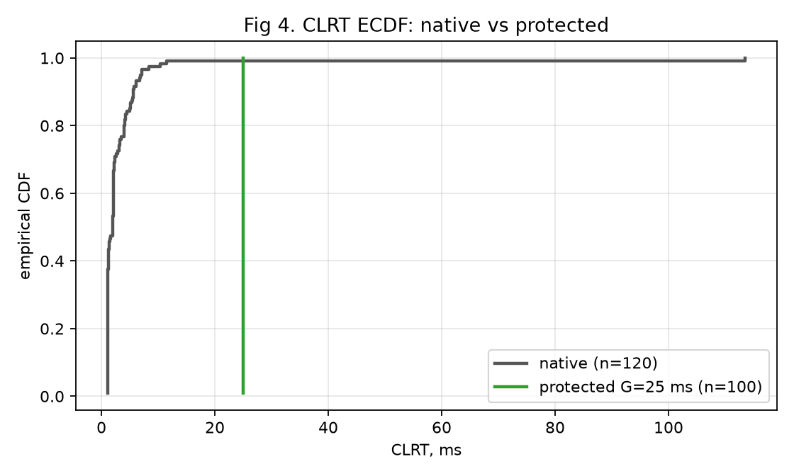

::: buildinfo
Source commit: `@COMMIT@` · Built: `@DATE@` · Reference program: `dnp3_timing_normalizer.p4` (sha 82f572ce)
:::

# 1. What this tutorial is

**In plain terms.** A device on a SCADA network can be identified just by *watching* how long it takes
to answer — no need to touch it. This project makes that timing look identical no matter which device
is behind the switch, using the switch itself. This tutorial explains the idea from first principles,
shows the mechanism on real hardware, and is honest about what it does and does not hide.

The tutorial has two layers. **Layer 1** (plain language) opens every major section — read just those
if you want the idea. **Layer 2** (technical detail) follows for readers who want the P4 and the
measurements. Every acronym is defined the first time it appears.

*DNP3* = Distributed Network Protocol 3, a common protocol between electric-grid control rooms and
field devices. *CLRT* = Cross-Layer Response Time, defined in §3. *Tofino-1* = the programmable
switch chip this runs on.

# 2. Background: DNP3, masters, outstations, and the three messages

**Layer 1.** In DNP3 a **master** (in the control room) asks questions and an **outstation** (a field
device such as a protective relay) answers. To read the outstation's data the master sends a **READ**.
Because DNP3 runs over TCP, the outstation's computer first sends a bare **ACK** ("I received your
packet") and then, a little later, the actual **RESPONSE** (the data). So one transaction is three
messages: READ → ACK → RESPONSE.

**Layer 2.** The READ is a DNP3 application request with function code 1. The ACK is a pure TCP
acknowledgement — a segment with the ACK flag set and zero payload (`tcp.len == 0 && tcp.flags.ack ==
1`). The RESPONSE is a DNP3 application response, function code 129. On the relay we study (a
Schweitzer SEL-751), the ACK and RESPONSE are **separate** packets; some other devices piggyback the
ACK onto the response and so have no separate ACK at all — a distinction that matters in §11.

# 3. What CLRT is and why it fingerprints a device

**Layer 1.** The gap between the ACK and the RESPONSE is the time the device spent thinking — reading
its inputs, building the answer. Different devices think at different, characteristic speeds, so this
gap is like a fingerprint. Formby and colleagues named it the **Cross-Layer Response Time (CLRT)**.

**Layer 2.** The ACK is emitted by the TCP stack on receipt; the RESPONSE is emitted after the
firmware's scan-and-assemble path. The gap is therefore a direct measurement of internal processing
latency, stable per device and distinct across devices. On our physical SEL-751 the native CLRT has a
median of 2.03 ms and a standard deviation of 10.33 ms; measured as observer entropy at 1 ms
resolution it carries **2.73 bits** of identifying information.


# 4. The threat model

**Layer 1.** The attacker only *watches* the network — they never log into any device. From timing and
packet headers alone they work out which relay model is answering, then look up that model's known
weaknesses. The defender wants the wire to look the same regardless of the device behind it.

**Layer 2.** This is passive device fingerprinting: reconnaissance with no active probing. It is one
step in a kill chain — model identification precedes targeted exploitation. The defense must be
*non-cooperative* (it cannot modify the certified relay) and must not itself add a detectable
software-latency signature.

# 5. The idea: hold the response inside the switch

**Layer 1.** When the real RESPONSE reaches the switch, the switch does not send it on immediately.
It parks the *original* packet in a waiting area and releases it at a fixed time — the ACK time plus a
chosen constant **G**. Every response then leaves at the same delay, so the timing fingerprint
disappears. Crucially the switch never rewrites the packet: what comes out is byte-for-byte what the
device sent.


**Layer 2.** The switch classifies the DNP3 transaction in its ingress pipeline, steers the response
into a low-priority Traffic-Manager queue, and declines to schedule that queue until a data-plane
deadline. No endpoint is modified; no controller is consulted per transaction (the control plane only
sets G once). Because the original packet is enqueued unmodified and released as-is, the mechanism is
byte-preserving — no CRC recompute, no field edits.

# 6. Where the original response waits, and what blocker tokens are

**Layer 1.** The waiting area is a queue inside the switch. To keep that queue "closed", the switch
keeps a small pool of tiny internal packets — **blocker tokens** — busy in a *higher-priority* queue.
As long as those tokens are circulating, the switch always serves them first and the response queue
has to wait. The tokens never leave the switch, so anyone watching the network sees none of them.


**Layer 2.** *TM* = Traffic Manager, the switch's queueing block. Q_BLOCK is queue id 7 (high strict
priority); Q_RESP is queue id 1 (low). Blocker tokens are internal frames with EtherType `0x88c1` that
recirculate on the loopback port dp8. A *reservoir* of tokens (K ≥ 64) is required, not a single
token, because a lone token can drain between arbitration cycles and briefly open the gate. "Holding"
is therefore an emergent property of keeping the high-priority queue non-empty, not a software timer.

# 7. Why blocker tokens never reach the endpoints

**Layer 1.** The blocker tokens exist only to occupy the switch's scheduler. They loop around an
internal port and are thrown away when their job is done. They are never addressed to the master or
the outstation and never go out a real port.

**Layer 2.** `to_block()` sets `bypass_egress = 1` and directs the token to the loopback port, so it
never traverses egress to a host. We verified this: the protected capture contains **zero** frames
with EtherType `0x88c1` at the master. Confirm it yourself:

<details><summary>Show the check</summary>

```bash
tshark -r example_pcaps/protected_demo.pcap -Y "eth.type==0x88c1"   # expect: no output
```
</details>

# 8. How the deadline arms and releases the response

**Layer 1.** When the switch sees the ACK, it notes the time and sets a deadline: ACK time + G. While
the deadline is in the future, the blocker tokens keep circulating and the response waits. The moment
the deadline passes, the tokens are retired; the high-priority queue empties; the switch finally sends
the response — untouched.


**Layer 2.** The transaction is armed by the READ (which claims a per-transaction *generation* tag).
The first qualifying ACK writes the deadline **idempotently** — a retransmitted ACK cannot move it.
Each recirculating blocker compares the current time to the deadline using a sign-bit ternary match
(the chip cannot do a 32-bit magnitude compare in one step); past the deadline the token is terminated
instead of re-injected. Full arithmetic and the packed state word are in `CODE_WALKTHROUGH.md` §5–§10.

# 9. Why the release has a small, stable tail

**Layer 1.** Release is not perfectly instant — there is a tiny, *fixed* lag between the deadline and
the response actually leaving. Because it is fixed (about 1.7 microseconds) and the same for every
device, it carries no fingerprint.


**Layer 2.** The tail decomposes into c1 (mean 14.4 ns, sd 7.16 ns) and c2 (mean 1720.1 ns, sd 1.14
ns), total 1734.5 ns with sd 7.34 ns — a property of the recirculation loop, independent of the
device. It is why the protected CLRT sits at G + ~1.7 µs and why residual timing entropy is 0 bits at
millisecond resolution, appearing only below 100 µs.

# 10. Fail-open and how G is selected

**Layer 1.** If anything goes wrong with the holding loop, the switch **releases** the response rather
than trapping it forever — losing a real SCADA response is unacceptable. And G must be chosen *above*
the device's natural response time; otherwise there is nothing to hold.


**Layer 2.** *Fail-open:* each token has a finite pass budget; a token that exhausts it retires the
transaction and the response is released (`ctr_release_fail_open`). *G selection:* the guard measures
`native_clrt = t_response − t_ack`, flags `protection = native_clrt < G`, and counts `zero_hold`
transactions. Set G above the p99 native CLRT of the slowest device in the anonymity set — we used
25 ms (native p99 ≈ 11.42 ms). At G = 1 ms every transaction is flagged zero-hold.

# 11. What the mechanism does and does not conceal

**Layer 1.** It hides the *timing* fingerprint — and only that. It does not hide the fact that this
device sends a separate ACK, nor its TCP settings, nor its response size. So it is one piece of a
bigger picture, not a full disguise.

**Layer 2 (claim discipline).**

- **Conceals:** the CLRT-magnitude channel — entropy drops from 2.73 bits to 0.00 bits at millisecond
  resolution on the real SEL-751 traffic, with the response byte-identical.
- **Does not conceal:** *ACK mode* (the SEL-751 uniquely sends a separate ACK), *TCP-stack* signature
  (TTL/MSS/window), and *response size*. On our 3-device corpus ACK mode and TCP stack already identify
  the relay at balanced accuracy 1.000, and they are untouched here.
- Because only the SEL-751 has a CLRT at all in this corpus, closing it is an *anonymity-set-of-one*
  result — a genuine within-channel reduction and a working mechanism, but not, by itself, a reduction
  in a real multi-channel device classifier. Size obfuscation is a **separate, unproven** line, out of
  scope this week; this mechanism does not pad or split.

# 12. Results




At G = 25 ms over 100 repetitions on the relay's real frames: median 24.999 ms, standard deviation
0.010 ms (native 10.33 ms) — a 1000× spread collapse — and byte-identity on all 100 responses. The
switch footprint is 10 of 12 ingress stages, 0 egress stages, 0 TCAM.

The full pipeline was also run **live end-to-end on the physical Tofino-1** (program loaded, real
replay traffic injected from both hosts, captured and verified on hardware, switch restored
afterward): native CLRT median 1.98 ms → protected 25.00 ms (n = 30), 30/30 released, 0 unmatched
frames, 0 external blocker frames, all verifier gates passing. See `evidence/live_demo/`.


# 13. How to run it

The runnable lab lives in `research/timing_final/` with a `Makefile`. The safe default is a replay
demonstration of the relay's real frames — no relay modification, no DNP3 control or write traffic.

<details><summary>The ten-minute path (see QUICKSTART.md for expected output per step)</summary>

```bash
cd research/timing_final
make preflight        # check the lab
make build            # compile / verify dnp3_timing_normalizer.p4
make load             # load the timing program
make configure-tm G_MS=25
make capture OUTPUT=protected_demo.pcap &
make run-protected TRIALS=10 G_MS=25
make analyze PCAP=protected_demo.pcap G_MS=25
make restore          # return the switch to queue_microbench
```
</details>

The one guarded command is `make demo MODE=replay TRIALS=10 G_MS=25`. Full operator procedure:
`LAB_RUNBOOK.md`. Inspect the captures: `WIRESHARK_GUIDE.md`. If anything misbehaves:
`TROUBLESHOOTING.md`.

# 14. Limitations and security scope

This is a **mechanism** result on real Tofino-1 silicon: a data-plane-scheduled, chaff-free,
byte-preserving timing-normalization state that substantially reduces the CLRT-magnitude fingerprint of
one physical relay. It is **not** full device anonymity, **not** size obfuscation, **not** a live
inline relay session (it is replay of the relay's real frames), and it is not demonstrated across
devices or TCP configurations, nor is it production-ready. Turning the within-channel result into an
end-to-end security result requires a fleet of separate-ACK devices normalized to a shared G with
ACK-mode and TCP-stack held constant — the natural next step. See `TIMING_MECHANISM_EXPLAINED.md` and
`TIMING_FINGERPRINTING_ANALYSIS.md` for the full treatment, and `references.md` for sources.
