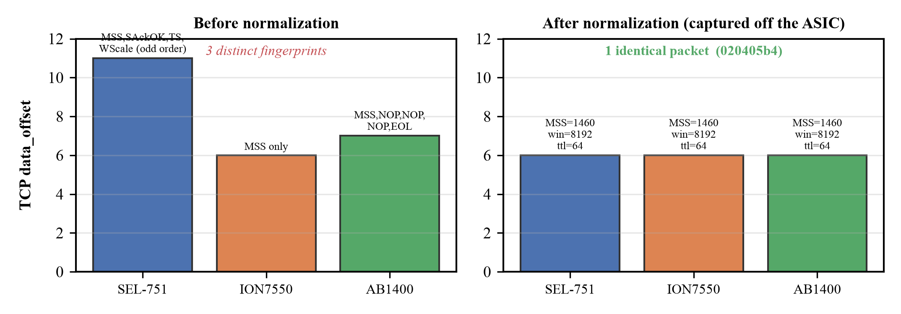
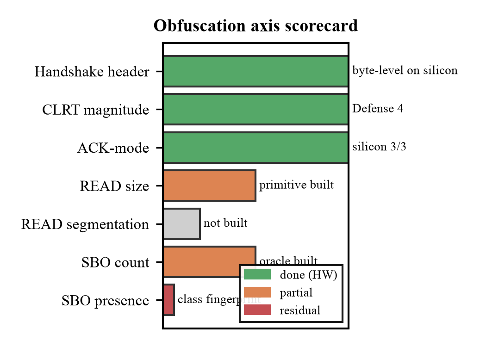
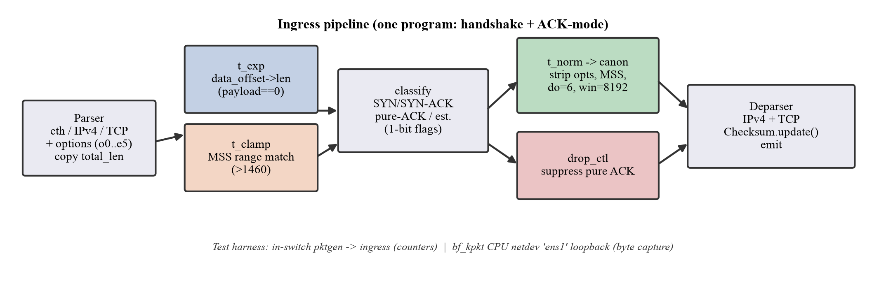

# Making two power-grid devices look the same: DNP3 timing-and-size obfuscation on a Tofino switch

A tutorial and explainer for the joint timing-and-size obfuscation built in this project. It walks
through the idea, the mechanism, how it maps onto the Tofino-1 pipeline, and what we proved on real
silicon. You do not need to have seen the code — every claim links to the file and the evidence.

---

## 1. The problem: a device gives itself away before it says anything

A DNP3 outstation is a piece of grid equipment — a protective relay, a meter — that answers polls
from a master over TCP. An attacker who can only *watch* the traffic (a passive observer, no
decryption) still wants to know **which device** is on the wire: a protective relay is a far more
interesting target than a revenue meter.

The device tells on itself in three ways, none of which is the payload:

- **How its TCP handshake looks.** Every TCP stack negotiates options — Maximum Segment Size,
  Timestamps, Window Scale, SACK-permitted — and each vendor's stack lays them out differently. In
  our capture corpus the three physical devices had three distinct SYN-ACK option layouts (the
  `data_offset` field alone was 11, 6, and 7). That layout is a fingerprint.
- **How it times its answer.** A Schweitzer SEL-751 sends a *separate* TCP ACK and then the
  response a millisecond or two later (a measurable ACK-to-response latency, the "CLRT"); an
  ION7550 piggybacks the ACK on the response. The delay *and* the two-packets-vs-one *shape* are
  fingerprints.
- **How big its answers are, and whether it does controls.** Response sizes, segment counts, and
  the presence of SELECT/OPERATE control exchanges all separate one device from another.

**The ideal.** Put one programmable switch (an Intel Tofino-1) in front of the outstation and make
the observable traffic **independent of the device** — so the SEL-751 and the ION7550 look
identical on the wire. Not "encrypted" (the constraint is plaintext DNP3, one switch, no proxy, no
second box), just *indistinguishable*.

The load-bearing subtlety, and the honest boundary of the whole project: the SEL-751 and ION7550
are different **device classes** — a separate-ACK relay that does controls, versus a combined-ACK
read-only meter. Some fingerprints can be collapsed cleanly; a few are structural and cannot be
erased without manufacturing traffic. We are precise below about which is which.

---

## 2. The mechanism, axis by axis

The observable transcript is a sequence of `(inter-packet gap Δ, size S, direction d)`. We attack it
one **axis** at a time, converting each into a "bounded win" with its own mechanism, oracle, and
hardware test, rather than claiming the whole transcript at once.



**Figure 1.** The headline result on the handshake axis. Before normalization the three devices have
three distinct handshake fingerprints (left). After the switch normalizes them, all three emit one
identical packet (right) — verified by capturing the bytes off the ASIC.

### Handshake header — make every SYN/SYN-ACK canonical
The switch rewrites only the handshake. It strips Timestamps / Window-Scale / SACK-permitted, forces
a single canonical `[MSS]` option, sets `data_offset = 6`, clamps the MSS to a public 1460 (never
raising it — that would risk a PMTU black-hole), canonicalizes the TCP window to a public constant,
sets TTL to 64, zeroes the IP-ID on atomic datagrams, and recomputes both checksums. Everything it
does not fully understand — a TCP-MD5/AO option, a SYN carrying payload, a fragment, an over-long
option region — it **fails open** (forwards untouched). The rewrite is *stateless and
packet-bounded*: no per-flow tables, no reassembly.

A key correctness point that took an iteration to get right: the rewrite must be **symmetric**. If
you strip options from the master's SYN but leave the outstation's SYN-ACK alone, the two ends
disagree about window scaling. Because the switch strips *both* directions, both ends consistently
negotiate "no options," and there is no desync. This is what lets us aggressively canonicalize the
SEL-751's full-option SYN-ACK instead of failing open on it.

### Response timing — CLRT magnitude, and ACK-mode
Two sub-signals. The **CLRT magnitude** (the actual delay) is held to a public deadline so its
distribution collapses — this is the accepted Defense 4 timing work. The **ACK mode** (two packets
vs one) is a separate shape: the switch **suppresses the outstation's standalone pure ACK**
(`ig_dprsr.drop_ctl`); the DNP3 response that follows within the CLRT re-acknowledges the master, so
the Case-A device now emits one observable packet, matching Case B. This is safe for the DNP3
request→ACK→response pattern within the timing budget; a fully robust deployment needs a light
per-flow "response pending" bit for CONFIRM/keepalive ACKs that are not followed by data.

### Response size and SBO
The **READ-range** primitive rewrites a request's object stop field to a public superset (keeping the
request's byte length identical), so the outstation naturally emits a public-target-sized response —
no byte is inserted, so no TCP sequence translation is needed. The **SBO** size mechanism pads a
SELECT/OPERATE with inert decoy control blocks to a public size, which *does* insert bytes and so
needs per-flow TCP sequence-delta translation; an oracle shows a single 32-bit delta plus an ACK
fix-up keeps an unmodified master consistent.



**Figure 2.** Where each axis stands. Three axes are done with hardware proof (handshake — byte
level; CLRT magnitude; ACK-mode). READ size is a built primitive; the SBO *presence* of controls is a
structural class fingerprint that padding cannot hide (a meter does no controls), and we say so
plainly rather than overclaim.

---

## 3. How it lands on the Tofino pipeline

A Tofino program is three stages: a **parser** that pulls fields out of the packet, a **match-action
(MAU)** section of tables that decide and rewrite, and a **deparser** that recomputes checksums and
serializes the packet back out. The whole normalizer is *one ingress program*.



**Figure 3.** The pipeline. The parser extracts Ethernet/IPv4/TCP and the option region as
fixed-width, `data_offset`-keyed blobs (the TNA parser cannot advance by a runtime amount, so there
is no TLV loop). The MAU classifies with cheap 1-bit flags and drives three small tables. The
deparser recomputes the IPv4 and TCP checksums. Both the handshake and ACK-mode mechanisms live in
this one program.

The interesting part is that the "obvious" way to write this does not compile, and the fixes are
reusable Tofino lessons:

- **The counter.** Twelve scattered `ctr.count(i)` calls each become an implicit table sharing one
  counter on overlapping paths — rejected, and at full nesting it crashed bf-p4c with a message-less
  internal error. Fix: compute one mutually-exclusive outcome index and count *once*.
- **Arithmetic on emitted fields.** Checking "is there a payload?" as
  `total_len != 20 + 4·data_offset` puts deparsed fields into a shift/add/compare the backend cannot
  place. Fix: precompute the expected header length from a tiny `data_offset → length` **const
  table** (`t_exp`) and compare with a plain equality.
- **Comparing two variables.** A gateway cannot test `MSS > 1460` or `pub_stop ≥ req_stop`. Fix: a
  **range-match table** (`t_clamp`) does the wide inequality in TCAM.
- **Deep nested gateways.** Each leaf gateway carries the whole enclosing path predicate; with wide
  fields at depth this blows the gateway input limit. Fix: precompute every deep predicate as a
  **1-bit flag** so the nested logic tests only bits.
- **The DNP3 CRC.** The size mechanism recomputes the DNP3 block CRC with the native Tofino
  `CRCPolynomial(0x3D65, reversed, init 0, xor 0xFFFF)` **hash extern** — which is CRC-16/DNP (its
  check value `0xEA82` matches the reference). The hash runs in the MAU, not the deparser.
- **Dropping a packet.** ACK suppression is `ig_dprsr.drop_ctl = 1`.

The takeaway for anyone building on Tofino: write the control in the idioms the MAU/gateway model
expects (single indexed counters, const/range tables, 1-bit flags), not the idioms a CPU would
accept.

### The test harness
Two ways to exercise the program on real silicon without a second machine:

- **In-switch pktgen → counters.** The switch's own packet generator injects a crafted packet on a
  recirculation port; a small parser state skips its 6-byte header; the per-outcome counters confirm
  the ASIC classified it correctly.
- **`bf_kpkt` CPU netdev → byte capture.** Swapping the packet driver to `bf_kpkt` exposes the CPU
  port as a Linux netdev (`ens1`). A build that loops packets back to the ingress port lets a raw
  socket inject a device SYN-ACK and read back the *exact normalized bytes* the pipeline produced.

---

## 4. What we proved

Every axis has an offline oracle (a Python re-implementation that checks the specification is
coherent and safe), a compile on the production toolchain, and — for the finished axes — a silicon
test.

| Check | Result |
|---|---|
| Handshake oracle (27 cases + validity) | **28/28 pass** |
| Device indistinguishability (offline) | **YES** — all devices → one packet |
| ACK-mode oracle | **10/10** — axis collapses |
| Size (READ-range) oracle | **7/7** |
| SBO core oracle (seq-delta) | **10/10** |
| Compile, bf-p4c 9.13.1 and 9.13.2 | **0 errors**, resource-identical |
| Silicon load on Tofino-1 | `initialized 1 devices` |
| Silicon classification (pktgen + counters) | **8/8 outcomes correct** |
| Silicon SYN-ACK normalize (3 devices) | **3/3** |
| **Silicon byte-level indistinguishability** | **YES — 1 identical packet for SEL-751, ION7550, AB1400, captured off the ASIC** |

The last row is the point. The bytes leaving the chip for all three devices are identical
(`data_offset=6, options=020405b4 [MSS 1460], window=8192, ttl=64, ip.id=0`); only the per-connection
5-tuple, sequence and acknowledgement numbers, and checksums differ — and those are flow state, not
device identity. (One honest gotcha from the capture: comparing whole Ethernet frames showed a
spurious 2-byte difference that turned out to be minimum-frame *padding* beyond the IP length; bound
the compare to `total_len` and it vanishes.)

### The honest limits
- The handshake and ACK-mode wins are **packet-bounded and stateless**, which is why they are clean.
- The ACK-mode suppression's full robustness needs a small per-flow state for CONFIRM/keepalive ACKs.
- Cross-device **READ size** identity still needs both devices' real range-READ responses measured
  against a common public target; **segmentation** of large responses is a separate, unbuilt lever.
- **SBO presence** is a structural class fingerprint: a meter does no controls, so the mere
  occurrence of a SELECT/OPERATE identifies the relay regardless of padding. No byte-rewrite hides
  that; only manufacturing decoy control traffic would, which runs into a safety wall.

This is why the repository's overall verdict is a *conditional* "no-go on the full transcript":
several axes are clean bounded wins (proven on silicon), but *universal* invariance across two device
classes runs into structural residuals that a single-switch, no-proxy design bounds. The productive
program — and what this project demonstrates — is to keep converting axes to bounded, hardware-proven
wins.

---

## 5. Reproduce it

```bash
# oracles (pure Python, no hardware)
$RESEARCH_PYTHON experiments/exp2_handshake_normalizer/tests/oracle.py            # 28/28
$RESEARCH_PYTHON experiments/exp2_handshake_normalizer/tests/indistinguishability.py  # YES
$RESEARCH_PYTHON experiments/exp3_ack_mode/oracle_ackmode.py                      # 10/10

# compile (bf-p4c 9.13.1)
bf-p4c --std p4-16 --target tofino --arch tna -o /tmp/out \
    experiments/exp2_handshake_normalizer/p4src/combined_normalizer.p4            # 0 errors

# silicon byte capture (switch host, bf_kpkt CPU netdev) — see evidence/hardware_9132/capture.py
```

Evidence for every silicon claim is under
`experiments/exp2_handshake_normalizer/evidence/hardware_9132/`
(`asic_byte_capture.log`, `asic_synack_matrix.log`, `asic_packet_matrix.log`, `silicon_load_*.log`).
The design docs are `INDISTINGUISHABILITY.md`, `CROSS_AXIS_INDISTINGUISHABILITY.md`,
`HARDWARE_RESULT.md`, and `VERDICT.md`.
