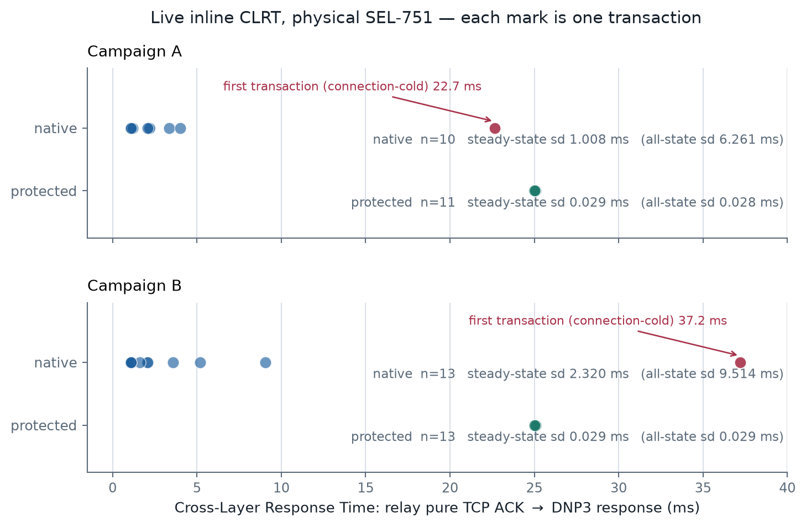
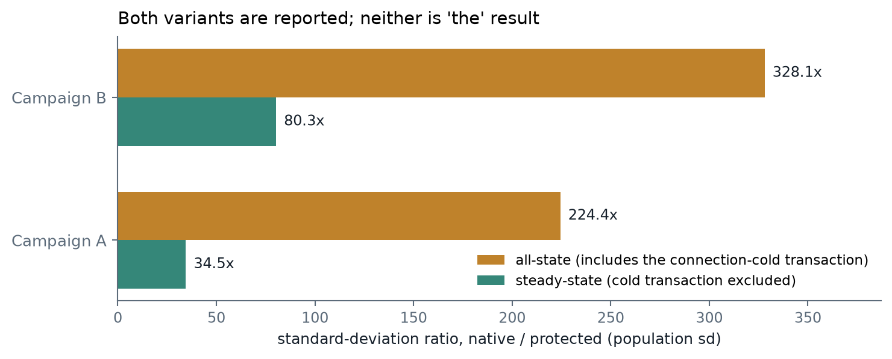
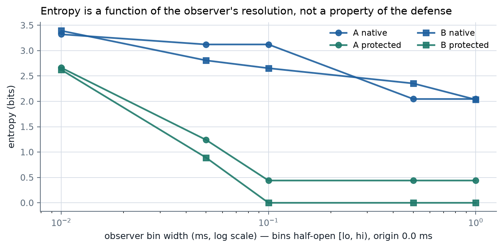

::: buildinfo
Every number in this document is generated from `authoritative_results.json`, which is computed
from the four shipped pcaps and nothing else. Build stamp: commit `@COMMIT@`, @DATE@.
:::

# 1. What was run, and what it showed

Running inline between the master and a physical SEL-751, the Tofino-1 Defense 2 implementation
forwarded the pure TCP ACK immediately and held the DNP3 RESPONSE until an ACK-relative deadline.
The live protected pcaps show that the relay's dispersed native CLRT observations were concentrated
into a narrow cluster around the configured 25 ms target, demonstrating suppression of the tested
CLRT-magnitude fingerprint.

Two live campaigns were run. Both are shipped, both are analysed, and neither is presented as
correcting the other.

| campaign | treatment | pcap | sha256 (head) | n (all) | n (steady) |
|:--|:--|:--|:--|--:|--:|
| A | native | `campaignA_native_n10.pcap` | `c2ed9fc1d3f8f27f…` | 10 | 9 |
| A | protected | `campaignA_protected_n11.pcap` | `cba20f3872a3511b…` | 11 | 10 |
| B | native | `campaignB_native_n13.pcap` | `2065ff7ae308724a…` | 13 | 12 |
| B | protected | `campaignB_protected_n13.pcap` | `1a94024dc96d502b…` | 13 | 12 |



# 2. CLRT: definition and source

**CLRT is the Cross-Layer Response Time.** The primary source is Formby, Srinivasan, Leonard,
Rogers and Beyah, *Who's in Control of Your Control System? Device Fingerprinting for
Cyber-Physical Systems*, NDSS 2016, which measures the interval between the TCP ACK and the
appearance of the response for each read request.

In this work CLRT is measured as

    t(DNP3 RESPONSE, application function 129)  -  t(the qualifying pure TCP ACK)

observed at the master-side capture point on Vision, using host pcap timestamps. A qualifying ACK
carries zero TCP payload, no SYN/FIN/RST, and an acknowledgement number equal to
`READ.tcp.seq + READ.tcp.len`.

# 3. Results, reported two ways

The two variants are reported separately and deliberately. Neither is "the" corrected result.

**All-state: every paired transaction**

| campaign | treatment | n | median | min | max | sd (pop) | sd (sample) | p95 | range |
|:--|:--|--:|--:|--:|--:|--:|--:|--:|--:|
| A | native | 10 | 2.126 | 1.061 | 22.660 | **6.261** | 6.600 | 22.660 | 21.599 |
| A | protected | 11 | 25.057 | 24.998 | 25.077 | **0.028** | 0.029 | 25.077 | 0.079 |
| B | native | 13 | 1.603 | 1.061 | 37.215 | **9.514** | 9.902 | 37.215 | 36.154 |
| B | protected | 13 | 25.070 | 25.003 | 25.083 | **0.029** | 0.030 | 25.083 | 0.080 |

**Steady-state: excluding the first, connection-cold transaction**

| campaign | treatment | n | median | min | max | sd (pop) | sd (sample) | p95 | range |
|:--|:--|--:|--:|--:|--:|--:|--:|--:|--:|
| A | native | 9 | 2.090 | 1.061 | 4.018 | **1.008** | 1.069 | 4.018 | 2.956 |
| A | protected | 10 | 25.060 | 24.998 | 25.077 | **0.029** | 0.031 | 25.077 | 0.079 |
| B | native | 12 | 1.373 | 1.061 | 9.059 | **2.320** | 2.423 | 9.059 | 7.998 |
| B | protected | 12 | 25.069 | 25.003 | 25.083 | **0.029** | 0.030 | 25.083 | 0.080 |

| campaign | all-state sd ratio | steady-state sd ratio |
|:--|--:|--:|
| A | 224.4x | 34.5x |
| B | 328.1x | 80.3x |

**The all-state variance is strongly influenced by the first transaction of each capture**, which
is the connection-cold transaction (campaign A: 22.660 ms; campaign B: 37.215 ms). Excluding it, the
steady-state distribution still shows substantial normalization. Both statements are true and both
are reported.



## 3.1 Release tail: the realized CLRT is near the target, not equal to it

The protected observations sit slightly above the configured 25 ms, by a small and consistent
margin: campaign A median +0.057 ms (min -0.002, max +0.077), campaign B median +0.070 ms
(min +0.003, max +0.083). This is the release implementation tail — deadline recognition, blocker
reservoir termination, queue scheduling and loopback traversal, plus observation timestamp noise.

The output is therefore

    CLRT_out  =  quantized G  +  deadline-recognition latency
                              +  blocker-reservoir termination latency
                              +  queue scheduling and loopback latency
                              +  observation timestamp noise

# 4. Entropy, with its binning stated

Entropy is a property of the observer's resolution, not of the defense. Every value below uses
**bin origin 0.0 ms** and **half-open bins [lo, hi)**, with the bin index computed as
`floor((x - origin) / width)`.



| campaign | treatment | bin width | occupied bins | entropy (bits) | n |
|:--|:--|--:|--:|--:|--:|
| A | native | 10 µs | 10 | 3.3219 | 10 |
| A | native | 50 µs | 9 | 3.1219 | 10 |
| A | native | 100 µs | 9 | 3.1219 | 10 |
| A | native | 500 µs | 5 | 2.0464 | 10 |
| A | native | 1 ms | 5 | 2.0464 | 10 |
| A | protected | 10 µs | 7 | 2.6635 | 11 |
| A | protected | 50 µs | 3 | 1.2407 | 11 |
| A | protected | 100 µs | 2 | 0.4395 | 11 |
| A | protected | 500 µs | 2 | 0.4395 | 11 |
| A | protected | 1 ms | 2 | 0.4395 | 11 |
| B | native | 10 µs | 11 | 3.3927 | 13 |
| B | native | 50 µs | 9 | 2.8074 | 13 |
| B | native | 100 µs | 8 | 2.6535 | 13 |
| B | native | 500 µs | 7 | 2.3535 | 13 |
| B | native | 1 ms | 6 | 2.0349 | 13 |
| B | protected | 10 µs | 7 | 2.6235 | 13 |
| B | protected | 50 µs | 2 | 0.8905 | 13 |
| B | protected | 100 µs | 1 | 0.0000 | 13 |
| B | protected | 500 µs | 1 | 0.0000 | 13 |
| B | protected | 1 ms | 1 | 0.0000 | 13 |

Read that table carefully. At 1 ms bins campaign B protected occupies one bin and measures
0.0000 bits, while campaign A protected occupies **two** bins and measures 0.4395 bits — its minimum,
24.998 ms, falls on the other side of the 25 ms bin edge. The same mechanism, the same target, a
different bin occupancy. That is why an unqualified "entropy is zero" is not a supportable
statement about this defense.

# 5. What the implementation actually does

This is **Defense 2 only**: the response is held, the ACK is not.

1. The master's Class-0 READ is forwarded to the relay.
2. The relay's pure TCP ACK is **forwarded immediately**, and its arrival time is stamped.
3. An ACK-relative deadline is armed at `t_ack + G`.
4. The relay's DNP3 RESPONSE is **held queue-resident** in a low-priority Traffic Manager queue on
   the internal dp8 loopback. The original response is what waits; it is not recirculated and it is
   not rewritten.
5. A high-priority **blocker reservoir** on the same port denies that queue service. The blockers,
   not the response, traverse the loop.
6. Each blocker compares the current timestamp against the deadline and terminates once past it.
7. With the high-priority queue drained, the response becomes schedulable and leaves.

**The blockers are currently seeded by the host and then circulate internally.** The release
decision is data-plane controlled, with no controller action in the transaction fast path. An
internal seeding mechanism has been designed and compiles, but it is not what produced these
measurements, and nothing here should be read as a claim of fully internal blocker generation.

A note on the Tofino, because the earlier write-up got this wrong: the Traffic Manager buffers and
schedules packets perfectly well. What P4 ingress cannot express is "release this queued packet at
absolute time T". The mechanism controls scheduling *eligibility* indirectly. That indirection is
the contribution, not the existence of buffering.

# 6. Integrity observations from the shipped captures

Across all four captures: **0 retransmissions, 0 duplicate acknowledgements, 0 reordering**, no
malformed frames, and all DNP3 CRCs valid. Response lengths were constant at
**frame 120 bytes, IP total length 106 bytes, TCP payload 54 bytes** — note the layer, since the
DNP3 response payload is 54 bytes and the frame carrying it is 120 bytes.

Observed DNP3 link addresses: READ src 1 → dst 0, RESPONSE src 0 → dst 1. The **outstation link
address is 0**. The value 10 in older notes came from the 10.0.0.x capture corpus and is wrong for
this relay.

Pairing quality: every transaction in all four captures paired exactly, with 0 ambiguous and 0
validation failures. Two independent pipelines were run — an exact-pairing analyzer using
expected-ack matching plus DNP3 function 129, and a separate tshark-only extraction using a
different pairing rule — and they agree on every transaction to better than 1 µs.

# 7. Reproduction

```bash
cd ~/dnp3_live
./status.sh                       # preflight; exits non-zero if the inline path is not live
./run.sh native                   # read-only Class-0 polls, nothing held
./run.sh protected                # same polls, blocker reservoir seeded (needs sudo)
./clrt.py native.pcap protected.pcap
```

To recompute the shipped results from the shipped pcaps:

```bash
$RESEARCH_PYTHON evidence/corrected_v2/scripts/build_authoritative.py
$RESEARCH_PYTHON evidence/corrected_v2/scripts/make_figures_v2.py --out meeting_package/timing_inline_v2/figures
```

The Wireshark procedure is in `WIRESHARK_GUIDE_V2.md`; the code walkthrough is in
`CODE_WALKTHROUGH_V2.md`.

# 8. Claim

> Running inline between the master and a physical SEL-751, the Tofino-1 Defense 2 implementation
> forwarded the pure TCP ACK immediately and held the DNP3 RESPONSE until an ACK-relative deadline.
> The live protected PCAPs show that the relay's dispersed native CLRT observations were
> concentrated into a narrow cluster around the configured 25 ms target, demonstrating suppression
> of the tested CLRT-magnitude fingerprint.

# 9. Limitations

- Tested on one SEL-751 with read-only DNP3 traffic only.
- The CLRT-magnitude channel only.
- **No full anonymity claim.** ACK mode, response size and TCP-stack characteristics are untouched.
- **No size-obfuscation claim.**
- **The blocker reservoir is currently host-seeded.** It circulates internally after seeding, and
  the release decision is data-plane controlled, but the seed frames are transmitted by the host.
- The first connection-cold transaction of each capture is reported separately, never discarded.
- **Live byte identity is not independently proven** in this inline configuration. The relay leg
  cannot be tapped, so the same frame cannot be compared before and after holding. What the shipped
  captures do support is constant response lengths, valid DNP3 CRCs, and no transport anomalies.
- Sample sizes are those of the shipped captures (10, 11, 13 and 13 transactions); no larger
  campaign is claimed.
