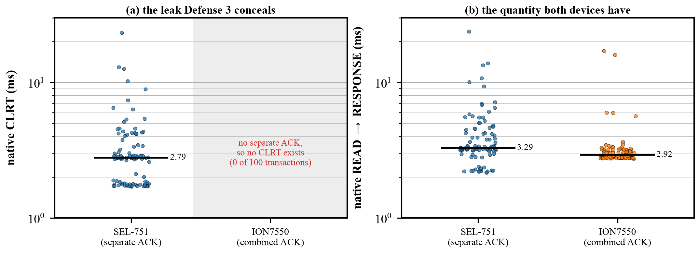

# ION7550 on the testbed: Case B natively, and inducible to Case A

> ## ►► STATUS: CLOSED — do not build on this (Philip, 2026-08-03)
>
> **The ION7550 emits no separate acknowledgement, therefore it has no CLRT, therefore it
> is out of scope.** That is the locked taxonomy (`CASE_A_TERMINOLOGY.md`: Case B =
> combined-ACK, no CLRT) and this measurement confirms it on physical hardware rather than
> only from the capture corpus.
>
> The "induce Case A by splitting the request into two TCP segments" result below is real
> and reproducible, but **it is not being pursued**: a CLRT that only exists because our
> own master fragmented its request is a CLRT we manufactured, not one the device leaks.
> It does not make the ION7550 a second separate-ACK device, and report open item #3
> ("a second separate-ACK device") therefore remains **open**.
>
> Nothing from this directory was added to `defense3/REPORT.*`. Kept as a measured
> negative result and as a reusable device-characterisation tool; resume only on an
> explicit decision to reopen it.

**2026-08-03. Physical Schneider/Power-Measurement ION7550 at `192.168.10.8`
(MAC `00:60:78:02:24:45`, OUI = Power Measurement Ltd), reached from Vision
`192.168.10.1` through the Tofino. Read-only throughout: nothing but Class 0 integrity
polls (group 60 variation 1, qualifier 0x06); no control command of any kind, and no
change to the device's configuration.**

## Question

Does a Class 0 read of this device return a **separate** TCP acknowledgement followed by
the response (Case A, which has a CLRT to conceal), or a response that **carries** the
acknowledgement (Case B, no CLRT)?

## Answer

**Case B — combined.** 40/40 transactions across two runs showed no pure ACK between the
read and the response. Then, separately: **the device can be driven into Case A behaviour
from the master side alone**, without touching its configuration (below).

| device | link addr | mode | n | CLRT (ms) | read→response (ms) |
|---|---|---|---|---|---|
| SEL-751 `.7` (control) | 0 | **SEPARATE (Case A)** | 20/20 | 2.758 med (1.72–5.89) | 3.23 med |
| ION7550 `.8` as-is | 10 | **COMBINED (Case B)** | 20/20 | — none exists — | 2.99 med (2.75–3.41) |
| ION7550 `.8`, split read | 10 | **SEPARATE (Case A)** | 20/20 | 1.979 med (1.34–13.25) | 3.02 med |

The SEL-751 arm is a **positive control run in the same session over the same switch
path**: it proves the method detects a separate ACK when one exists, and that the switch
(on the frozen Defense 2 baseline, blocker generator disabled) is not itself altering
acknowledgement timing.

### Wire evidence — as-is (combined)

```
4  0.601542  192.168.10.1 → .8  len 18  seq 1   ack 1     the Class 0 READ
5  0.604603  192.168.10.8 → .1  len 90  seq 1   ack 19    the RESPONSE, and ack=19
                                                          (= 1+18) acknowledges the READ
6  0.604645  192.168.10.1 → .8  len 0           ack 91    the master's own ACK
```
One frame from the device per transaction. Across 20 transactions the capture holds
exactly one zero-length frame from the ION, and it is a **RST at teardown** (the device
resets rather than closing gracefully), not a transaction acknowledgement.

### Wire evidence — split read (separate)

```
4  0.601519  192.168.10.1 → .8  len 9   seq 1    segment 1 of the SAME 18 read bytes
5  0.603751  192.168.10.1 → .8  len 9   seq 10   segment 2
6  0.605275  192.168.10.8 → .1  len 0   ack 19   a STANDALONE pure ACK  <-- Case A
7  0.606892  192.168.10.8 → .1  len 90  ack 19   the RESPONSE, 1.616 ms later = CLRT
```

## Why it is combined, and what actually controls it

The acknowledgement mode is a property of the outstation's **TCP stack**, not of DNP3.
Two quantities decide it: the stack's delayed-ACK timer, and how fast the application
answers. Whichever comes first carries the acknowledgement.

Both were measured here:

- **The ION's delayed-ACK timer is ≈ 40 ms.** This fell out of a failed probe: before the
  link address was known, reads were sent to address 100, which the device ignored at the
  link layer. With no response to piggyback on, its stack acknowledged on the timer, at
  **39.8–40.8 ms across 10 probes** — a textbook 40 ms delayed ACK.
- **The ION answers Class 0 in ≈ 3.0 ms**, far inside that timer. So the acknowledgement
  is always still pending when the response is ready, and always rides on it.
- The SEL-751, by contrast, acknowledges in 0.4–2.3 ms — *before* its own response — so
  its stack does not wait for a delayed-ACK timer at all.

This also explains the taxonomy without any appeal to vendor intent: Case A and Case B are
not device categories so much as the two sides of the inequality
`response latency  vs  delayed-ACK timer`.

## Can the device be configured to emit separate ACKs?

**Not through device configuration — but it does not need to be.**

- **No DNP3 or device setting exposes this.** The behaviour lives in the embedded TCP
  stack (delayed-ACK timer), which the DNP3 profile does not cover and which the device's
  management surfaces do not expose. The device's open ports are 80 (HTTP config server,
  responds `HTTP/1.0 200`), 20000 (DNP3), 502 (Modbus) and 23 (telnet) — all of which
  configure protocol and metering behaviour, not stack ACK policy. **No configuration
  change was attempted**; this is an assessment of the surface, not a test of it.
- **The master-side lever works and needs no device change.** Delivering the *same 18
  read bytes* as **two TCP segments** obliges the receiver to acknowledge immediately —
  RFC 1122 §4.2.3.2 requires an acknowledgement at least every second full-sized segment
  — so the ACK is emitted before the application answers. Result: 20/20 separate, with a
  real, observable CLRT of 1.979 ms median. The DNP3 bytes are byte-identical; only the
  segmentation changed.
- **A second, untested lever** follows from the same inequality: any read whose processing
  exceeds ~40 ms would also force a standalone ACK. Not attempted here — the segmentation
  lever is simpler and does not depend on finding a slow request.

### What this does and does not license

- It **does** give the project a second device that presents a Case A observable, which is
  what report open item #3 ("a second separate-ACK device", previously "not available")
  was blocked on. Defense 3 holds *acknowledgements*, so a device that emits a separate
  acknowledgement is testable against it.
- It **does not** mean the ION7550 leaks a CLRT in normal operation. The separate ACK here
  is induced by *our own master's* segmentation. A real deployment's master is a third
  party, and with an ordinary single-segment poll this device is Case B and has no CLRT to
  observe. Any use of this in an evaluation must say plainly that the Case A observable
  was induced, and by what.
- The induced CLRT (1.98 ms median) is a genuine measurement of *this device's*
  read-to-response latency minus the acknowledgement delay; it is not an artifact of the
  measurement path (the SEL-751 control rules that out).

## Reproduce

```bash
# on Vision (master side, 192.168.10.1, capture group required)
python3 probe_ack_mode.py --self-test                                   # frame builder
python3 probe_ack_mode.py --relay 192.168.10.8 --scan                   # find link addr
sg wireshark -c "python3 probe_ack_mode.py --relay 192.168.10.8 --dest 10 --n 20"
sg wireshark -c "python3 probe_ack_mode.py --relay 192.168.10.8 --dest 10 --n 20 --split-read"
sg wireshark -c "python3 probe_ack_mode.py --relay 192.168.10.7 --dest 0  --n 20"  # control
```

`--self-test` builds the 16 Class 0 frames the D-sweep campaign sent to the SEL-751 and
checks them byte-for-byte against the recorded originals, so a frame-construction error
cannot masquerade as a device finding.

## Corrections to prior notes

- The physical ION7550's DNP3 link address is **10**, not the 100 used in the
  `Traffic Trace/ION7550.pcap` corpus — corpus addresses do not transfer to this unit.
- Project memory recorded the corpus ION7550 at `10.0.0.2`; the capture actually shows
  **`10.0.0.11`** (master `10.0.0.3`). Corrected.

## The native distributions (100 transactions per device)

Collected as **4 interleaved blocks of 25 native single-segment polls per device**, so a
drift in ambient conditions cannot land on one device and not the other. Every block keeps
its own capture; the pcap is the primary evidence and the JSON is derived from it.

| device | n | separate / combined | native CLRT (ms) | native READ→RESPONSE (ms) |
|---|---|---|---|---|
| SEL-751 | 100 | **100 / 0** | median **2.785**, min 1.710, max 23.181 | median 3.289, p05 2.220, p95 9.400 |
| ION7550 | 100 | **0 / 100** | **none — the quantity does not exist** | median **2.921**, p05 2.765, p95 3.742 |



**The comparison that matters is between the two panels.** The two devices answer a Class 0
read in almost the same time — 3.29 ms versus 2.92 ms median — so the left panel is not
reporting that one device is faster. It is reporting that one device *exposes* an
acknowledgement-to-response interval and the other never emits the acknowledgement that
would start it. The leak is a property of acknowledgement behaviour, not of speed.

The SEL-751's CLRT is also visibly the wider distribution (1.71–23.18 ms, with a long
upper tail from connection-cold first polls, which are retained here and are 4 of its 100),
which is the spread Defense 3 exists to compress.

## Evidence

- `evidence/20260803_native/` — the 100-per-device native dataset: `{sel751,ion7550}_r{1..4}.json`
  and **the matching `.pcap` for every block** (8 captures).
- `evidence/20260803_ion7550/` — the first-contact runs: `ackmode_sel751.json` (control),
  `ackmode_ion7550.json` (as-is), `ackmode_ion7550_split.json` (induced Case A), and pcaps.
- `fig_native_clrt.py` → `out/fig_native_clrt.{pdf,png}` — regenerates the figure from the
  JSON above and prints every number in the table.
